# AnimSimulatorSystem 动画模拟器系统-使用文档

- 返回 [说明文档](../../README.md)

# 📜目录

- [AnimSimulatorSystem 动画模拟器系统-使用文档](#animsimulatorsystem-动画模拟器系统-使用文档)
- [📜目录](#目录)
- [官方教程](#官方教程)
- [示例场景](#示例场景)
- [测试场景](#测试场景)
- [快速入门](#快速入门)
- [资源导入](#资源导入)
- [系统配置](#系统配置)
  - [动画模拟管理器](#动画模拟管理器)
  - [资源文件路径](#资源文件路径)
  - [动画动作播放器 配置](#动画动作播放器-配置)
  - [动画角色皮肤组 配置](#动画角色皮肤组-配置)
  - [进度条 配置](#进度条-配置)
    - [等级进度条 配置](#等级进度条-配置)
    - [动作进度条 配置](#动作进度条-配置)
- [动画模拟器 使用](#动画模拟器-使用)
  - [角色预制体](#角色预制体)
    - [皮肤组](#皮肤组)
  - [动画动作播放器](#动画动作播放器)
    - [动画动作列表](#动画动作列表)
    - [动画动作列表UI 制作与排错](#动画动作列表ui-制作与排错)
      - [预制体结构](#预制体结构)
      - [配置要点](#配置要点)
      - [排错速查](#排错速查)
      - [运行期自检片段](#运行期自检片段)
  - [背景预制体](#背景预制体)

# 官方教程

2D美术资源的制作，需要使用Spine或Live2D等，专业的2D动画制作软件来完成。\
官方文档与教程中，会对2D动画制作的流程与功能进行详细介绍。\
建议 学习视频教程 来快速掌握 基本流程 与 使用。\

<span style="color: rgb(255, 255, 0);">**<策划可以跳过这部分>**</span>，直接进入下面的 Unity配置教程。\
但仍建议从 官方教程 来基本了解一下Spine或Live2D的制作流程，理解2D动画美术资源的结构与组成，以便更好地进行 Unity中的配置与使用。

- [Spine 官方网站](https://zh.esotericsoftware.com/)
  - 官方的视频教程。只在 YouTube 提供了英文教程。
  - 可以使用 浏览器翻译插件 翻译中文字幕 进行阅读。
  - 另外，也可以在 [Bilibili](https://search.bilibili.com/all?keyword=Dialogue+System&from_source=webtop_search&spm_id_from=333.1007&search_source=5) 上查找到相关教程。
- [Live2D 官方网站](https://www.live2d.com/zh-CHS/)
  - 官方的详细文档，详细描述了 Dialogue System 的各项功能。
  - 只有 英文 的版本。可以使用 浏览器翻译插件 进行阅读。
- [浏览器 翻译插件](https://microsoftedge.microsoft.com/addons/detail/%E6%B2%89%E6%B5%B8%E5%BC%8F%E7%BF%BB%E8%AF%91-%E7%BD%91%E9%A1%B5%E7%BF%BB%E8%AF%91%E6%8F%92%E4%BB%B6-pdf%E7%BF%BB%E8%AF%91-/amkbmndfnliijdhojkpoglbnaaahippg)
  - 这里提供 微软Edge浏览器 中的翻译插件的安装链接。
  - 另外，在 Google Chorme浏览器 中，也可以找到这款 翻译插件。

# 示例场景

在示例场景中，演示了所有 动画模拟器系统 的功能。可以参考示例场景，来完成各类功能的配置。
例如，动画动作的配置，位置的放置，交互操作的方式，交互范围的大小等。\
动作进度条、等级进度条的配置，等级解锁 动画动作，进度触发 动画动作等。\
换装系统的配置，皮肤的分组，解锁条件，选择方式等。


- 示例场景
  - Assets\Plugins\Fs\Runtime\GameFramework\Gameplay\Systems\AnimSimulatorSystem\Demo\AnimSimulatorSystemDemo.unity
  - 打开示例场景，直接 运行游戏 就能在 Game窗口 中看到 动画模拟器系统 的演示内容。

<video controls="" poster="" src="Movie_004.mp4" ></videos>

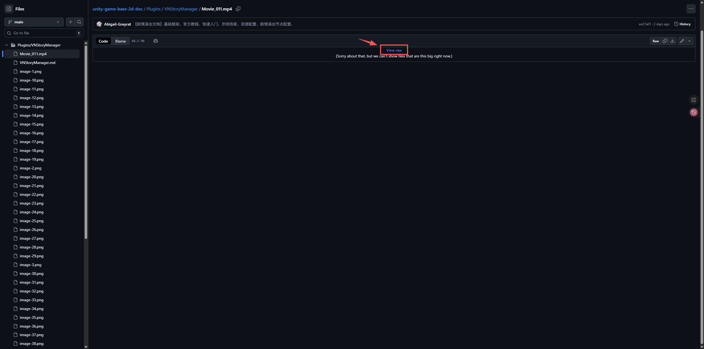

- 示例视频
  - 可以在 [视频链接](Movie_004.mp4)
    中，点击 [View raw]按钮，下载视频 进行观看。


- 示例场景的配置
  - 示例场景的 剧情演出数据的配置，具有很多参考价值。
    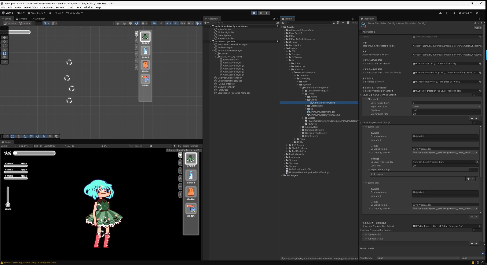
  - 在场景的AnimSimulatorManager预制体上，配置了AnimSimulatorConfig(动画模拟器配置)的文件，上面对 背景、角色、动画动作的播放器、皮肤组、等级进度条、动作进度条等项目，做了详细的配置。
    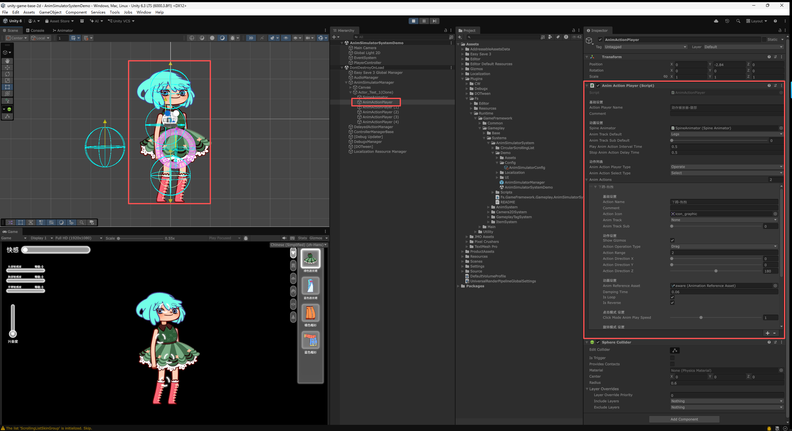
  - 在角色的预制体上，配置了多个 动画动作的播放器，用于指定 角色身上每个位置 可以播放的 动画动作。例如，在头部配置摸头的动画，在身体配置空闲与走路的动画。之后通过玩家操作，在不同的动画之间进行切换与操作。

# 测试场景

示例场景 仅作为功能的演示。在制作 正式的游戏资产 与 配置时，请使用已经创建好的 正式游戏资产。
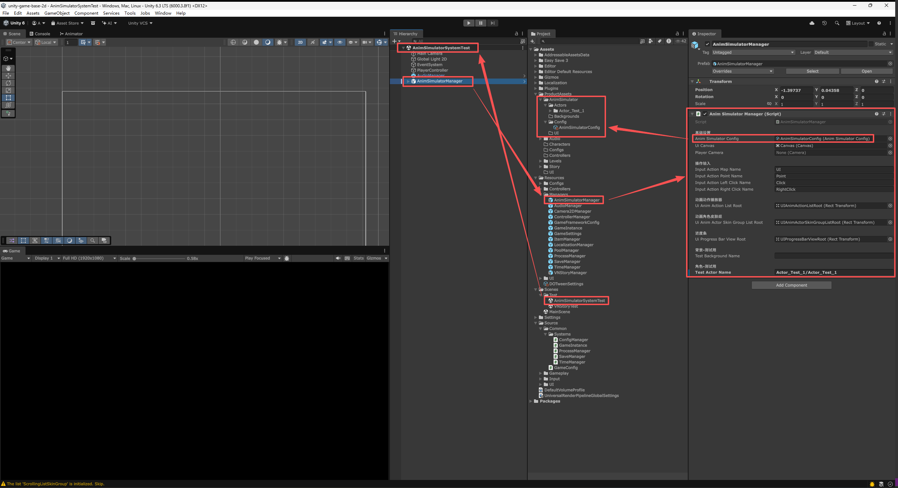

- 正式游戏资产
  - 动画模拟器管理器：Assets\Resources\Managers\AnimSimulatorManager.prefab
  - 角色预制体：Assets\ProductAssets\AnimSimulator\Actors\
  - 背景预制体：Assets\ProductAssets\AnimSimulator\Backgrounds\
  - UI预制体：Assets\ProductAssets\AnimSimulator\UI\
  - 动画模拟器配置文件：Assets\ProductAssets\AnimSimulator\Config\AnimSimulatorConfig.asset
- 测试场景
  - Assets\Scenes\Test\VNStoryTest.unity
  - 打开测试场景，直接 运行游戏 就能在 Game窗口中看到 剧情演出的内容。

# 快速入门

通过最简洁的流程，快速熟悉 动画模拟器系统。\
而关于 详细的配置方法，会在之后的教程中 逐一进行解说。


- 打开测试场景。
  - 打开 Assets\Plugins\Fs\Runtime\GameFramework\Gameplay\Systems\AnimSimulatorSystem\Demo\AnimSimulatorSystemDemo.unity 场景。
  - 在测试场景中，可以直接点击运行游戏，测试 动画模拟器系统 的功能。


- Spine或Live2D 动画资源的导入。
  - 首先需要将 美术制作好的Spine或Live2D的动画资源，导入到Unity中，并制作成 预制体。
  - Spine或Live2D 动画资源的导入 与 预制体的制作方法，请参考 资源导入文档中的 [2D角色](../../../Fs/Runtime/GameFramework/Common/Systems/AssetSystem/Docs~/AssetImport/AssetImport.md#2d角色) 部分。
    
  - 动画角色的预制体，需要放置在 Assets\Plugins\Fs\Runtime\GameFramework\Gameplay\Systems\AnimSimulatorSystem\Demo\Assets\Actors\ 文件夹中，文件夹位置可以在 AnimSimulatorConfig(动画模拟器配置)进行修改，在之后的教程中会进行讲解。
  - 动画资源的文件 一般会有很多，建议在 Actors 文件夹中 再新建一个文件夹，放置每个角色的 动画资源与预制体，并按照 角色的分类进行 命名与整理。


- 挂载 AnimActor组件。
  - 双击刚制作好的 角色预制体，打开 预制体编辑模式。
  - 在 Hierarchy面板中 选中 角色预制体的 根物体，在 Inspector面板中 点击 [Add Component]按钮，添加 AnimActor组件。
  - 将 Spine动画的SkeletonAnimation组件，拖拽到 AnimActor组件的 Spine Animator 栏中。组件一般会 自动寻找并挂载，可以再次确认。

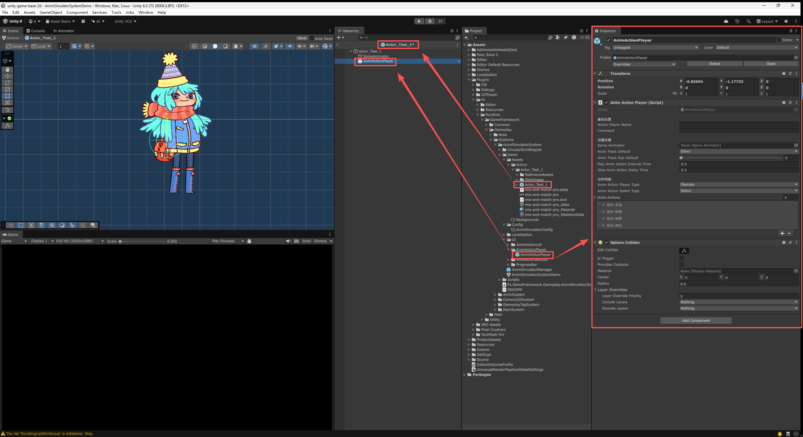

- 放置 AnimActionPlayer(动画动作播放器)。
  - 将 Assets\Plugins\Fs\Runtime\GameFramework\Gameplay\Systems\AnimSimulatorSystem\Demo\UI\AnimActionPlayer\AnimActionPlayer.prefab 预制体，拖拽放置到 角色预制体中。
  - 也可以自己手动创建空物体，并挂载 AnimActionPlayer组件 与 SphereCollider组件 来完成。只是通过预制体的方式，能够直接使用 已经配置好的 组件与参数，节省了配置的时间。
  - 将 Spine动画的SkeletonAnimation组件，拖拽到 AnimActionPlayer组件的 Spine Animator 栏中。组件一般会 自动寻找并挂载，可以再次确认。

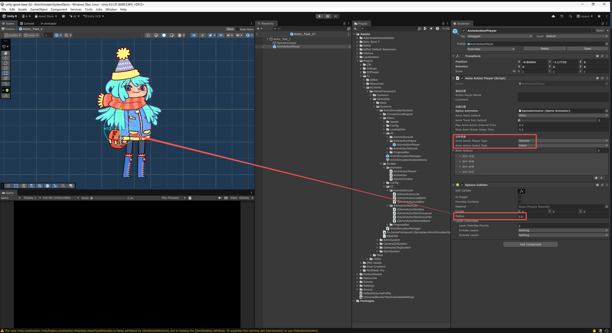

- 配置 AnimActionPlayer(动画动作播放器)。
  - 通过 SphereCollider组件的 Radius(半径)参数，来调整 玩家进行交互操作的 范围大小。
    - Center(中心)参数，可以调整 交互范围 的位置。一般默认保持[0,0,0]即可。
  - 将 AnimActionPlayer组件的 Anim Action Player Type(动画动作播放器类型)设置成 Operate(操作)。表示这个 动画动作播放器 是通过玩家操作 来触发动画动作的。
  - 将 AnimActionPlayer组件的 Anim Action Select Type(动画动作选择类型)设置成 Select(选择)。表示玩家在操作时，会有一个选择列表 来选择想要触发的 动画动作。

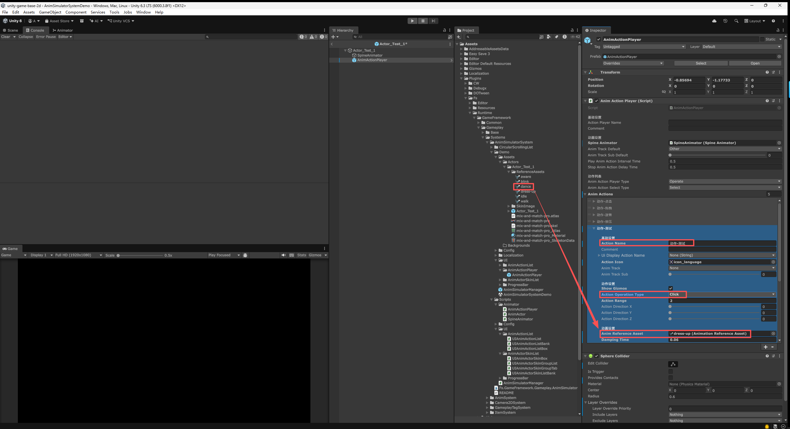

- 添加 动画动作。
  - 在 AnimActionPlayer组件的 Anim Actions(动画动作列表)中，点击右下角的[+][-]按钮，在列表末尾 增加一个 动画动作条目。
  - 将 Action Name(动作名称)设置成“动作-测试”。这个名称 仅用于配置文件之间的识别与指定。游戏中显示的名称，需要在 UiDisplayActionName(显示动作名称)中进行设置。
  - 将 Action Operation Type(动作操作类型)设置成 Click(点击)。表示这个 动画动作 是通过玩家点击 来触发的。
  - 将Spine的动画文件"dress-up"拖拽到 Anim Reference Asset(动画引用文件)栏中，作为这个 动画动作 的动画资源。


- 测试 动画动作。
  - 返回到 场景中，点击 AnimSimulatorManager 物体，在Inspector面板中的 Test Actor Name(测试角色名称)栏中，填写之前制作的 Actors文件夹中的 角色预制体的名称，因为放置在文件夹中，所以需要填写文件夹名称+预制体名称，例如 "Actor_Test_1/Actor_Test_1"。
    
  - 点击上方最左边的[开始]按钮，运行游戏。在Game面板中，动画动作播放器的位置 会显示一个 白色的提示圈，当光标移到 提示圈范围内时，会显示 配置的动画动作列表。
  - 通过鼠标的滚轮，可以在 动画动作列表中 进行切换。切换到列表的最上方，就会显示出 刚配置的动画动作，鼠标单击 就可以触发这个动画动作的播放。

# 资源导入

在 动画模拟器系统中，通常需要从外部导入 美术制作的资源文件，并在Unity中制作成 预制体。\
例如，角色的Spine动画预制体、皮肤的UI图片、音频文件等。\
具体的导入方法与流程，可以参考 [资源导入文档](../../../Fs/Runtime/GameFramework/Common/Systems/AssetSystem/Docs~/AssetImport/AssetImport.md)。

# 系统配置

背景、角色预制体的 文件夹路径、动画动作播放器、进度条、皮肤列表的UI样式 等。都可以在 AnimSimulatorConfig(动画模拟管理器配置)文件中进行配置。


- 创建 AnimSimulatorConfig(动画模拟管理器配置)文件。
  - 在 Project面板中，鼠标右键 打开操作菜单，点击 Create > Fs > Anim Simulator System > Anim Simulator Config 来创建一个 AnimSimulatorConfig文件。
  - 也可以直接从 Assets\Plugins\Fs\Runtime\GameFramework\Gameplay\Systems\AnimSimulatorSystem\Demo\Config\AnimSimulatorConfig，直接复制(Ctrl+C、Ctrl+V)一个 AnimSimulatorConfig文件，进行修改使用。

## 动画模拟管理器

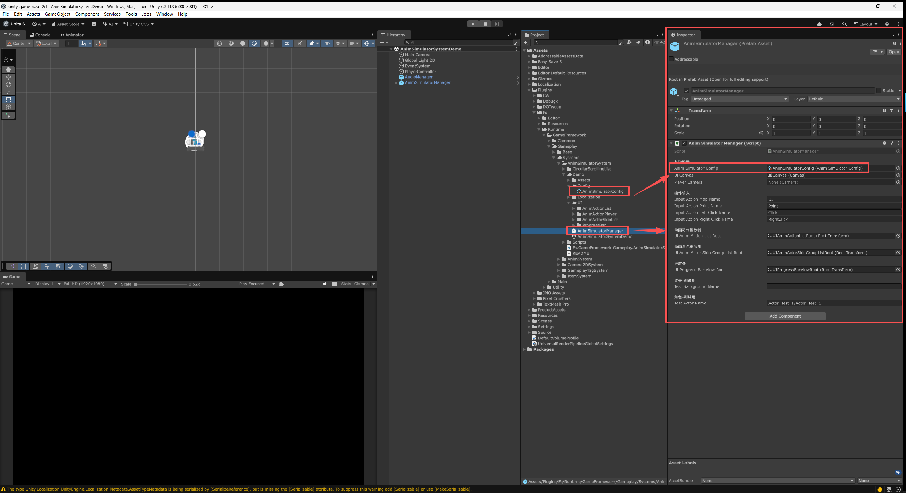

- AnimSimulatorConfig，需要配置在 AnimSimulatorManager(动画模拟管理器) 预制体上进行。
  - 将创建好的 AnimSimulatorConfig(动画模拟管理器配置)文件，拖拽到 AnimSimulatorManager预制体的 Inspector面板中的AnimSimulatorConfig栏中，作为它的 配置文件 进行使用。
- 不过，AnimSimulatorManager 预制体上 已经做好了相关的配置，如无需要 <span style="color: rgb(255, 255, 0);">**<可不进行修改>**</span>。

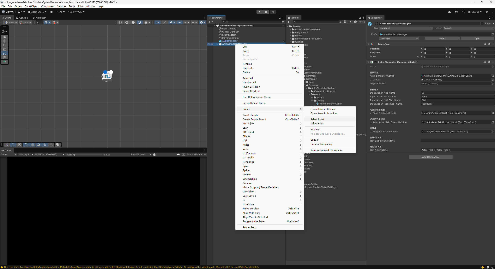

- 场景中的所有物体 会显示在 Hierarchy 面板中，蓝色的物体代表是预制体，鼠标右键 场景中的预制体，点击操作菜单中的[Prefab > Select Asset]就能在 Project 面板中，快速找到并选中 预制体的源文件。

## 资源文件路径


- 背景、角色、可以在AnimSimulatorConfig中，修改文件夹的路径。只有放置到 指定文件夹中的 美术资源，才可以在 动画模拟器系统中 进行配置与使用。
  - BackgroundAddressableFolder：背景，文件夹路径。
  - ActorAddressableFolder：角色，文件夹路径。
- 文件夹路径 的格式为 Assets/ProductAssets/AnimSimulator/Actors/，以Assets开头，文件夹后面使用“/”隔开，所以 最后也需要使用“/”进行结尾。
  - 建议将资源文件夹都放置在 Assets/ProductAssets/文件夹中，根据不同的系统，进行分类整理。
  - 例如，角色的预制体 可以防止在 Assets/ProductAssets/AnimSimulator/Actors/ 文件夹中，背景的预制体 可以放置在 Assets/ProductAssets/AnimSimulator/Backgrounds/ 文件夹中。

## 动画动作播放器 配置

动画动作播放器 相关的配置，在这里可以替换 动作列表的UI样式。


- Ui Anim Action List Prefab：动画动作列表的 UI预制体。可以替换成 自己制作的 UI预制体，来修改动画动作列表的 UI样式。
  - 点击右侧配置的文件，就可以在 Project面板中，快速找到当前的预制体的源文件。
  - 建议将新制作的UI预制体，放置在 Assets/ProductAssets/AnimSimulator/UI/ 文件夹中，进行分类整理。
  - 建议直接复制整个AnimActionList文件夹，因为UI预制体通常还会制作 UI动画、特效等相关的资源文件，这样能够保持UI预制体的 相关资源文件的完整性。

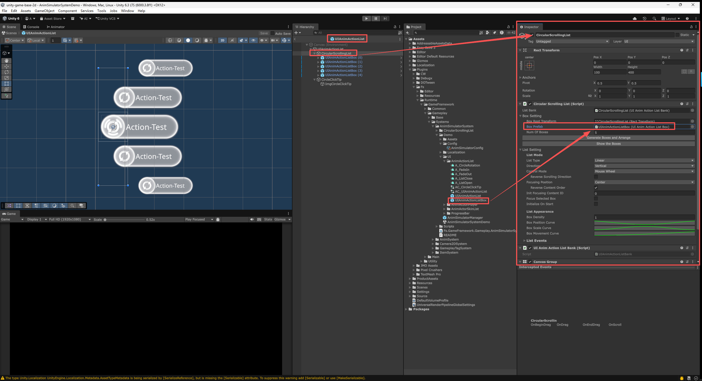

- 在复制出来的新的UI预制体上，进行修改来完成UI样式的替换。例如，替换图片、调整排版、修改动画效果等。
  - 单个 动画动作的条目UI，是制作在 UIAnimActionListBox 预制体中的，需要在这个预制体上进行修改。
  - 之后，将 UIAnimActionListBox预制体，配置在 UIAnimActionList预制体的CircularScrollingList组件上，挂载到 Box Prefab栏中，并点击下方的 [Generate Boxes And Arrange]按钮，应用修改的设置。

## 动画角色皮肤组 配置

动画角色皮肤组 相关的配置，在这里可以替换 皮肤列表的UI样式。
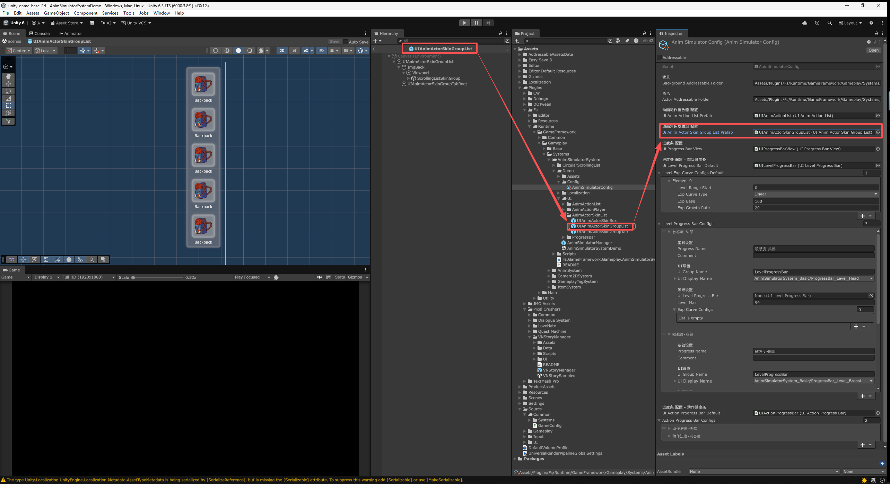

- Ui Anim Actor Skin Group List Prefab：动画角色皮肤组列表的 UI预制体。可以替换这个UI预制体，来修改 UI样式。
  - 点击右侧配置的文件，就可以在 Project面板中，快速找到当前的预制体的源文件。
  - 建议将新制作的UI预制体，放置在 Assets/ProductAssets/AnimSimulator/UI/ 文件夹中，进行分类整理。
  - 建议直接复制整个 AnimActorSkinList文件夹，因为UI预制体通常还会制作 UI动画、特效等相关的资源文件，这样能够保持UI预制体的 相关资源文件的完整性。


- Ui Anim Actor Skin Group List组件，是动画角色皮肤组列表的 核心组件。
  - UI Anim Actor Skin Group Tab Prefab：动画角色皮肤组标签的 UI预制体。所有的Tab标签 都会根据 [角色的皮肤组配置](#皮肤组) 并使用这个预制体来自动生成。可以替换这个UI预制体，来修改UI样式。
  - UI Anim Actor Skin Group Tab Root：动画角色皮肤组标签的根物体。指定 Ui Anim Actor Skin Group List预制体中的一个子物体，自动生成的 Tab标签 就会放置在这个物体下。可以调整这个物体的位置、排版等，来修改UI样式。
  - Scrolling List Skin Group：动画角色皮肤组的 滚动列表组件。通常不需要修改。
  - Ui Anim Actor Skin List Bank：动画角色皮肤组的 滚动列表数据。通常不需要修改。


- UI Anim Actor Skin Group Tab组件，是动画角色皮肤组标签的 核心组件。
  - 制作自定义的Tab标签UI预制体时，建议直接从这个预制体进行复制，再修改UI样式。
  - Img Skin Group Icon：皮肤组图标。通常不需要替换，直接点击右侧配置的物体，快速选中 Hierarchy面板中的这个物体，直接修改 大小、位置、排版、图片等。
  - Img Skin Group Background：皮肤组背景。通常不需要替换，直接点击右侧配置的物体，快速选中 Hierarchy面板中的这个物体，直接修改 大小、位置、排版等。使用的 图标，会根据 [角色的皮肤组配置](#皮肤组) 的配置自动替换。
  - Color Selected：选中颜色。当Tab标签被选中时 使用的颜色。会直接着色到 Img Skin Group Background图片上。默认为白色，表示不进行着色，使用图片原本的颜色。
  - Color Unselected：未选中颜色。当Tab标签未被选中时 使用的颜色。会直接着色到 Img Skin Group Background图片上。默认为灰色，表示未选中状态的颜色。
  - Go Is Selected：选中状态的标记物体。当Tab标签被选中时，这个物体会被激活显示。可以制作一些外框、特效、提示图标等，来作为选中状态的标记物体。
  - Go Is Unselected：未选中状态的标记物体。当Tab标签未被选中时，这个物体会被激活显示。
  - Btn Skin Group Tab：皮肤组标签的按钮。通常不需要替换。可以调整这个按钮组件的大小、位置等，来修改按钮的可点击范围。


- Circular Scrolling List组件，是动画角色皮肤组的 滚动列表组件。
  - ScrollingListSkinGroup物体上，挂载了 Circular Scrolling List组件。可以在这个组件上，替换 Box Prefab(单个皮肤选项的 UI预制体)，来修改 UI样式。调整 列表的 排版、方向、滚动效果等。
  - Box Prefab：单个 皮肤选项的 UI预制体。可以替换成 自己制作的 UI预制体，来修改单个皮肤选项的 UI样式。
    - 建议直接从 UIAnimActorSkinBox预制体进行复制，再修改UI样式。
  - Num Of Boxes：UI预制体的数量。列表中显示的 皮肤选项UI预制体的数量，根据 UI排版的需要，来调整数量。
  - Generate Boxes And Arrange 按钮：生成并排列UI预制体。修改了 Box Prefab 与 Num Of Boxes参数后，需要点击这个按钮，来生成新的UI预制体，并按照设置进行排列。
  - List Type：列表类型。列表的滚动循环类型。
    - Linear：线性。列表滚动到末尾时，就无法继续滚动了，只能反向滚动回去。
    - Circular：循环。列表滚动到末尾时，会继续滚动回到开头，形成一个循环的滚动列表。
  - Direction：滚动方向。
    - Horizontal：水平。列表在水平方向上 进行滚动。
    - Vertical：垂直。列表在垂直方向上 进行滚动。
  - Control Mode：控制模式。列表的滚动控制方式。
    - Nothing：无。列表不接受任何输入，无法进行滚动。
    - Everything：全部。列表接受所有输入，可以通过鼠标、触摸等方式进行滚动。
    - Pointer：鼠标或指针的操作，可以通过 鼠标拖拽 来进行滚动。
    - Mouse Wheel：鼠标滚轮。鼠标滚轮的操作，可以通过 鼠标滚轮 来进行滚动。
  - Box Density：UI预制体 密度。列表中UI预制体的密度，数值越大，UI预制体之间的间距就越小。
  - Box Position Curve：UI预制体 位置曲线。修改UI预制体的 排列位置，X轴是在 列表滚动方向上的位置，Y轴是 垂直于滚动方向的位置偏移。
    - 例如，将曲线调整成 波浪形，就可以让UI预制体在滚动时，呈现出波浪形的 排列效果。
  - Box Scale Curve：UI预制体 缩放曲线。修改UI预制体的缩放，X轴是在 列表滚动方向上的位置，Y轴是缩放的倍数。
    - 例如，将曲线调整成 拱门形，就可以让UI预制体在滚动时，呈现出中间大，两端小的拱门形的 缩放效果。
  - Box Velocity Curve：UI预制体 释放速度曲线。修改UI预制体的 释放滚动速度，X轴是持续时间(秒)，Y轴是速度的倍数。
    - 例如，将曲线调整成 先快后慢的形状，在鼠标拖拽 并向上甩动列表，在释放鼠标后，列表会先以指定速度(Y轴)滚动一段时间，并在指定持续时间(X轴)内，逐渐减速，直到停止。
  - Box Movement Curve：UI预制体 移动曲线。修改UI预制体的 移动方式，X轴是持续时间(秒)，Y轴是 滚动方向上的位置。
    - 例如，将曲线调整成 先降后升的形状，在鼠标滚轮 向下滚动列表，在持续时间内，列表会先向上(反方向)滚动一小段距离，再向下滚动到目标位置，形成一个先退后进的移动效果。

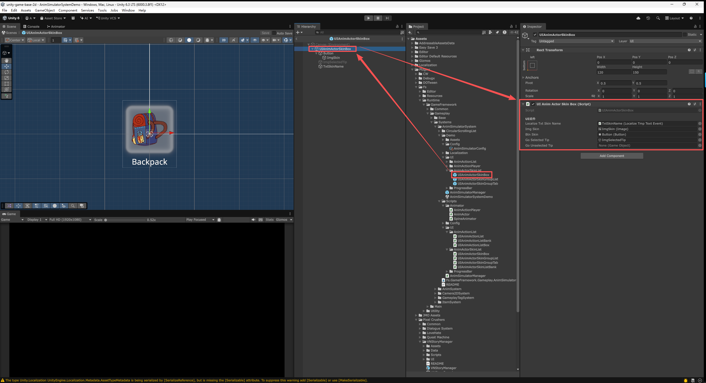

- UI Anim Actor Skin Box组件，是动画角色皮肤组中，单个皮肤选项的 核心组件。
  - 制作自定义的单个皮肤选项UI预制体时，建议直接从这个预制体进行复制，再修改UI样式。
  - Localize Txt Skin Name：本地化文本，皮肤名称。通常不需要修改。点击已配置的内容，就可以在Hierarchy面板中，快速选中这个物体。直接修改 文本的排版、颜色、大小等，来修改UI样式。显示的文本内容，会根据 [角色的皮肤组配置](#皮肤组) 的 Ui Display Skin Name(显示皮肤名称)进行替换。
  - Img Skin：皮肤图片。通常不需要修改。点击已配置的内容，就可以在Hierarchy面板中，快速选中这个物体。直接修改 图片的大小、位置、排版等，来修改UI样式。显示的图片内容，会根据 [角色的皮肤组配置](#角色预制体) 的 Skin Image(皮肤图标)进行替换。
  - Btn Skin：皮肤的按钮。通常不需要修改。可以调整这个按钮组件的大小、位置等，来修改按钮的可点击范围。
  - Go Selected Tip：选中提示物体。当这个皮肤选项被选中时，这个物体会被激活显示。可以制作一些外框、特效、提示图标等，来作为选中状态的标记物体。
  - Go Unselected Tip：未选中提示物体。当这个皮肤选项未被选中时，这个物体会被激活显示。

## 进度条 配置

进度条相关的 配置，在这里可以替换 进度条的UI样式。
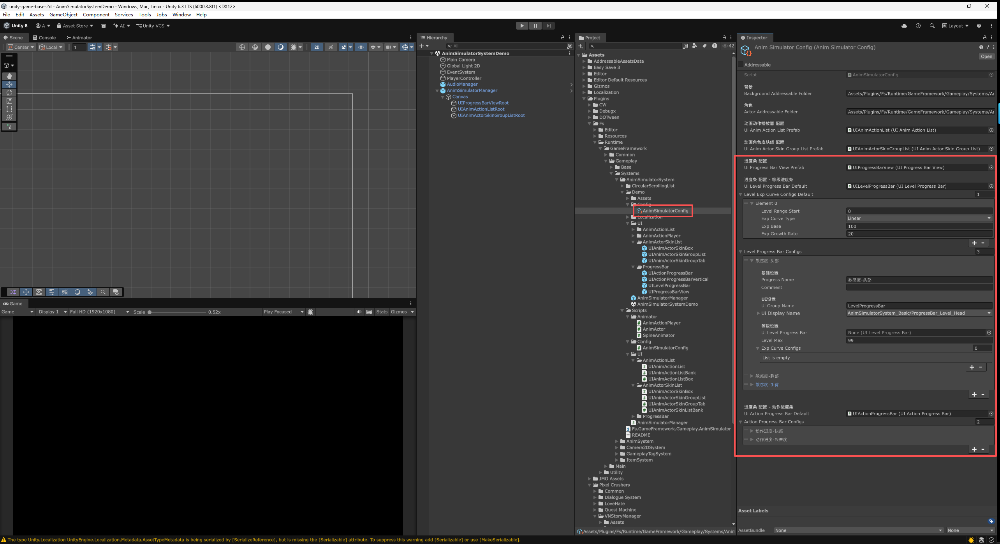

- Ui Progress Bar View Prefab：进度条UI视口的预制体。可以替换成 自己制作的 UI预制体，来修改进度条的 UI样式。
  - 点击右侧配置的文件，就可以在 Project面板中，快速找到当前的预制体的源文件。
  - 建议将新制作的UI预制体，放置在 Assets/ProductAssets/AnimSimulator/UI/ 文件夹中，进行分类整理。
  - 建议直接复制整个UIProgressBarView预制体，因为UI预制体通常还会制作 UI动画、特效等相关的资源文件，这样能够保持UI预制体的 相关资源文件的完整性。
    
  - Ui Groups：进度条UI的分组。可以根据需求，配置多个不同的 进度条分组，分布在不同的排版位置。
    - Ui Group Name：分组名称。这个名称 仅用于配置文件之间的识别与指定。游戏中不显示。
    - Ui Group Root：分组根物体。自动生成的 进度条UI 会放置在这个物体下。可以调整这个物体的位置、排版等，来修改UI样式。

### 等级进度条 配置

随着玩家的操作 或其他系统的养成，会获得经验值，经验值的积累会提升等级，而等级的提升一般会作为解锁条件，来解锁更多的 动画动作、皮肤等内容。
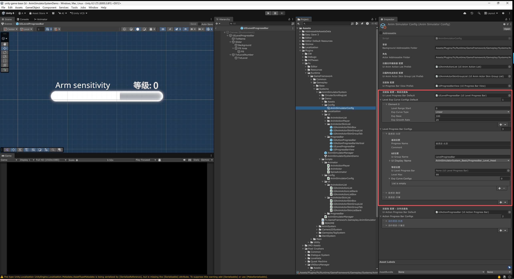

- Ui Level Progress Bar Default：默认的 等级进度条UI预制体。可以替换成 自己制作的 UI预制体，来修改等级进度条的 UI样式。
  - 每个 等级进度条还可以 单独配置不同的 UI预制体，来修改UI样式。但未单独配置时，会默认使用这里配置的 UI预制体。
- Level Exp Curve Configs Default：等级经验曲线配置，默认。可以替换成 自己制作的 等级经验曲线配置文件，来修改 等级所需经验的 增长曲线。
  - 每个 等级进度条还可以 单独配置不同的 等级经验曲线配置文件，但未单独配置时，会默认使用这里配置的 等级经验曲线配置文件。
  - Level Range Start：起始等级范围。大于等于这个等级时，使用这个 经验增长曲线的配置。可以在不同的等级范围，配置多组不同的 经验增长曲线。
  - Exp Curve Type：等级经验曲线类型。决定每一级所需经验的计算方式。
    - Linear：线性增长，每升一级，所需经验增加一个固定的数值，适合于等级较低，或者想要让玩家快速升级的情况。所需经验 = 经验基础值 + (等级 * 经验增长率)。
    - Exponent：指数增长，每升一级，所需经验增加的数值会越来越大，适合于等级较高，或者想要让玩家升级难度逐渐增加的情况。所需经验 = 经验基础值 * (等级 ^ 经验增长率)。
  - Exp Base：经验基础值。每一级所需经验的基础值。
  - Exp Growth Rate：经验增长率。根据曲线类型 与当前等级，调整每一级 所需经验的增长量。
- Level Progress Bar Configs：等级进度条 配置组。配置了所有 等级进度条。
  - Progress Name：进度条名称。这个名称 仅用于配置文件之间的识别与指定。游戏中不显示。
  - Comment：备注。仅用于配置文件之间的备注说明。游戏中不显示。
  - Ui Group Name：UI分组名称。会将 进度条 添加到指定 分组下。若为空，则不显示UI的进度条，但会保留 进度条功能。在之前提到的 Ui Groups 中的 Ui Group Name，等级进度条的UI物体，会自动生成在指定的 UI分组的 Ui Group Root物体下。
  - Ui Display Name：显示名称。玩家在UI中，看到的这个进度条的名称。通常是 多语言的条目，需要预先在 多语言系统中，添加好这个 文本条目。
  - Ui Level Progress Bar：等级进度条UI预制体。可以单独配置 不同的等级进度条UI预制体，来修改UI样式。未单独配置时，会默认使用 Ui Level Progress Bar Default中配置的 UI预制体。
  - Exp Curve Configs：等级经验曲线配置。可以单独配置 不同的等级经验曲线配置文件，来修改 等级所需经验的 增长曲线。未单独配置时，会默认使用 Level Exp Curve Configs Default中配置的 等级经验曲线配置文件。


- UI Level Progress Bar组件，是等级进度条UI预制体中的 核心组件。
  - Localize Txt Name：本地化文本，名称。通常不需要修改。点击已配置的内容，就可以在Hierarchy面板中，快速选中这个物体。直接修改 文本的排版、颜色、大小等，来修改UI样式。显示的文本内容，会根据 [等级进度条配置](#等级进度条) 的 Ui Display Name(显示名称)进行替换。
  - Slider Progress：进度滑条组件。通常不需要修改。直接修改 滑条的大小、位置、排版等，来修改UI样式。滑条的填充量，会根据 当前经验值/升级所需经验值 的比例进行填充。
  - Slider Tween Base Duration：滑条数值平滑变化的 持续时间(秒)。当经验值发生变化时，滑条的填充量 会平滑地变化到 新的数值。数值越大，变化就越慢。
  - Txt Level Number：等级数字文本。通常不需要修改。直接修改 文本的排版、颜色、大小等，来修改UI样式。显示的文本内容，会根据 当前等级数值 来进行替换。

### 动作进度条 配置

随着玩家的操作 或道具的使用，会获得进度值，进度值会逐渐积累。当进度值达到 指定的数值时，就会触发一个动画动作，并消耗 指定的进度值。\
例如，玩家通过持续的操作，可以积累“快乐值”。当“快乐值”达到100时，就会自动触发角色的“跳舞动作”，并消耗掉“快乐值”。


- Ui Action Progress Bar Default：默认的 动作进度条UI预制体。可以替换成 自己制作的 UI预制体，来修改动作进度条的 UI样式。
  - 每个 动作进度条还可以 单独配置不同的 UI预制体，来修改UI样式，但未单独配置时，会默认使用这里配置的 UI预制体。
- Action Progress Bar Configs：动作进度条配置组。配置了所有 动作进度条。
  - Progress Name：进度条名称。这个名称 仅用于配置文件之间的识别与指定。游戏中不显示。
  - Comment：备注。仅用于配置文件之间的备注说明。游戏中不显示。
  - Ui Group Name：UI分组名称。会将 进度条 添加到指定 分组下。若为空，则不显示UI的进度条，但会保留 进度条功能。在之前提到的 Ui Groups 中的 Ui Group Name，动作进度条的UI物体，会自动生成在指定的 UI分组的 Ui Group Root物体下。
  - Ui Display Name：显示名称。玩家在UI中，看到的这个进度条的名称。通常是 多语言的条目，需要预先在 多语言系统中，添加好这个 文本条目。
  - Ui Action Progress Bar：动作进度条UI预制体。可以单独配置 不同的动作进度条UI预制体，来修改UI样式。未单独配置时，会默认使用 Ui Action Progress Bar Default中配置的 UI预制体。
  - Progress Value Max：当前进度值达到该值后，进度条将视为满值，进度达到100%。
  - Progress Value Limit：进度条的限制值。获取的进度值总和达到该值后，进度条将不再增加。以此来限制可以播放的动画动作的 总体上限。
  - Action Play Configs：动画动作 配置组。配置了这个 动作进度条中，所有的动画动作，以及对应的触发条件、消耗进度值等。
    - Action Player Name：动画动作播放器 名称。对指定的 动画动作播放器 进行操作。这个名称 需要配置在 [动画动作播放器](#动画动作播放器) 中的 Action Player Name栏中，来进行指定。
      - 所有 [角色预制体](#角色预制体) 中，配置的 [动画动作播放器](#动画动作播放器)，建议使用 同一套 Action Player Name名称，这样就可以通过相同的一个名称，来同时对 所有角色预制体 中的动画动作播放器 进行操作。
    - Anim Action Play Type：动作的播放方式。
      - Auto：自动。当进度值 达到要求时，自动触发 动画动作的播放。
      - Manual：手动。当进度值 达到要求时，不会自动触发，而是需要玩家 手动点击UI按钮，来触发 动画动作的播放。
    - Anim Action Select Type：动作的播放选择方式。
      - Select：选择。由玩家在 动画动作的列表中，进行选择。
      - Order：顺序。直接按照配置的顺序，一次一个 播放动画动作。
      - Random：随机。在所有的动画动作中，随机 播放动画动作。
    - Action Play Count：动作播放次数。最多可播放的动作次数，0表示不限制次数。达到该次数后，即使进度值满足要求，也无法播放动作。
    - Progress Value Required：进度值 要求。触发这个动画动作的播放，需要达到的进度值。
    - Progress Value Consume：进度值 消耗。触发这个动画动作的播放后，需要消耗的进度值。

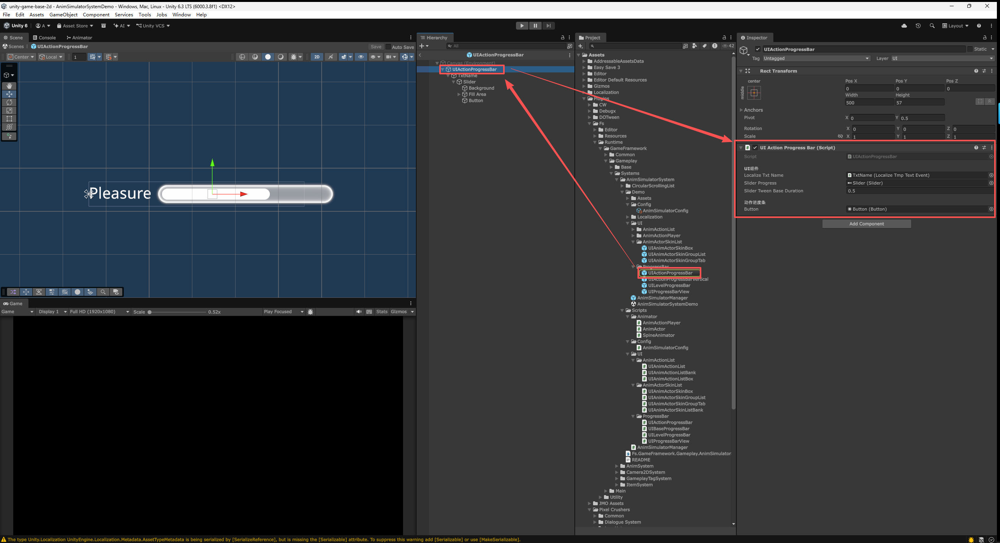

- UI Action Progress Bar组件，是动作进度条UI预制体中的 核心组件。
  - Localize Txt Name：本地化文本，名称。通常不需要修改。点击已配置的内容，就可以在Hierarchy面板中，快速选中这个物体。直接修改 文本的排版、颜色、大小等，来修改UI样式。显示的文本内容，会根据 [动作进度条配置](#动作进度条) 的 Ui Display Name(显示名称)进行替换。
  - Slider Progress：进度滑条组件。通常不需要修改。直接修改 滑条的大小、位置、排版等，来修改UI样式。滑条的填充量，会根据 当前进度值/Progress Value Required(进度值要求) 的比例进行填充。
  - Slider Tween Base Duration：滑条数值平滑变化的 持续时间(秒)。当进度值发生变化时，滑条的填充量 会平滑地变化到 新的数值。数值越大，变化就越慢。
  - Button：播放动作的按钮。当 Anim Action Play Type(动画动作播放方式)设置成 Manual(手动)时，这个按钮会被激活显示，玩家需要点击这个按钮，来触发动画动作的播放。可以调整这个按钮组件的大小、位置等，来修改按钮的可点击范围。

# 动画模拟器 使用

使用 动画模拟器系统，通常需要在 Unity中 进行一些配置，例如，角色预制体的制作、动画动作播放器的摆放与配置、进度条的配置、皮肤列表的配置等。

## 角色预制体

角色预制体 需要放置在 系统配置中 [资源文件路径](#资源文件路径) 中指定的角色文件夹路径下，才可以在动画模拟器系统中进行配置与使用。\

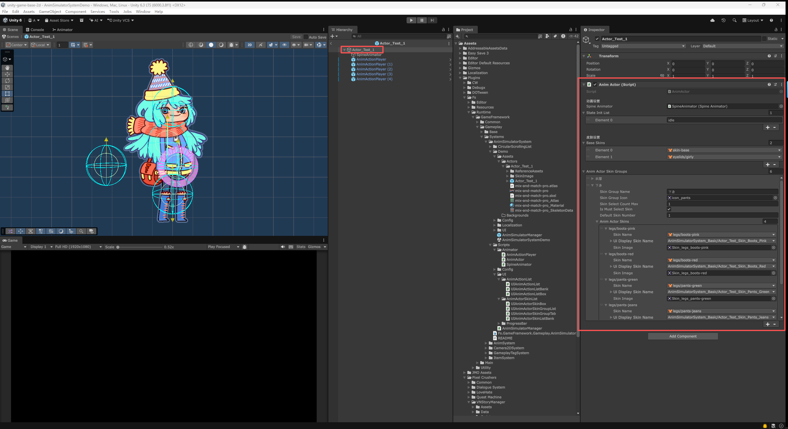

- 角色预制体的根物体，需要挂载 AnimActor组件。
  - AnimActor组件 是角色预制体的核心组件，负责管理角色的动画状态、皮肤等动画相关的功能。
  - State Init List：状态初始化列表。状态的切换，通常会伴随 动画的切换。状态列表与对应的动画组，通常在子物体的 Spine Animator(动画播放器)或 Live2D Animator组件中进行配置。
  - Base Skins：基础皮肤列表。角色的基础皮肤，会始终存在，不会被替换。通常用于角色的基础服装、身体等部位的皮肤配置。

### 皮肤组

- Anim Actor Skin Groups：角色皮肤组列表。配置了角色上所有可切换的皮肤，按照配置 在UI中分组显示，供玩家进行选择切换。通常用于角色的换装系统的配置。
  - Skin Group Name：皮肤组名称。这个名称 仅用于配置文件之间的识别与指定。游戏中仅显示 Skin Group Icon 中配置的图标。
  - Skin Group Icon：皮肤组图标。这个图标 会显示在UI中，作为这个皮肤组的代表图标，玩家通过点击这个图标，来选择切换这个皮肤组。
  - Skin Select Count Max：皮肤选择的最大数量。同时可应用的皮肤 最大数量，0则不限制。例如，饰品的皮肤组，可以同时选择多个饰品皮肤。眼睛的皮肤组，通常只能选择 一个眼睛皮肤。
  - Is Must Select Skin：必须选择皮肤。是否 必须选择 至少一个皮肤。例如，眼睛的皮肤组，必须选择一个眼睛皮肤。饰品的皮肤组，可以不选择任何一个饰品皮肤。
  - Default Skin Number：默认皮肤序号。在必须选择皮肤时，默认选择的皮肤序号。从1开始计数。
  - Anim Actor Skins：角色皮肤列表。配置了这个皮肤组中，所有的皮肤选项。每个皮肤选项，代表一个可切换的皮肤。
    - Skin Name：皮肤名称。Spine或Live2D中制作的皮肤，通常会通过 文本名称 来进行指定。 这个名称 仅用于配置文件之间的 识别与指定。游戏中显示的名称，需要在 UiDisplaySkinName(显示皮肤名称)中进行设置。
    - Ui Display Skin Name：显示皮肤名称。玩家在UI中，看到的这个皮肤的名称。通常是 多语言的条目，需要预先在 多语言系统中，添加好这个 文本条目。
    - Skin Image：皮肤图标。这个图标 会显示在UI中，作为这个皮肤的 预览图标，玩家通过点击这个图标，来选择切换这个皮肤。

## 动画动作播放器


- AnimActionPlayer(动画动作播放器)，用于配置 角色身上可以被 玩家操作的动画动作。
  - 可以将 AnimActionPlayer预制体，直接拖拽放置到 角色预制体中。也可以自己手动创建空物体，并挂载 AnimActionPlayer组件(SphereCollider组件通常会自动添加)来完成。通过预制体的方式，能够直接使用 已经配置好的 组件与参数，节省了配置的时间。
  - Action Player Name：动画动作播放器名称。这个名称 仅用于配置文件之间的识别与指定。
  - Comment：备注。对于这个动画动作播放器的备注说明，便于策划进行识别与区分。
  - Spine Animator：Spine动画播放器。这个组件 是Spine动画的核心组件，负责Spine动画的播放与控制。通常会自动寻找并挂载到预制体上，如果没有找到，也可以手动添加并配置。
  - Anim Track Default：动画轨道默认值。当通过这个动画动作播放器，触发播放动画时，如果没有在动画动作的配置中，指定动画轨道，就会使用这个默认的动画轨道。
  - Anim Track Sub Default：动画子轨道默认值。当通过这个动画动作播放器，触发播放动画时，如果没有在动画动作的配置中，指定动画子轨道，就会使用这个默认的动画子轨道。
  - Play Anim Action Interval Time：最小间隔时间，连续播放 动画动作的 最小间隔时间，单位是秒。避免玩家连续快速地 触发动画动作，导致动画播放过于频繁，影响动画播放效果。一般设置成0.5秒左右。
  - Stop Anim Action Delay Time：停止动画动作 延迟时间。单位是秒。动画动作 播放完成 或 玩家停止操作后，等待指定时间后，才停止动画动作的播放。一般设置成0.5秒左右，能够让动画动作的停止更自然一些。
  - Anim Action Player Type：动画动作播放器 类型。用于区分不同的 动画动作播放器类别。
    - Operate(玩家操作)：通过玩家的交互操作 来触发动画动作的播放。
    - ProgressBar(进度条控制)：通过进度条的进度 来触发动画动作的播放。
  - Anim Action Select Type：动画动作选择类型。用于区分不同的 动画动作选择方式。
    - Select(选择)：玩家在操作时，会有一个选择列表 来选择想要触发的 动画动作。
    - Random(随机)：每次玩家在操作时，都会随机触发一个动画动作。可以通过调整 每个动画动作的权重值，来调整被 随机到的概率。

### 动画动作列表

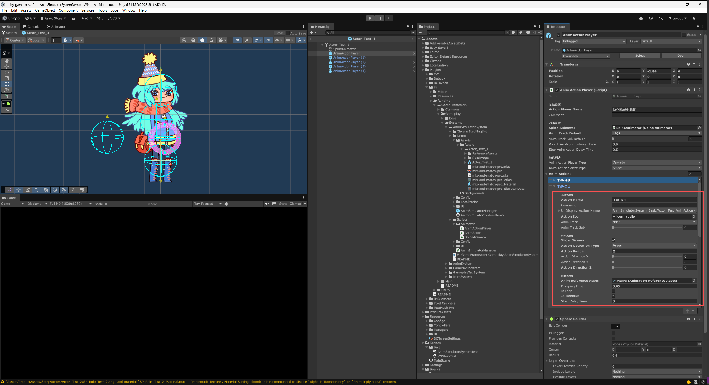

- Anim Actions：动画动作列表。配置了这个动画动作播放器中，所有的动画动作选项。每个动画动作选项，代表一个可触发的动画动作。
  - Action Name：动作名称。这个名称 仅用于配置文件之间的识别与指定。UI中显示的名称，需要在 UiDisplayActionName(显示动作名称)中进行设置。
  - Comment：备注。对于这个动画动作的备注说明，便于策划进行识别与区分。
  - Ui Display Action Name：显示动作名称。玩家在UI中，看到的这个动画动作的名称。通常是 多语言的条目，需要预先在 多语言系统中，添加好这个 文本条目。
  - Action Icon：动作图标。这个图标 会显示在UI中，作为这个动画动作的预览图标。
  - Anim Track：动画轨道。用于不同类型的动画的区分，便于分类整理。不同轨道的动画 可以同时播放。在上面的 Anim Track Default(动画轨道默认值)中，配置了默认的动画轨道，如果在这里没有 指定动画轨道(设置为None)，就会使用默认的动画轨道。
  - Anim Track Sub：动画子轨道。用于同一类型动画的区分，便于分类整理。不同子轨道的动画 可以同时播放。在上面的 Anim Track Sub Default(动画子轨道默认值)中，配置了默认的动画子轨道，如果在这里没有 指定动画子轨道(设置为None)，就会使用默认的动画子轨道。
  - Show Gizmos：显示线框。在Scene场景视图中，是否显示这个动画动作的交互范围的线框。便于调整交互范围的位置与大小。
  - Action Operation Type：动作操作类型。这个动画动作 是通过什么方式 来触发的。
    - Click(点击)：点击后，直接播放 动画动作。
    - Drag(拖拽)：沿着指定方向来回拖拽，作为动画播放的进度参数。
    - Rotate(旋转)：绕指定中心拖拽旋转，作为动画播放的进度参数。
    - Press(按压)：长按时，动画进度涨到100%。松开时，动画进度落到0%。
  - Action Range：动作的交互范围。交互范围的大小，影响动画进度的变化程度。例如，拖拽到范围边缘时，动画进度涨到100%，拖拽到范围中心时，动画进度为0%。一般设置成2.0左右。
  - Action Direction X：动作的交互方向 X轴。对交互方向的X轴进行旋转，调整交互的方向。例如，拖拽的交互方向，默认是水平垂直向上的，可以通过这个值进行选择来调整。
  - Action Direction Y：动作的交互方向 Y轴。对交互方向的Y轴进行旋转，调整交互的方向。
  - Action Direction Z：动作的交互方向 Z轴。对交互方向的Z轴进行旋转，调整交互的方向。
  - Anim Reference Asset：动画引用文件。这个文件 是从Spine导入到Unity中的SkeletonData资源文件，包含了Spine动画的所有数据。通过这个文件，来指定这个动画动作所使用的 动画资源。
  - Damping Time：阻尼时间。用于平滑过渡动画的进度变化，单位是秒。一般设置成0.05秒左右，能够让动画进度的变化更自然一些。增大这个值，可以让动画的反应更迟钝，更有重量感。
  - Is Loop：是否循环。这个动画动作 是否需要循环播放。例如，从Idle动画切换到Walk动画，两个动画均为循环动画，那么这个动画动作就需要设置成 循环。
  - Is Reverse：是否反向。这个动画动作 是否需要反向播放。
  - Start Delay Time：开始延迟时间，单位是秒。玩家触发这个动画动作后，等待指定时间，才开始播放动画。

    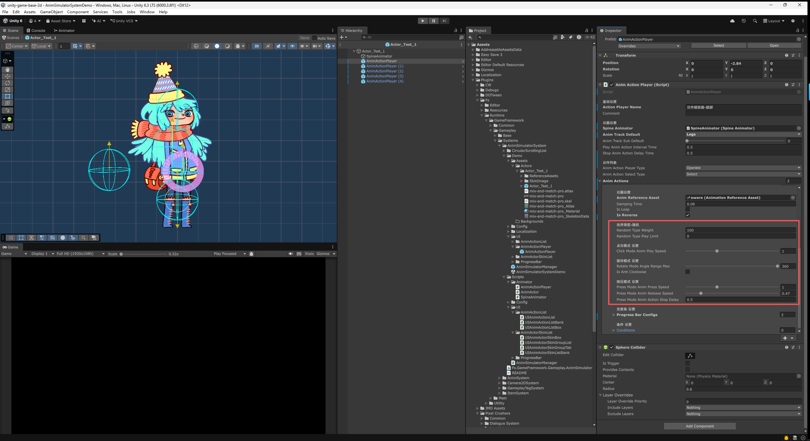
  - 当动画动作播放器的 Anim Action Select Type(动画动作选择类型)设置成 Random(随机)时，需要配置 Random类型相关的参数。
  - Random Type Weight：随机权重。权重值越大，被随机到的概率就越大。随机概率 = 这个动画动作的权重值 / 所有动画动作的权重值总和。例如，两个动画动作，动画动作A的权重值是10，动画动作B的权重值是40，那么动画动作A被随机到的概率就是10/(10+40)=20%，动画动作B被随机到的概率就是40/(10+40)=80%。
  - Random Type Play Limit：限制播放次数。这个动画动作可以被播放的最大次数，达到这个次数后，就不会再被随机到。设置为0则不限制。
  - Click Mode Anim Play Speed：点击模式 动画播放速度。这个动画动作的动画播放速度的倍速，默认为1.0。
  - Rotate Mode Angle Range Max：旋转模式 角度范围最大值，单位是 度。旋转的角度达到这个最大值时，动画进度涨到100%。设置为360度时，可以进行全方位的旋转交互。设置为180度时，可以进行半周的旋转交互。
  - Is Anti Clockwise：是否逆时针。旋转交互时，是否 逆时针的方向来进行旋转。
  - Press Mode Anim Press Speed：按压模式 动画按压速度。在按压时 动画进度 上涨的速度倍率，默认为1.0。
  - Press Mode Anim Release Speed：按压模式 动画松开速度。在松开时 动画进度 下降的速度倍率，默认为1.0。
  - Press Mode Anim Action Stop Delay：按压模式 动画动作停止延迟时间（秒），按压松开 并不进行操作后，等待一段时间 再停止动作。

    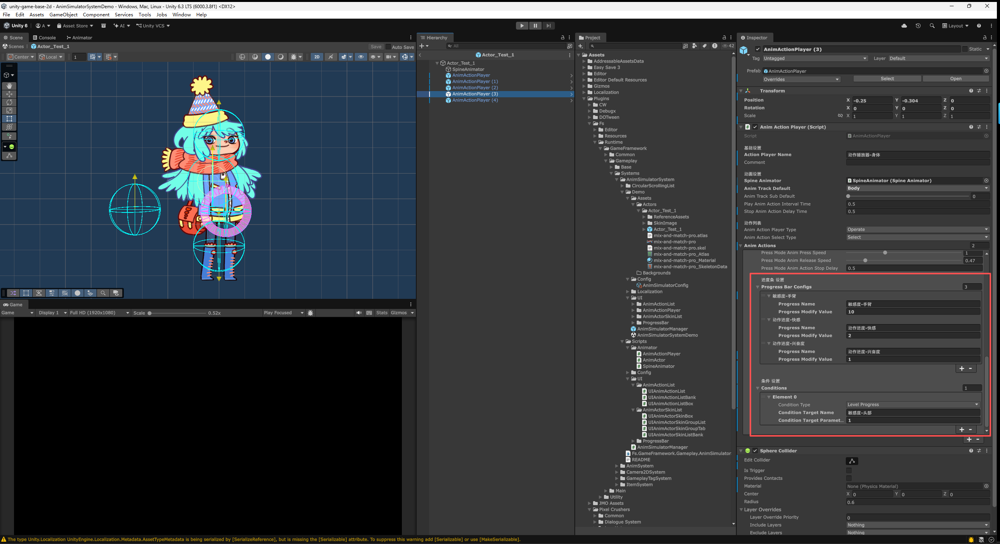
  - Progress Bar Configs：进度条 配置组。动作关联的 进度条 配置组，对进度条 进行操作。
    - Progress Name：进度条名称。指定关联的 进度条名称。进度条需要在 系统配置的 [进度条配置](#进度条-配置) 中进行配置。
    - Progress Modify Value：进度条 修改值。完成一次动画动作，对进度条 进行增加或减少的值。配置为负数时，就会对进度条进行减少。
  - Conditions：条件组。满足所有条件，动作才会在 动画动作列表 中出现。
    - Condition Type：条件类型。用于区分不同的条件类型。
      - Level Progress：等级进度。
        - Condition Target Name：条件目标名称，等级进度条名称。等级进度条需要在 系统配置的 [进度条配置](#进度条-配置) 中进行配置。
        - Condition Target Parameter：条件目标参数值，达到指定的 等级后，满足条件。
      - Item：道具。
        - Condition Target Name：条件目标名称，道具ID。根据游戏中道具系统的配置，指定道具ID。
        - Condition Target Parameter：条件目标参数值，道具数量。拥有指定数量的道具后，满足条件。
    - Condition Target Name：条件目标名称。根据条件类型的不同，指定不同的目标名称。
    - Condition Target Parameter：条件目标参数值。根据条件类型的不同，指定不同的目标参数值。

### 动画动作列表UI 制作与排错

上面的 [动画动作列表](#动画动作列表) 讲的是**数据**（AnimActionPlayer 上配置了哪些动作）。这一节讲的是**显示这些数据的 UI 预制体**（`UIAnimActionList.prefab`）：玩家把光标移到角色身上时淡入、滚动选择动作的那个列表。

自 2.0.0 起，这个列表由第三方的 CircularScrollingList 改为 Unity 原生 `ScrollRect` + toolkit 的虚拟滚动列表（`UiwFocusOrderList`）。两者的驱动方式完全不同，**下面这些点在原来的实现里都不存在**，是重做后新增的约束——不满足时的表现往往非常具有迷惑性（比如"列表明明显示出来了却一动不动"），故单列一节。

#### 预制体结构

```
UIAnimActionList              ← Animator（淡入淡出 / 开合动画）+ UIAnimActionList 脚本
├─ CircularScrollingList      ← CanvasGroup + ScrollRect + UIAnimActionScrollList
│  └─ Viewport                ← RectMask2D + 透明 Image（必需，见要点 ②）
│     └─ Content              ← 空 RectTransform，格子由脚本实例化到此
└─ CircleClickTip             ← 纯视觉的点击提示，不参与射线
   └─ ImgCircleClickTip
```

- `CircularScrollingList` 这个**节点名是历史遗留**（2.0.0 之前挂的是同名的第三方组件），现在挂的是 Unity 原生 ScrollRect。不要改名——4 个动画剪辑（`A_FadeIn` / `A_FadeOut` / `A_ListOpen` / `A_ListClose`）的曲线是**按节点路径名绑定**的，改名会让整套开合动画失配。同理，`CircleClickTip` 也不要挪层级。
- 列表的显示 / 隐藏由 Animator 驱动 `CircularScrollingList` 上 CanvasGroup 的 `Alpha` 与 `Blocks Raycasts`：`A_ListOpen` 置 1、`A_ListClose` / `A_FadeOut` 置 0。**收起状态下列表是收不到任何 UI 射线的**，这是有意为之。
- 格子预制体（`UIAnimActionListBox.prefab`）挂在 `UIAnimActionScrollList` 的 `Cell Prefab` 上，不要作为子物体预先摆进 Content —— 格子由虚拟滚动按需实例化与复用。

#### 配置要点

**① Content 的尺寸由脚本接管，不要手动设置，也不要挂 Layout Group / Content Size Fitter。**

- **行高**自动取自 `Cell Prefab` 根 RectTransform 的高度（示例中为 60）。想改行距就改格子预制体的高度。
- **Content 高度** = 条目数 × 行高 **+ 首尾留白**。
- **首尾留白**是焦点列表特有的：`Focus Anchor` 设为 `Center` 时，第一条和最后一条也必须能滚到视口正中，所以 Content 头尾各补 `(视口高 − 行高) / 2`。
- ⚠️ 这一项需要 **`com.ale.toolkit` ≥ 1.7.1**。低于该版本时没有留白，动作只有 3 条时 Content 仅 180px、比 400px 的视口还矮，ScrollRect 判定"无内容可滚"——表现为**条目全挤在列表顶部、滚轮完全没反应**；即便动作很多，首尾各半个视口的条目也**永远无法被选中**。

**② Viewport 上必须有一张"透明但可命中"的 Image。**

原生 ScrollRect 靠 UI 射线收滚轮：光标必须命中某个 Raycast Target，事件才会沿父链冒泡到 ScrollRect。原来的 CircularScrollingList 是自己轮询鼠标滚轮的，不依赖射线，所以旧预制体上没有这张图——重做后必须补。两个设置**缺一不可**：

- `Image`：`Color` 的 **A = 0**、**`Raycast Target` 勾选**
- `CanvasRenderer`：**`Cull Transparent Mesh` 不要勾** ← 最容易漏。勾上后 alpha 为 0 的图形会被剔除，**连带失去射线命中**，等于白加

漏掉时的表现：只有光标恰好压在某个格子的图标或文字上才滚得动，格子之间的空隙一滚就停。

**③ Viewport 宽度必须容得下动作名标签。**

`RectMask2D` 是按 Viewport 矩形裁剪的，而动作名标签是自格子中心**向右伸出**的（示例中 `ImgNameLabel` 伸到 +150px）。Viewport 只有 100px 宽时，动作名会被齐根切掉、只剩中间的图标。示例取 500×400（**关于中心对称**加宽，格子与其子物体的相对位置不受影响）。调整动作名排版时，记得同步复查这个宽度。

**④ 滚轮的步长与平滑位移，分别由两个组件上的两个字段控制。**

| 字段 | 在哪 | 含义 |
|---|---|---|
| `Scroll Sensitivity` | ScrollRect | **一档滚轮走多远**（像素）。设为行高（示例 60），一档正好一条动作；否则会停在两条之间 |
| `Scroll Tween Duration` | UIAnimActionScrollList | **一档走完用多久**（秒）。默认 0.1；设为 0 则恢复瞬间跳变 |

`Movement Type` 建议 `Clamped`，滚到两端不回弹过冲。

⚠️ **`Scroll Sensitivity` 在运行期会被列表取走并置 0**，这是有意的，不是 bug。原因是 `ScrollRect` 与 `UIAnimActionScrollList` 挂在同一个 GameObject 上，而 `ExecuteEvents` 会把滚轮事件派发给该物体上**全部** `IScrollHandler`——两者都会收到。不把 `ScrollRect` 的灵敏度清零，就会先被它瞬间挪一档、再被补间从头拉回，白抖一帧。清零后位移完全由列表给出，行为唯一。

- 这只改运行期的字段值，**不动预制体**——Inspector 上的 `Scroll Sensitivity` 仍是「一档滚多远」的唯一可调入口，只是改由列表来应用它。
- 所以**运行时读到 `scrollSensitivity` 为 0 属正常**，别照着它去反推「滚轮坏了」。
- 连滚数档时按**目标位置**累加，而非按当前位置——否则每档都从半路重新起算，越滚越短、最后停在两条之间。

> 已知限制：**拖拽滚动松手后不做吸附对齐**。停在两条之间时，焦点缩放曲线会让上下两条都呈半放大态。只用滚轮不受影响（一档整格步进，且拖拽开始时会取消进行中的补间）。

**⑤ 场景 EventSystem 的输入模块必须接线（最隐蔽的一条）。**

本系统有**两条互相独立**的输入通路，务必先分清：

| 通路 | 走什么 | 负责什么 |
|---|---|---|
| 角色交互 | `AnimSimulatorManager` 的 `ToolkitInputBinder` + **物理射线**（`Physics2D.GetRayIntersection`） | 光标移动、列表的悬停淡入 / 展开、点击 / 拖拽 / 旋转 / 按压驱动动画 |
| 列表交互 | **UI EventSystem**（`GraphicRaycaster` + `InputSystemUIInputModule`） | 列表滚轮、格子点击 |

角色交互**完全绕开 EventSystem**。所以 EventSystem 一旦坏掉，**悬停展开一切正常，只有列表滚不动、格子点不动**——极易误判成列表本身的问题。检查项：

- EventSystem 上 `InputSystemUIInputModule` 的 `Actions Asset`，以及 `Point` / `Left Click` / `Scroll Wheel` 等动作引用，必须都指向工程内**确实存在**的 `.inputactions` 资产。引用指向一份已被删除的资产时，Inspector 里**看起来仍有名字**（如 `UI/ScrollWheel`），但实际解析为 null，不会有任何报错。
- 场景里的 `PlayerInput` 若设置了 `UI Input Module`，它会在运行时用**自己的** Actions 覆盖模块的 Actions Asset，并按「动作图名/动作名」重映射引用。**两边应指向同一份资产**，否则重映射可能整体落空、把引用全部洗成 null。
- Demo 场景就踩过这个坑：模块引用的是一份随 Fs 插件一起消失的 `.inputactions`（GUID 在工程中已不存在），十个动作引用全部解析失败，UI 指针事件一个都产不出来。现已改为与 `PlayerInput` 共用 `Assets/InputSystem_Actions.inputactions`。

#### 排错速查

| 症状 | 最可能的原因 | 怎么确认 |
|---|---|---|
| 条目全挤在列表顶部，滚轮完全没反应 | ① 缺首尾留白（toolkit < 1.7.1） | 比一下 Content 高度是否 ≤ Viewport 高度 |
| 首尾几条动作永远选不中，中间的正常 | ① 同上 | 滚到底，看焦点能否落到最后一条 |
| 只有压在格子上才滚得动，空隙处滚不动 | ② Viewport 缺可命中 Image，或勾了 Cull Transparent Mesh | 查 Viewport 的 Image 与 CanvasRenderer |
| 滚轮和格子点击都没反应，但悬停展开正常 | ⑤ EventSystem 输入模块引用失效 | 播放时查模块的 `scrollWheel` / `point` 是否为空 |
| 动作名看不见，只剩中间的图标 | ③ Viewport 太窄，被 RectMask2D 裁掉 | 把 Viewport 加宽，看标签是否回来 |
| 一档滚轮跳过好几条，或总停在两条之间 | ④ Scroll Sensitivity 与行高不一致 | 令其等于 Cell Prefab 的高度 |
| 滚轮切换条目是瞬间跳变的 | ④ Scroll Tween Duration 为 0，或 toolkit < 1.7.2 | 把它设为 0.1 左右 |
| 滚轮位移过慢 / 拖沓 | ④ Scroll Tween Duration 过大 | 0.1 秒是较跟手的取值，超过 0.2 会明显发黏 |
| 运行时看到 Scroll Sensitivity 变成 0 | 正常现象，列表按 ④ 接管了滚轮 | 看预制体上的值是否仍是行高 |
| 格子位置错乱 / 相互重叠 | Content 上挂了 Layout Group 或 Content Size Fitter | 移除这些组件，定位交回虚拟滚动 |
| 列表已淡出却仍挡住背后的点击 | 开合动画未把 `Blocks Raycasts` 归 0 | 查 `A_ListClose` / `A_FadeOut` 的曲线 |

#### 运行期自检片段

排查"到底是列表的问题还是 EventSystem 的问题"时，进入播放模式后执行下面这段即可分辨。它先看输入模块有没有动作，再直接给列表合成一个滚轮事件——**若合成事件能滚而实际滚轮不能，问题就一定在 EventSystem 一侧**。

```csharp
// 1) 输入模块是否拿得到动作
var uim = UnityEngine.EventSystems.EventSystem.current.currentInputModule
          as UnityEngine.InputSystem.UI.InputSystemUIInputModule;
Debug.Log($"scrollWheel = {(uim.scrollWheel?.action == null ? "未接线!" : uim.scrollWheel.action.name)}");
Debug.Log($"point       = {(uim.point?.action == null ? "未接线!" : uim.point.action.name)}");

// 2) 给列表合成一个滚轮事件，看 Content 会不会动
var scrollRect = /* 列表上的 ScrollRect */;
var ped = new UnityEngine.EventSystems.PointerEventData(UnityEngine.EventSystems.EventSystem.current)
{
    position    = RectTransformUtility.WorldToScreenPoint(null, scrollRect.viewport.position),
    scrollDelta = new Vector2(0f, -1f),   // 向下滚一档
};
var hits = new System.Collections.Generic.List<UnityEngine.EventSystems.RaycastResult>();
UnityEngine.EventSystems.EventSystem.current.RaycastAll(ped, hits);
Debug.Log($"射线命中 {hits.Count} 个，最上层 = {(hits.Count > 0 ? hits[0].gameObject.name : "无")}");
if (hits.Count > 0)
{
    ped.pointerCurrentRaycast = hits[0];
    var handler = UnityEngine.EventSystems.ExecuteEvents.ExecuteHierarchy(
        hits[0].gameObject, ped, UnityEngine.EventSystems.ExecuteEvents.scrollHandler);
    Debug.Log($"滚轮由 {(handler ? handler.name : "无人")} 处理，Content = {scrollRect.content.anchoredPosition}");
}
```

判读方式：

- **射线命中 0 个** → 列表处于收起态（`Blocks Raycasts` 为 0），或要点 ② 没配好。
- **命中了但"无人处理"** → 命中的对象不在 ScrollRect 的子树下（例如被某个兄弟节点的图形挡在了上层）。
- **Content 动了，但实际滚轮不动** → 列表侧没问题，去查要点 ⑤ 的输入模块。

## 背景预制体

背景预制体 需要放置在 系统配置中 [资源文件路径](#资源文件路径) 中指定的背景文件夹路径下，才可以在动画模拟器系统中进行配置与使用。\
背景预制体 与 角色预制体的 配置方式 其实是相同的，都是由Spine动画资源导入到Unity中，制作成预制体，并挂载AnimActor组件与Spine Animator组件来完成。\
做出区分是为了方便 分类整理，以及在系统配置中，能够区分背景与角色的文件夹路径，来进行不同的资源管理。
