# AnimSimulatorSystem 动画模拟器系统-美术资产规范

此插件，是在 Unity 中使用 Spine 或 Live2D 制作的 2D 动画资源，进行游玩的 动画模拟器系统。\
可使用光标进行 点击、拖拽、旋转、按压 4 种操作方式，来游玩 2D 动画资源的 动画动作，并支持可分组的 自定义换装。

在这里对各类 美术资产 的 格式、尺寸、布局 等规范进行说明。\
美术在制作 相关资产 时，请参考以下规范进行制作。

# 📜目录

- [AnimSimulatorSystem 动画模拟器系统-美术资产规范](#animsimulatorsystem-动画模拟器系统-美术资产规范)
- [📜目录](#目录)
- [示例场景](#示例场景)
- [原文件规范](#原文件规范)
- [背景图片](#背景图片)
- [角色头像图片](#角色头像图片)
- [角色](#角色)
    - [「图层拆分-2D动画用」](#图层拆分-2d动画用)
    - [「Spine动画预制体」](#spine动画预制体)
- [特效](#特效)
- [音频](#音频)
- [富文本图标](#富文本图标)

# 示例场景

在示例场景中，演示了所有 动画模拟器 的功能与所需的 美术资产类型。\
示例场景以 UPM 的 Sample 形式随包分发，导入方法见 [AnimSimulatorSystem 使用文档](../../README.md#示例场景) 的「示例场景」一节。

# 原文件规范

- 美术在制作 各类 美术资产 时，建议 保留原文件 以便后续修改与调整。
  - 例如，使用 Photoshop 制作的 PSD 文件、使用 Illustrator 制作的 AI 文件、使用 Spine 软件 制作的 SPINE 文件 等。
- 制作要求：
  - 原文件的格式、尺寸、布局 等规范，可以根据 美术人员 的习惯 进行设计与制作。
  - 分辨率尺寸：尽量保持较大的 分辨率尺寸，以保证后续导出时的清晰度。例如，4K分辨率 3840x2160 像素。
  - 布局：建议根据 对象，进行单独的文件制作。例如，制作角色时，角色视觉重心 布局居中，每个角色一个单独的PSD文件。
  - 图层：单独的对象 或 前后遮挡 的部分，建议 分层制作 以便后续调整与修改。例如，耳环、挂饰、背后的头发、面部胸前的头发 等。
  - 色彩空间：建议设置成 sRGB色彩空间。CMYK色彩空间 主要用于 印刷制品，不适合 用于 数字显示设备。
- 导出为 最终使用的 美术资产 时，请参考 本文档 中的 各类 美术资产规范 进行导出与制作。例如，PNG格式、JPG格式、MP3格式 等。

# 背景图片

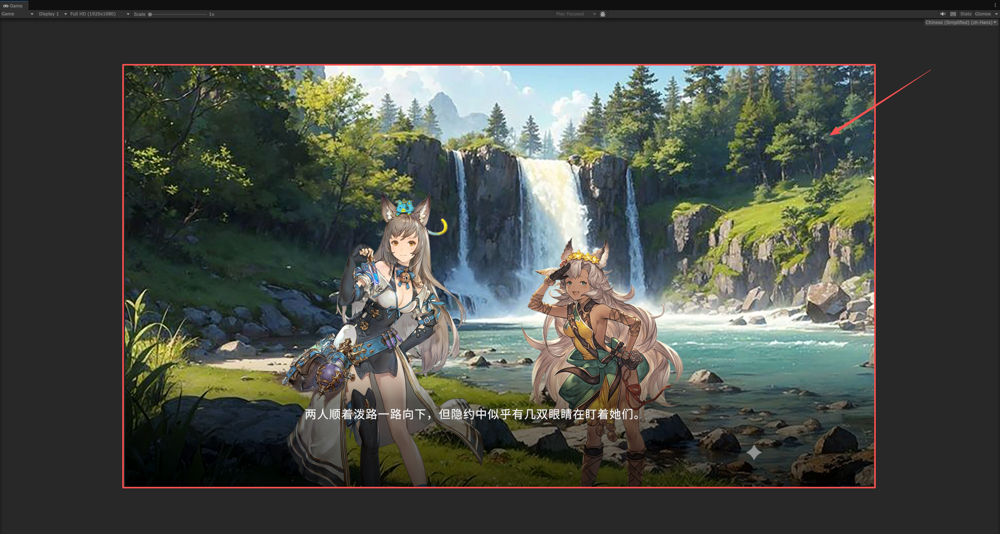

- 格式要求：
  - 建议使用 JPG 格式，以减小文件体积。因为背景图片通常不存在 半透明 区域。
  - 制作或导出时，如果有 色彩空间 选项，设置成 sRGB 色彩空间。
- 尺寸要求：
  - 宽高比例 16:9。
  - 建议使用 2560(宽)x1440(高) 像素。在高分辨率的显示器上，也能保证较高的清晰度。
  - 也支持 1920x1080、1280x720 等其他 16:9 比例的分辨率尺寸。

# 角色头像图片

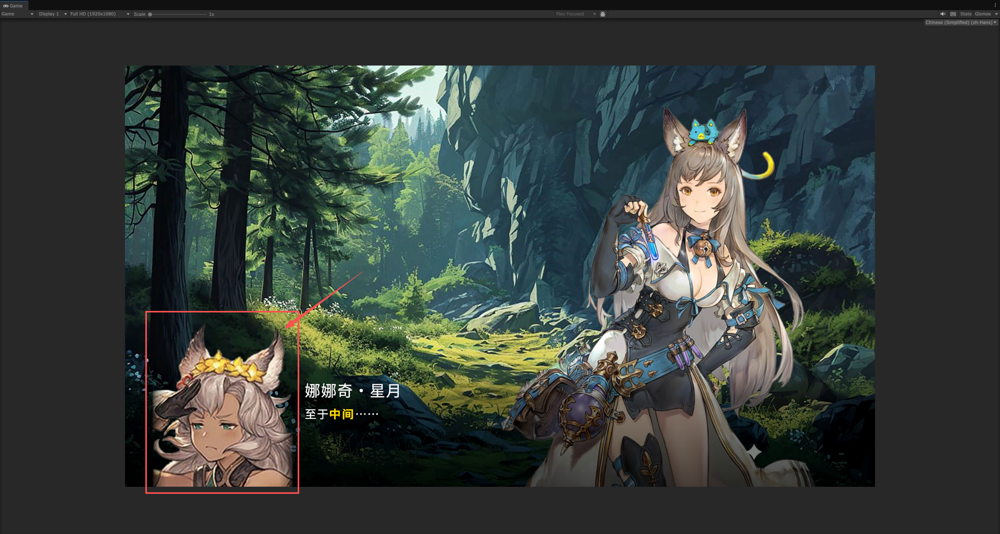

- 格式要求：
  - 建议使用 PNG 格式，以支持半透明区域。因为头像图片通常存在 半透明 区域。
  - 制作或导出时，如果有 色彩空间 选项，设置成 sRGB 色彩空间。
  - 也支持 JPG 格式。
- 尺寸要求：
  - 宽高比例 6:7。
  - 建议使用 360(宽)x420(高) 像素。

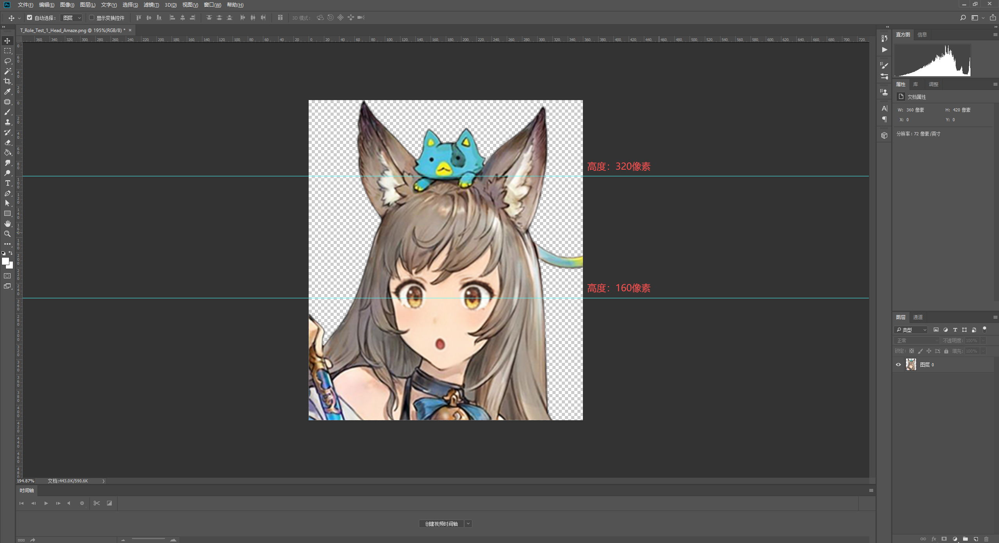

- 布局要求：
  - 眼睛的高度 建议在 160像素、头顶的高度 建议在 320像素。
  - 顶部直接留空 或用于 头部装饰物、兽人的耳朵等。

# 角色

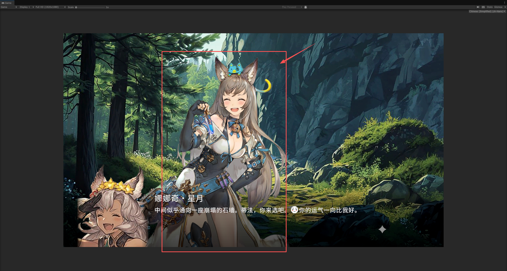

- 所有的角色 都建议制作成动画，并通过 局部的动画切换与组合，来实现 角色的各种 动作与表情的变化。
  - 本项目的 角色动画 通常由美术人员 使用 [Spine软件](https://zh.esotericsoftware.com/) 或 [Live2D软件](https://www.live2d.com/zh-CHS/) 进行制作。策划只需负责 角色动画的导入与配置。
- 制作或导出时，如果有 色彩空间 选项，设置成 sRGB 色彩空间。

### 「图层拆分-2D动画用」

- 角色的各个部位，建议根据 2D动画制作 的需求，进行 合理的图层拆分 与命名。
  - 可以参考 Spine软件官方教程-[如何为动画分割素材](https://zh.esotericsoftware.com/blog/How-to-cut-your-assets-for-animation)。
  - 可以参考 Spine软件官方项目-[着装混搭](https://zh.esotericsoftware.com/spine-examples-mix-and-match)。项目中完整地制作了 一个角色的图层拆分、骨骼绑定、网格蒙皮、皮肤切换、约束、IK、动画 等功能内容。
- 拆分规则：
  - 前后遮挡：根据 角色的 前后遮挡 关系，进行 图层拆分。
    - 例如，头发在脸的前面，脸在脖子的前面，衣服在手的前面 等。
  - 独立运动：根据 角色的 独立运动 的部位结构，进行 图层拆分。
    - 例如，乳房的左右要独立拆分。眼睛部分 独立拆分为 眼皮、眼白(白眼球)、瞳孔、上眼睑投影 等。
  - 差分部位：根据 角色的 各类差分部位，进行 图层拆分。
    - 例如，表情差分、服装差分、动作差分 等。
  - 服装：根据 角色的 各类服装，进行 图层拆分。
    - 贴身服装 会贴合身体运动，因此不需要进行单独拆分。例如，内衣、丝袜、手套 等。
    - 松散服装 会有独立运动，因此需要进行单独拆分。例如，大衣、披风、裙摆 等。
  - 装饰物：根据 角色的 各类装饰物，进行 图层拆分。
    - 例如，耳环、项链、发饰、宠物 等。

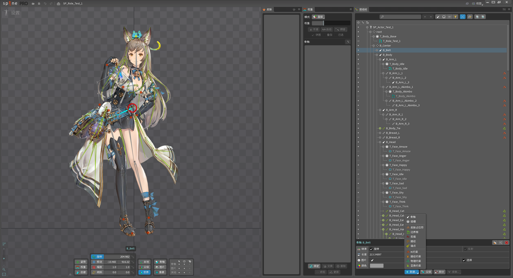

- 示例角色：一个角色的图层拆分示例。
  - 头部
    - 前发 Hair_Front：头部前方的头发部分
      - 发束：可以根据需要，按照发束 进行进一步拆分，例如 刘海 Bangs、侧发 Side_Hair 等。
    - 后发 Hair_Back：头部后方的头发部分
      - 发束：可以根据需要，按照发束 进行进一步拆分，例如 马尾 Ponytail、辫子 Braid 等。
    - 脸 Face：空白的整个头部区域
      - 鼻子 Nose：<一般不单独拆分>，与脸部合并。制作复杂的独立动画时，可以单独拆分。例如，猪鼻子、大象鼻子等。
      - 眉毛 Eyebrow：<一般不单独拆分>，与脸部合并。制作复杂的独立动画时，可以单独拆分。
        - 眉毛-左 Eyebrow_Left
        - 眉毛-右 Eyebrow_Right
      - 耳朵：<一般不单独拆分>，与脸部合并。制作复杂的独立动画时，可以单独拆分。
        - 耳朵-左 Ear_Left
        - 耳朵-右 Ear_Right
        - 例如，兽人的大耳朵 会有独立的抖动动画。
    - 眼睛：左右的眼睛通常会单独拆分。制作表情时，眼睛会有独立的运动。
      - 眼皮 Eye_Left_Lid：单独开合的上眼睑、下眼睑部分。
        - 眼睫毛 Eyelash_Left：<一般不单独拆分>，与眼皮合并。制作复杂的独立动画时，可以单独拆分。
      - 眼球 Eye_Left_Ball：单独运动的眼球部分。
        - 瞳孔 Pupil_Left：<一般不单独拆分>，与眼球合并。制作复杂的独立动画时，可以单独拆分。
        - 眼白 Eye_Left_White：<一般不单独拆分>，与眼球合并。制作复杂的独立动画时，可以单独拆分。
        - 眼睑投影 Eye_Left_Shadow：<一般不单独拆分>，与眼球合并。制作复杂的独立动画时，可以单独拆分。
    - 嘴巴 Mouth：单独开合的嘴巴部分。
      - 嘴唇 Mouth_Lips：<一般不单独拆分>，与嘴巴合并。制作复杂的独立动画时，可以单独拆分。
      - 口腔 Mouth_Inside：<一般不单独拆分>，与嘴巴合并。制作复杂的独立动画时，可以单独拆分。
      - 牙齿-上 Teeth_Upper：<一般不单独拆分>，与嘴巴合并。制作复杂的独立动画时，可以单独拆分。例如，嘴巴开合起伏时，牙齿上下会有轻微运动。
      - 牙齿-下 Teeth_Lower：<一般不单独拆分>，与嘴巴合并。制作复杂的独立动画时，可以单独拆分。
      - 舌头 Tongue：<一般不单独拆分>，与嘴巴合并。制作复杂的独立动画时，可以单独拆分。
    - 装饰物：
      - 例如，耳环 Earrings、项链 Necklace、发带 Hairband、头饰 Headpiece 等。
  - 身体
    - 身体 Body：通常是上半身的部分
      - 腰 Waist：<一般不单独拆分>，与身体合并。制作复杂的独立动画时，可以单独拆分。
      - 延伸至最底部的 会阴 部分，但不包括臀部。
    - 乳房：左右的乳房通常会 单独拆分。特别是有独立运动时。
      - 乳房-左 Bust_Left
      - 乳房-右 Bust_Right
    - 手臂：左右的手臂通常会单独拆分。特别是与其他部位有前后遮挡关系时。
      - 手臂-左 Arm_Left
      - 手臂-右 Arm_Right
    - 腿：左右的腿通常会单独拆分。特别是与其他部位有前后遮挡关系时。
      - 腿-左 Legs_Left
      - 腿-右 Legs_Right
      - 包括整个臀部，左右的臀部 单独拆分，与 身体底部的 会阴部分 进行组合。
    - 服装 Clothes：根据 服装的松紧与独立运动，进行合理拆分。
      - 贴身服装：<一般不单独拆分>，与身体、手臂、腿部合并。例如，内衣、丝袜、手套 等。
      - 松散服装：单独拆分。例如，大衣、披风、裙摆、腰带、背包 等。

### 「Spine动画预制体」

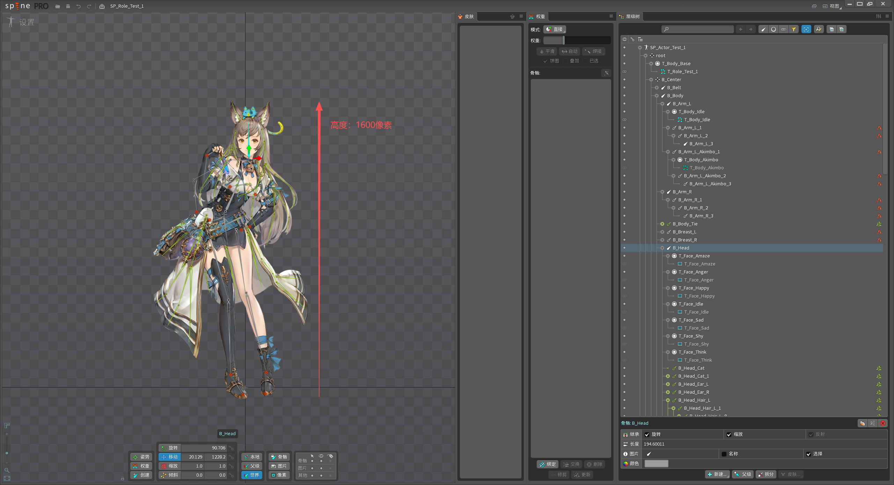

- 尺寸要求：
  - 制作角色动画时，分辨率按照 1米=1000像素 的比例进行制作。图示的角色 大约在 1.6米=1600像素。
  - 所有图片的图集，尽量控制在 2048x2048像素 之内。因此，角色的各个部位 也需要 进行合理的划分与设计。

- 制作要求：
  - 骨骼数量 根据实际需求 进行设计。尽量减少 不必要的骨骼数量，以提高 性能。
  - 物理约束、IK约束、变化约束、路径约束 等，根据实际需求 进行使用。尽量减少 不必要的约束数量，以提高 性能。
  - 网格变形 根据实际需求 进行使用。尽量减少 不必要的网格 顶点数量，以提高 性能。
  - 裁剪(Clipping) 尽量不要使用。对性能的影响较大。

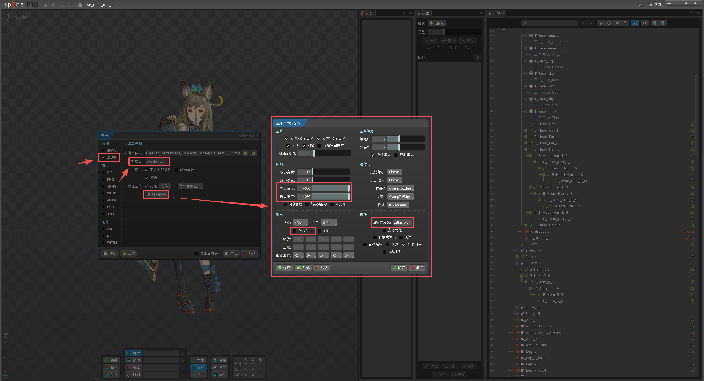

- Spine动画导出：
  - 需要 按照要求 进行设置。除了下述的几个关键设置，其他设置也尽量与图示中 保持一致。
  - 数据类型：二进制。在 导出窗口 的左侧，选择 数据类型。
  - 扩展名：[.skel.bytes]。
  - 纹理打包设置：
    - 最大宽度/高度：4096。避免被分成多张图集，但在制作Spine时，也尽量控制图集内容在2048之内。
    - 预乘Alpha：取消√勾选。会影响 半透明颜色 在 Unity 中的渲染效果。
    - 图集扩展名：[.atlas.txt]。
  - Spine导出的资源文件 一般有3个。分别是“.png”格式的 图集图片、“.atlas.txt”格式的 图集数据资源、“.skel.bytes”格式的Spine动画数据资源。

# 特效

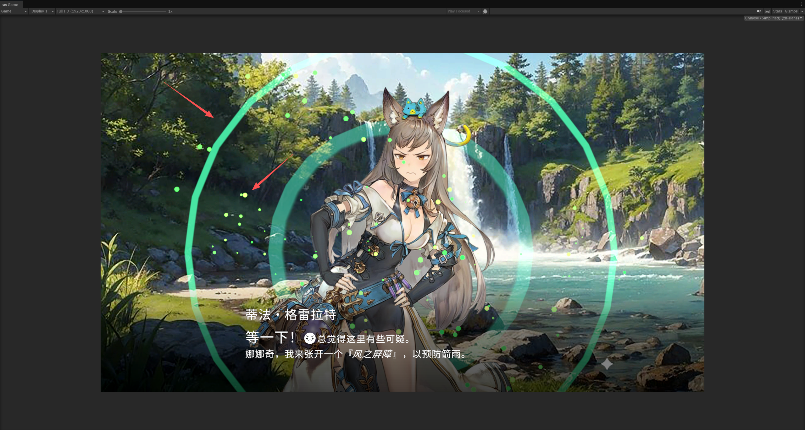

- Unity 的预制体(Prefab)格式，可以组合各类复杂的功能。因此 特效也使用 预制体 进行制作。
- 本项目的 特效动画 通常由美术人员 使用 Spine软件 或 Live2D软件 进行制作，也可使用 Unity的粒子系统、动画系统等。策划只需负责 角色动画的导入与配置。
  - 制作 Spine动画预制体 的方法，与 [角色](#角色) 中的 [Spine动画预制体](#spine动画预制体) 相同。
  - 制作 Unity粒子系统 特效的方法，可以参考 [官方教程-粒子系统](https://docs.unity3d.com/cn/current/Manual/ParticleSystems.html)。
  - 制作 Unity动画系统 特效的方法，可以参考 [官方教程-动画系统](https://docs.unity3d.com/cn/current/Manual/AnimationSection.html)。

# 音频

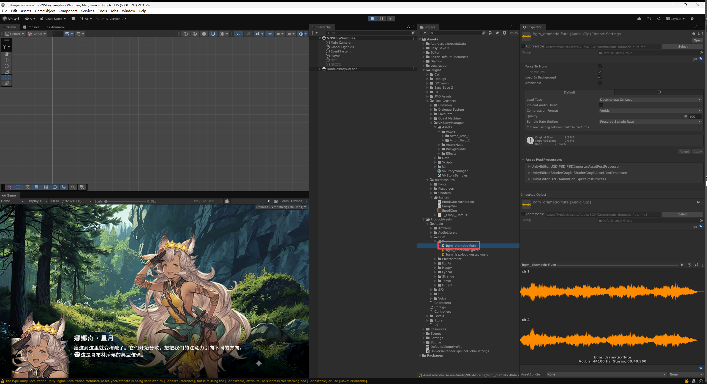

- 格式要求：
  - 建议使用 mp3 等 压缩效率 较高的格式。
  - 也支持 wav、ogg 等格式。但 wav 格式文件体积较大，建议只用于 音效(SFX) 等 时间较短的音频。
- 长度要求：
  - 背景音乐(BGM) 等时间较长的音乐，建议控制在30秒以下，最长不超过60秒。
- 制作要求:
  - 音频前后 不建议留有过多 空白时间。音频的切换过渡、间隔时间等，会通过 音频系统 进行控制。
  - 背景音乐(BGM) 通常会循环播放、首尾相接，尽量保证 开始和结束时的 音乐节奏、旋律 等 能够自然衔接。

# 富文本图标

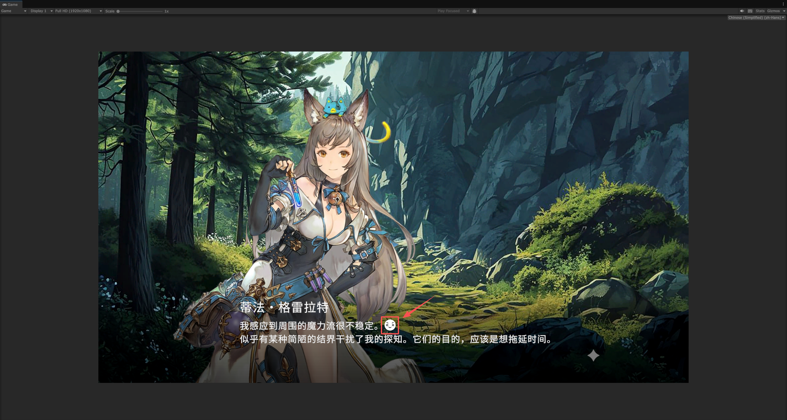

- 格式要求：
  - 建议使用 PNG 格式，以支持半透明区域。
  - 制作或导出时，如果有 色彩空间 选项，设置成 sRGB 色彩空间。
- 尺寸要求：
  - 根据 图标的数量与大小，设计合适的尺寸。但图集的总尺寸 最大不要超过 2048x2048 像素。
  - 单个图标的尺寸，建议控制在 32x32 ~ 128x128 像素 之间。实际根据 图标出现在屏幕中的大小 进行设计。
  - 图标的大小，建议保持一致。例如，全部使用 64x64 像素 的图标。
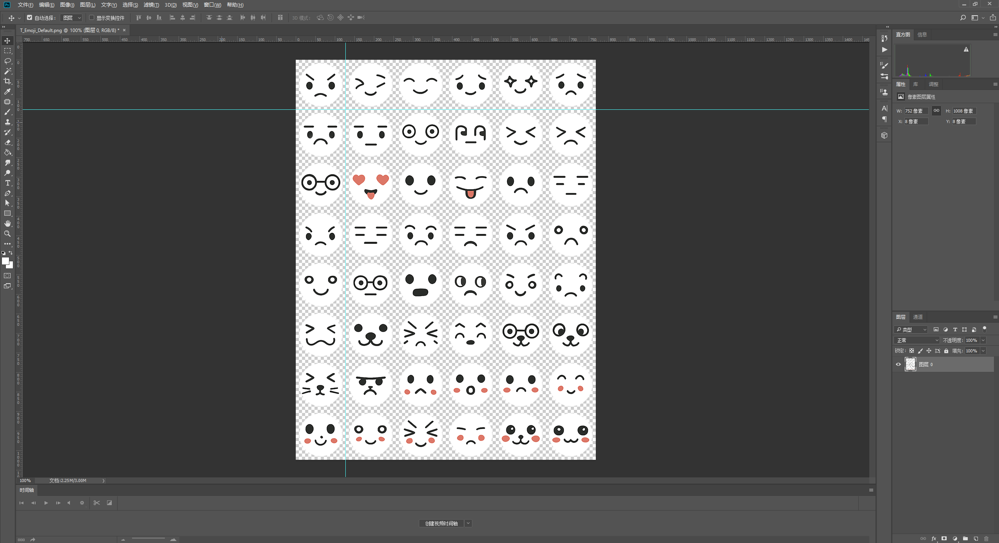
- 布局要求：
  - 所有的图标集合在 一张图片 中，形成 图集。
  - 网格布局，行列间距 建议 为 2或4 像素。边缘的图标 也需要跟图片边缘 保持行列间距的一半的距离。
  - 图标的排列顺序，建议从左到右、从上到下 依次排列。
