# AnimSimulatorSystem 动画模拟器系统-使用文档

- 返回 [说明文档](../../README.md)

# 📜目录

- [AnimSimulatorSystem 动画模拟器系统-使用文档](#animsimulatorsystem-动画模拟器系统-使用文档)
- [📜目录](#目录)
- [官方教程](#官方教程)
- [示例场景](#示例场景)
- [正式项目的资产布局](#正式项目的资产布局)
- [快速入门](#快速入门)
- [资源导入](#资源导入)
- [动画后端](#动画后端)
  - [启用后端](#启用后端)
  - [Spine 接入](#spine-接入)
    - [一、安装运行时](#一安装运行时)
    - [二、Spine 角色预制体](#二spine-角色预制体)
    - [三、状态与动画](#三状态与动画)
    - [四、Spine 皮肤](#四spine-皮肤)
    - [五、其它](#五其它)
  - [Live2D 接入](#live2d-接入)
    - [一、导入 SDK](#一导入-sdk)
    - [二、Live2D 角色预制体](#二live2d-角色预制体)
    - [三、动作查找表（必填）](#三动作查找表必填)
    - [四、轨道 → 层 映射](#四轨道--层-映射)
    - [五、Live2D 皮肤](#五live2d-皮肤)
    - [六、两条使用约束](#六两条使用约束)
- [系统配置](#系统配置)
  - [动画模拟管理器](#动画模拟管理器)
  - [资源文件路径](#资源文件路径)
  - [动画动作播放器 配置](#动画动作播放器-配置)
  - [动画角色皮肤组 配置](#动画角色皮肤组-配置)
  - [进度条 配置](#进度条-配置)
    - [等级进度条 配置](#等级进度条-配置)
    - [动作进度条 配置](#动作进度条-配置)
- [动画模拟器 使用](#动画模拟器-使用)
  - [角色预制体](#角色预制体)
    - [皮肤组](#皮肤组)
  - [动画动作播放器](#动画动作播放器)
    - [轨道与混合权重](#轨道与混合权重)
    - [动画动作列表](#动画动作列表)
    - [动画动作列表UI 制作与排错](#动画动作列表ui-制作与排错)
      - [预制体结构](#预制体结构)
      - [配置要点](#配置要点)
      - [排错速查](#排错速查)
      - [运行期自检片段](#运行期自检片段)
  - [背景预制体](#背景预制体)

# 官方教程

2D美术资源的制作，需要使用Spine或Live2D等，专业的2D动画制作软件来完成。\
官方文档与教程中，会对2D动画制作的流程与功能进行详细介绍。\
建议 学习视频教程 来快速掌握 基本流程 与 使用。\

<span style="color: rgb(255, 255, 0);">**<策划可以跳过这部分>**</span>，直接进入下面的 Unity配置教程。\
但仍建议从 官方教程 来基本了解一下Spine或Live2D的制作流程，理解2D动画美术资源的结构与组成，以便更好地进行 Unity中的配置与使用。

- [Spine 官方网站](https://zh.esotericsoftware.com/)
  - 官方的视频教程。只在 YouTube 提供了英文教程。
  - 可以使用 浏览器翻译插件 翻译中文字幕 进行阅读。
  - 另外，也可以在 [Bilibili](https://search.bilibili.com/all?keyword=Spine) 上查找到相关教程。
- [Live2D 官方网站](https://www.live2d.com/zh-CHS/)
  - 官方的详细文档，详细描述了 Live2D Cubism 的各项功能。
  - 只有 英文 的版本。可以使用 浏览器翻译插件 进行阅读。
- [浏览器 翻译插件](https://microsoftedge.microsoft.com/addons/detail/%E6%B2%89%E6%B5%B8%E5%BC%8F%E7%BF%BB%E8%AF%91-%E7%BD%91%E9%A1%B5%E7%BF%BB%E8%AF%91%E6%8F%92%E4%BB%B6-pdf%E7%BF%BB%E8%AF%91-/amkbmndfnliijdhojkpoglbnaaahippg)
  - 这里提供 微软Edge浏览器 中的翻译插件的安装链接。
  - 另外，在 Google Chorme浏览器 中，也可以找到这款 翻译插件。

# 示例场景

在示例场景中，演示了所有 动画模拟器系统 的功能。可以参考示例场景，来完成各类功能的配置。
例如，动画动作的配置，位置的放置，交互操作的方式，交互范围的大小等。\
动作进度条、等级进度条的配置，等级解锁 动画动作，进度触发 动画动作等。\
换装系统的配置，皮肤的分组，解锁条件，选择方式等。

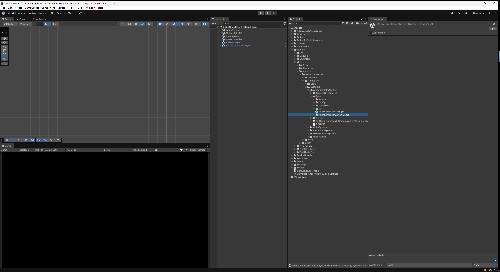

- 示例场景（Demo）以 **UPM 的 Sample 形式随包分发**，需要先导入才会出现在工程里。
  - 导入：菜单 `Window > Package Manager` → 左侧选中 **Anim Simulator System** → 右侧 **Samples** 页 → 点击 `Anim Simulator System Demo` 的 [Import]。
  - 导入后的位置：`Assets\Samples\Anim Simulator System\<版本号>\Anim Simulator System Demo\`
  - 打开其中的 `AnimSimulatorSystemDemo.unity`，直接 运行游戏 就能在 Game窗口 中看到 动画模拟器系统 的演示内容。

> Sample 是**复制**到 `Assets` 下的，属于你自己的工程资产，可以随意修改，不会被包升级覆盖。反过来，包本体位于 `Packages\com.ale.animsimulatorsystem\`，不要把游戏资产放进去。

<video controls="" poster="" src="Docs~/Movie_004.mp4" ></video>


- 示例视频
  - 可以在 [视频链接](Docs~/Movie_004.mp4)
    中，点击 [View raw]按钮，下载视频 进行观看。


- 示例场景的配置
  - 示例场景里那套 动画模拟器 的完整配置，具有很多参考价值。
    
  - 在场景的AnimSimulatorManager预制体上，配置了AnimSimulatorConfig(动画模拟器配置)的文件，上面对 背景、角色、动画动作的播放器、皮肤组、等级进度条、动作进度条等项目，做了详细的配置。
    
  - 在角色的预制体上，配置了多个 动画动作的播放器，用于指定 角色身上每个位置 可以播放的 动画动作。例如，在头部配置摸头的动画，在身体配置空闲与走路的动画。之后通过玩家操作，在不同的动画之间进行切换与操作。

# 正式项目的资产布局

上面的示例场景 仅作为功能的演示，导入后归你的工程所有、可以随意改动。但**不建议直接在 Sample 目录里长出正式内容**——`Assets\Samples\` 是 Package Manager 的导入落点，重新导入或升级包时容易被覆盖或产生重复副本。正式的游戏资产请另建目录存放。


下面是一份**建议布局**（不是既存目录，需要自己建）。它与本文档其余章节的示例路径一致，照着摆能少改几处配置：

- 动画模拟器管理器：`Assets\Resources\Managers\AnimSimulatorManager.prefab`
  - 放在 `Resources` 下，是为了让它能被随场景加载；也可以直接把该预制体拖进启动场景。
- 角色预制体：`Assets\ProductAssets\AnimSimulator\Actors\`
- 背景预制体：`Assets\ProductAssets\AnimSimulator\Backgrounds\`
- UI 预制体：`Assets\ProductAssets\AnimSimulator\UI\`
- 动画模拟器配置文件：`Assets\ProductAssets\AnimSimulator\Config\AnimSimulatorConfig.asset`

> 角色与背景的文件夹路径**必须与 AnimSimulatorConfig 里配置的一致**，否则按地址加载会找不到资产。改法见下面的 [资源文件路径](#资源文件路径) 一节。

# 快速入门

通过最简洁的流程，快速熟悉 动画模拟器系统。\
而关于 详细的配置方法，会在之后的教程中 逐一进行解说。


- 打开示例场景。
  - 按上面 [示例场景](#示例场景) 一节的步骤，先从 Package Manager 的 Samples 页导入 Demo。
  - 打开导入后的 `Assets\Samples\Anim Simulator System\<版本号>\Anim Simulator System Demo\AnimSimulatorSystemDemo.unity` 场景。
  - 在示例场景中，可以直接点击运行游戏，测试 动画模拟器系统 的功能。

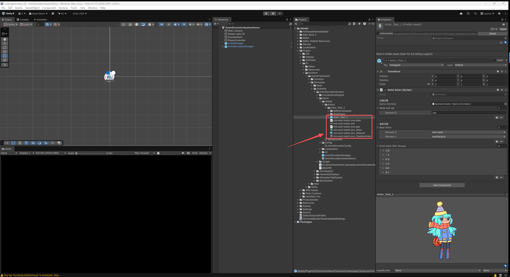

- Spine或Live2D 动画资源的导入。
  - 首先需要将 美术制作好的Spine或Live2D的动画资源，导入到Unity中，并制作成 预制体。
  - Spine或Live2D 动画资源的导入 与 预制体的制作方法，见下面的 [资源导入](#资源导入) 一节。
    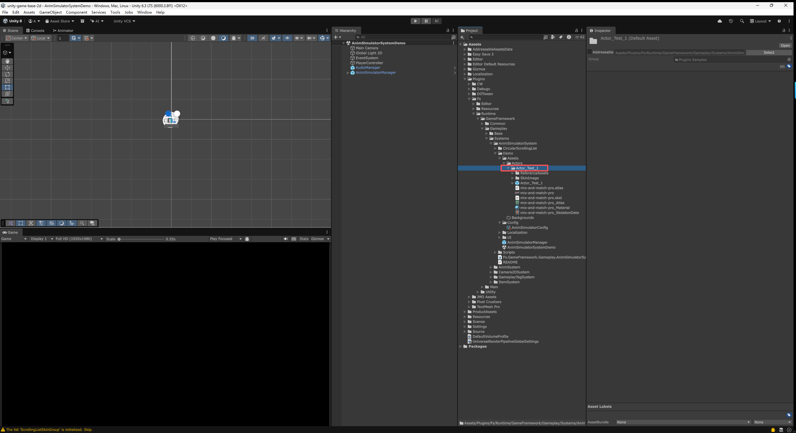
  - 动画角色的预制体，需要放置在 AnimSimulatorConfig(动画模拟器配置)的 `ActorAddressableFolder` 所指的文件夹中——Demo 里是 `Assets\Demo\Assets\Actors\`，正式项目建议改到 `Assets\ProductAssets\AnimSimulator\Actors\`，改法见下面的 [资源文件路径](#资源文件路径) 一节。
  - 动画资源的文件 一般会有很多，建议在 Actors 文件夹中 再新建一个文件夹，放置每个角色的 动画资源与预制体，并按照 角色的分类进行 命名与整理。

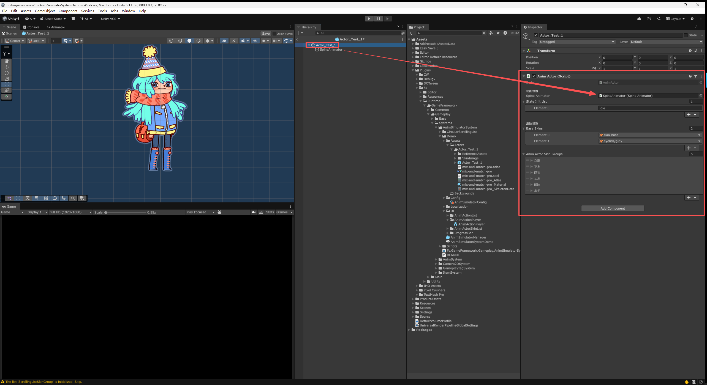

- 挂载 AnimActor组件。
  - 双击刚制作好的 角色预制体，打开 预制体编辑模式。
  - 在 Hierarchy面板中 选中 角色预制体的 根物体，在 Inspector面板中 点击 [Add Component]按钮，添加 AnimActor组件。
  - 将角色的动画控制器（Spine 角色是 **SpineAnimator**，Live2D 角色是 **Live2dAnimator**），拖拽到 AnimActor组件的 **Animator(动画控制器)** 栏中。组件一般会 自动寻找并挂载，可以再次确认。


- 放置 AnimActionPlayer(动画动作播放器)。
  - 将 Demo 中的 `Assets\UI\AnimActionPlayer\AnimActionPlayer.prefab` 预制体（导入 Sample 后位于 `Assets\Samples\Anim Simulator System\<版本号>\...` 下），拖拽放置到 角色预制体中。
  - 也可以自己手动创建空物体，并挂载 AnimActionPlayer组件 与 SphereCollider组件 来完成。只是通过预制体的方式，能够直接使用 已经配置好的 组件与参数，节省了配置的时间。
  - 将角色的动画控制器（SpineAnimator 或 Live2dAnimator），拖拽到 AnimActionPlayer组件的 **Animator(动画控制器)** 栏中。组件一般会 自动寻找并挂载，可以再次确认。


- 配置 AnimActionPlayer(动画动作播放器)。
  - 通过 SphereCollider组件的 Radius(半径)参数，来调整 玩家进行交互操作的 范围大小。
    - Center(中心)参数，可以调整 交互范围 的位置。一般默认保持[0,0,0]即可。
  - 将 AnimActionPlayer组件的 Anim Action Player Type(动画动作播放器类型)设置成 Operate(操作)。表示这个 动画动作播放器 是通过玩家操作 来触发动画动作的，玩家在操作时会有一个选择列表 来选择想要触发的 动画动作。
    - 若希望「点一下就随机播一个、不铺开列表」，改设成 Random(点击随机) 即可，其余配置不变。


- 添加 动画动作。
  - 在 AnimActionPlayer组件的 Anim Actions(动画动作列表)中，点击右下角的[+][-]按钮，在列表末尾 增加一个 动画动作条目。
  - 将 Action Name(动作名称)设置成“动作-测试”。这个名称 仅用于配置文件之间的识别与指定。游戏中显示的名称，需要在 UiDisplayActionName(显示动作名称)中进行设置。
  - 将 Action Operation Type(动作操作类型)设置成 Click(点击)。表示这个 动画动作 是通过玩家点击 来触发的。
  - 在 **Anim Name(动画名称)** 栏中，填写这个动作要播放的动画名，例如“dress-up”。这个名字就是在 Spine 或 Live2D 中制作动画时起的名字，**两个后端使用相同的命名规则**。

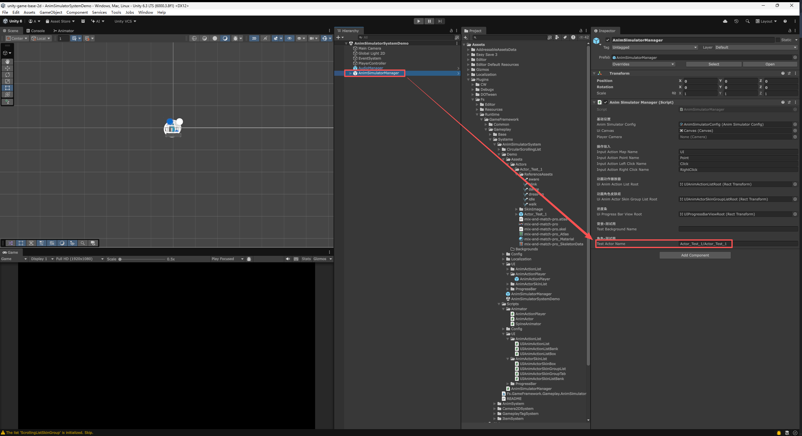

- 测试 动画动作。
  - 返回到 场景中，点击 AnimSimulatorManager 物体，在Inspector面板中的 Test Actor Name(测试角色名称)栏中，填写之前制作的 Actors文件夹中的 角色预制体的名称，因为放置在文件夹中，所以需要填写文件夹名称+预制体名称，例如 "Actor_Test_1/Actor_Test_1"。
    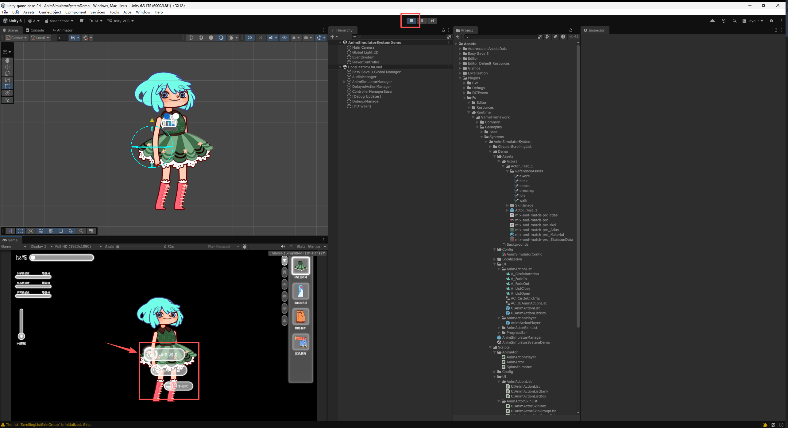
  - 点击上方最左边的[开始]按钮，运行游戏。在Game面板中，动画动作播放器的位置 会显示一个 白色的提示圈，当光标移到 提示圈范围内时，会显示 配置的动画动作列表。
  - 通过鼠标的滚轮，可以在 动画动作列表中 进行切换。切换到列表的最上方，就会显示出 刚配置的动画动作，鼠标单击 就可以触发这个动画动作的播放。

# 资源导入

在 动画模拟器系统中，通常需要从外部导入 美术制作的资源文件，并在Unity中制作成 预制体。\
例如，角色的Spine动画预制体、皮肤的UI图片、音频文件等。\
具体的导入方法与流程，请参考 [Spine 官方的 spine-unity 文档](https://zh.esotericsoftware.com/spine-unity)（骨骼数据的导入、SkeletonAnimation 预制体的生成、材质与图集的设置）。

> 本节原先链接的是 Fs 框架的《资源导入文档》。本插件已不再依赖 Fs，那份文档也不随本包分发，故改为指向 Spine 官方文档。

# 动画后端

插件支持 **Spine** 与 **Live2D** 两个动画后端，**可在同一工程内同时启用**。一个工程里两种角色并存，用哪个后端由角色预制体上挂的是 `SpineAnimator` 还是 `Live2dAnimator` 决定。

上层的 AnimActor 与 AnimActionPlayer 只与动画控制器的公共基类 `AnimatorBase` 打交道，对具体后端无感。**动画与皮肤都用字符串名指定，两个后端使用相同的命名规则**，因此同一份动作 / 皮肤组配置对两边都成立。

## 启用后端

后端由编译宏控制，在插件的欢迎窗口里开关：菜单 `Tools > Ale Toolkit > Anim Simulator System > Welcome`。

| 宏 | 需要的运行时 | 安装方式 |
|---|---|---|
| `ASS_SPINE` | `com.esotericsoftware.spine.spine-unity`（+ `spine-csharp`） | git URL，经 Package Manager 安装 |
| `ASS_LIVE2D` | Cubism SDK for Unity（≥ Cubism 5 SDK R1 beta2） | **不是 UPM 包**，需从官网下载 `.unitypackage` 手动导入 |

- 两个宏**可以同时启用**，互不排斥。
- 只装了运行时、没开宏，对应的动画控制器不会参与编译；欢迎窗口会显示运行时的安装状态，开宏时若检测不到运行时会先弹确认。
- 两个都不启用时插件仍能编译，但角色动画无法播放——编辑器加载时会给出提示。

## Spine 接入

### 一、安装运行时

Spine 的 Unity 运行时以 **git URL** 分发（不在 UPM 注册表中），在 `Packages/manifest.json` 里按需添加，或经 Package Manager 的 `Add package from git URL...` 添加：

| 包 | git URL（`#4.2` 为分支，按项目使用的 Spine 版本调整） |
|---|---|
| `com.esotericsoftware.spine.spine-csharp` | `https://github.com/EsotericSoftware/spine-runtimes.git?path=spine-csharp/src#4.2` |
| `com.esotericsoftware.spine.spine-unity` | `https://github.com/EsotericSoftware/spine-runtimes.git?path=spine-unity/Assets/Spine#4.2` |
| `com.esotericsoftware.spine.urp-shaders` | `https://github.com/EsotericSoftware/spine-runtimes.git?path=spine-unity/Modules/com.esotericsoftware.spine.urp-shaders#4.2` |

- `spine-unity` 依赖 `spine-csharp`，两者都要装。
- **URP 工程还需装 `urp-shaders`**，否则 Spine 材质在 URP 下不显示。
- 装好后在欢迎窗口中启用 `ASS_SPINE`。

骨骼数据的导入、`SkeletonAnimation` 预制体的生成、材质与图集设置，见 [Spine 官方的 spine-unity 文档](https://zh.esotericsoftware.com/spine-unity)。

### 二、Spine 角色预制体

- 按 Spine 官方流程把骨骼数据导入 Unity，生成带 **`SkeletonAnimation`** 组件的物体。
  > 本系统**只支持 `SkeletonAnimation`**，不支持 `SkeletonGraphic`（UI 用）与 `SkeletonMecanim`。
- 在该物体上挂载 **`SpineAnimator`**，并配置：
  - **Spine Skeleton Animation**：同物体上的 `SkeletonAnimation`。添加组件时会自动寻找并填入。
  - **Spine State Data**：状态数据列表，见下面的[状态与动画](#三状态与动画)。
- 角色预制体的**根物体**上挂 **`AnimActor`**，把 `SpineAnimator` 拖到它的 Animator 栏。
  > 惯例上 `SkeletonAnimation` + `SpineAnimator` 放在根物体的**子物体**里，`AnimActor` 在根物体上——Demo 的 `Actor_Test_1` 就是这么搭的。放在同一个物体上也能正常工作。

### 三、状态与动画

`SpineAnimator` 的 **Spine State Data(状态数据列表)** 定义「状态名 → 该状态要播的一组动画」，`AnimActor` 的 State Init List 里填的状态名就是在这里定义的。每条状态：

- **State Name**：状态名称，例如 `idle`。
- **Spine Skeleton Animation**（可选）：该状态专用的渲染器。留空则用上面配置的默认渲染器；**填了则该状态的动画会播到这个渲染器上**，用于一个角色由多个 Spine 模型拼成的场合（该渲染器会随状态的启用 / 停用自动淡入淡出）。
- **Spine Anim Datas**：这个状态要播放的动画列表，每条包含：
  - **Anim Name**：动画名，即在 Spine 中制作动画时起的名字。**Spine 侧按名直接在骨架数据中查找，不需要额外的查找表**（这是与 Live2D 的一处差异）。
  - **Anim Track / Anim Track Sub**：动画轨道与子轨道。**Spine 的 `AnimationState` 轨道数不受限制**，本系统的轨道号（`主轨道 × 10 + 子轨道`）无需像 Live2D 那样映射到有限的层；SpineAnimator 内部只做一次<b>保序压缩</b>（把 `Action` / `Other` 这两个大枚举值收敛到紧凑序号），配置与行为都不受影响。
  - **Is Loop / Is Reverse / Speed**：是否循环、是否反向、播放速度倍率。
  - **Start Delay Time**：起播延迟（秒）。
  - **Loop Interval Time Range**：循环间隔（秒）。仅循环动画有效，填非零范围后，每播完一次会在该范围内随机等待一段时间再播下一次——用于眨眼、耳朵抖动这类「偶尔来一下」的动画。

### 四、Spine 皮肤

Spine 的 Skin 是骨架数据里的一等公民，因此**皮肤名直接就是 Spine 中制作时的皮肤名**（含文件夹路径时用 `/` 分隔，例如 `clothes/dress-green`），不需要像 Live2D 那样另做映射配置。

- **Base Skins**：始终显示的基础皮肤，`SpineAnimator` 与 `AnimActor` 上都有，两处都会被合并进来。
- 可切换的皮肤在 `AnimActor` 的[皮肤组](#皮肤组)里配置。
- 运行时，系统把「基础皮肤 + 当前应用中的皮肤」合并成一个名为 `Combined Skin` 的组合皮肤整体套到骨架上，因此**多件皮肤可以叠加显示**（配饰之类的皮肤组把 Skin Select Count Max 设为 0 即可不限数量）。
- 皮肤名字段会**自动列出骨架里可用的皮肤名下拉**，不必手打。

> `SpineAnimator` 另有一个 Spine 专有的 `RepackedSkin()` 方法（把当前组合皮肤重打包成单张图集以减少绘制调用）。它开销较大，一般在换装全部完成后再手动调用，系统不会自动调。

### 五、其它

- **Anim Fade Duration**：切换模型时的淡入淡出时长（秒）。系统补间的是骨架的整体透明度 `Skeleton.A`。
- **Is Display On Init**：初始化时就显示。默认关闭——角色初始为透明且非激活，等状态生效后再淡入。
- **进度控制（拖拽 / 旋转 / 按压）在 Spine 侧是原生支持的**：直接读写 `TrackEntry.TrackTime`，不像 Live2D 那样需要走单独的采样通道。

## Live2D 接入

### 一、导入 SDK

Live2D Cubism SDK for Unity **不是 UPM 包**：官方以 `.unitypackage` 分发，其中包含专有的 Cubism Core 原生库（开源的 `Live2D/CubismUnityComponents` 仓库既没有 `package.json`、也不含 Core）。因此它无法写进本包的 `dependencies`，只能手动导入。

1. 从 [Live2D 官方下载页](https://www.live2d.com/en/sdk/download/unity/) 下载 Cubism SDK for Unity。
2. 把 `.unitypackage` 拖入工程，导入到 `Assets/Live2D/Cubism/`。导入完成后**关闭并重新打开工程**（官方要求）。
3. 在欢迎窗口中启用 `ASS_LIVE2D`。SDK 自带 `Live2D.Cubism` 程序集定义，本插件会自动引用到。

#### URP 工程的三项必需设置

三项缺一不可，且**症状互不相同、都不会报错**，照 [官方 URP 导入说明](https://docs.live2d.com/en/cubism-sdk-tutorials/urp-import/) 逐项配好：

| 设置 | 位置 | 漏掉的症状 |
|---|---|---|
| Renderer List 里要有 `CubismURPRenderer.asset`，且**设为 Default** | Universal Render Pipeline Asset | 模型**完全不显示**。注册了多个 Renderer Data 时若它不是 Default，Scene 视图也画不出来 |
| **HDR Precision = 64 Bits**（或索性关掉 HDR） | 同上，`Quality > HDR` 下 | **除 Live2D 模型外满屏漆黑** —— 背景、Spine 角色等在模型绘制前画的东西全被抹掉 |
| 需要位于模型**之后**的东西必须走**不透明队列**（`renderQueue < 2500`） | 该物体的材质 | 它会**盖住 Live2D 模型** |

后两项都源自 Cubism 的绘制方式，值得说清楚——踩上了很难自己想明白：

- **为什么 HDR 必须 64 位**：Cubism 把模型画进一张**离屏 RT**，再用 `Blend One OneMinusSrcAlpha`（预乘 alpha）把它 blit 回相机颜色缓冲。这张 RT 的格式**从相机颜色格式派生**，而 URP 在「HDR 开 + 32 位精度」下用的是 `B10G11R11_UFloat`——**没有 alpha 通道**。采样出的 alpha 恒为 1，混合式退化成 `dst = src`，于是**整屏被 RT 覆盖**，空白处就是纯黑。改 64 位（`R16G16B16A16`）后 alpha 通道回来，混合才正常。

- **为什么背景要走不透明队列**：Cubism 的绘制通道注入在 **`BeforeRenderingTransparents`**，即在常规透明队列**之前**。任何 `renderQueue >= 2500` 的东西都在它之后绘制，会盖住模型。把背景改到不透明队列（Geometry，2000）即可排到模型之后。

  > 这条同时给出了一条好用的分层规则：**不透明队列 = 排在 Live2D 模型之后，透明队列 = 排在模型之前**。想在角色前面放特效或前景，保持它在透明队列即可。
  >
  > Demo 的背景为此配了专用材质 `M_Backgrounds_Forest_1.mat`（`renderQueue = 2000`）——不能直接改内置的 `Sprite-Unlit-Default`，那是全工程共用的。自己的背景照此办理。
  >
  > **Spine 不受这条约束**：它是普通的 `MeshRenderer`，与背景同在透明队列里按 Z 排序，因此仅靠空间坐标就能得到正确的前后关系。

### 二、Live2D 角色预制体

Live2D 角色预制体的搭法与 Spine 一致，只是组件不同：

- 模型根物体上，除了 Cubism 导入时自带的组件外，还需要 **`CubismFadeController`**（指定模型的 `.fadeMotionList` 资产）与 **`CubismMotionController`**（设置 Layer Count）——它们是 Cubism 播放动作的前提。
- 挂载 **`Live2dAnimator`**，并配置：
  - **Live2d Render Controller**：模型的 `CubismRenderController`。本系统以它作为「渲染器」，淡入淡出即补间它的 Opacity。
  - **Live2d Motion Controller**：上面添加的 `CubismMotionController`。
  - **Live2d State Data**：状态名 → 该状态要播的一组动画。与 Spine 的状态数据列表一一对应。
- 根物体上再挂 **`AnimActor`**，把 `Live2dAnimator` 拖到它的 Animator 栏。之后的皮肤组、动画动作播放器配置与 Spine 完全相同。

### 三、动作查找表（必填）

Cubism **没有「按名查找动作」的 API**——motion3.json 导入后会生成一个个散落的 `AnimationClip`，彼此之间没有索引。因此需要在 `Live2dAnimator` 的 **Live2d Anim Clips(动作查找表)** 里，把动画名与动作剪辑一一对应起来。

- **Anim Name**：动画名。动作配置里填的就是这个名字。
- **Clip**：motion3.json 导入后生成的 `AnimationClip`。
- 动画名留空时，会用剪辑自身的资产名兜底，省去手填。
- 重复的动画名会给出告警，后一条被忽略。

### 四、轨道 → 层 映射

本系统的动画轨道号是 `主轨道 × 10 + 子轨道`（例如 Body/0 = 10、Eyes/0 = 40），值域最大到 9990；而 Cubism 的**层（layer）数量很少**，在 `CubismMotionController` 的 Layer Count 上配置。两者必须映射。

**层号即覆盖优先级**：Cubism 的层混合器按层号先后应用，层号大的盖住层号小的。这正是 [轨道与混合权重](#轨道与混合权重) 里「枚举值大的轨道覆盖枚举值小的」在本后端的落点。

在 `Live2dAnimator` 的 **Live2d Track Layers(轨道映射)** 中显式指定「哪条轨道走哪一层」：

- 未显式指定的轨道，自 2.3.0 起**按轨道在 `EAnimTrack` 中的序数自动分层**（钳制在 Layer Count 内）。序数保序，故「高轨道的层号永远不低于低轨道」恒成立；且与播放顺序无关，同一份配置每次都算出同一个层号。
- 层数不够时，序数超出范围的高轨道会被钳到最后一层、互相覆盖，首次发生时**告警一次**——请显式指定映射，或调大 Layer Count。
- 映射里的层索引若超出 Layer Count，选中组件时 Inspector 就会告警，不必等到运行时才发现。
- **0 号层是层混合器的基准层，权重恒为 1**。需要用轨道混合权重的动画，不要落到 0 号层上。

> **2.3.0 的行为变更**：此前未显式映射的轨道是「按首次播放的先后抢第一个空闲层」，先播 `Action` 再播 `Body` 会让 `Body` 拿到更大的层号、反过来盖住 `Action`，同一份配置还会因玩家操作顺序不同而每次算出不同的层。同时删掉了已无作用的 **Live2d Layer Index Default(默认层索引)** 字段——钳取之后任何轨道都必得到有效层号，不再存在「无空闲层可分配」这回事。

### 五、Live2D 皮肤

**Cubism 没有「皮肤」这个概念**——Spine 的 Skin 是骨架数据里的一等公民，可按名取用并合并；Cubism 只有部件（`CubismPart`）与可绘制对象（`CubismDrawable`）。所以 Live2D 侧的「一件皮肤」是一份**配置出来的映射**，在 `Live2dAnimator` 的 **Live2d Skins** 中定义：

- **Skin Name**：皮肤名。与 Spine 侧使用相同的命名规则（含路径时用 '/' 分隔），这样 AnimActor 上的一份皮肤组配置对两个后端都适用。
- **Part Ids**：该皮肤要显示的部件 ID 列表（即 Cubism Editor 中的部件 ID）。
- **Textures**（可选）：贴图替换，把某个可绘制对象的主贴图换成另一张。用于「同一套部件、不同花色」的场合。

换装时取「基础皮肤 + 应用中皮肤」的并集展开成部件集合，集合内的部件不透明度置 1、其余**被本组件管辖的**部件置 0。**未在任何皮肤里出现过的部件（身体、脸等模型固有部件）不受影响**，不会被误伤。

### 六、两条使用约束

1. **动作不要动画「模型整体不透明度」**。若 motion3.json 给模型不透明度打了关键帧（导入后表现为剪辑里一条 `CubismRenderController.Opacity` 曲线），它会与本系统的淡入淡出同帧争写。整体淡入淡出请交给系统，动作里不要碰。
2. **进度控制与反向播放走单独的采样通道**。Cubism 没有读写播放进度的 API、播放速度也必须 ≥ 0，因此拖拽 / 旋转 / 按压三种交互，以及反向播放、速度为 0 的场合，改由本插件逐帧采样剪辑来驱动；这条通道**不经过 Cubism 自己的动作淡入淡出**（常规的循环 / 正向播放仍走原生通道，淡入淡出正常）。

# 系统配置

背景、角色预制体的 文件夹路径、动画动作播放器、进度条、皮肤列表的UI样式 等。都可以在 AnimSimulatorConfig(动画模拟管理器配置)文件中进行配置。

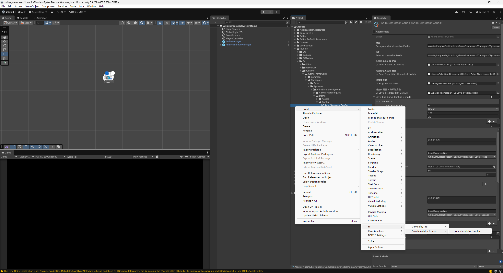

- 创建 AnimSimulatorConfig(动画模拟管理器配置)文件。
  - 在 Project面板中，鼠标右键 打开操作菜单，点击 `Create > Ale > AnimSimulator System > AnimSimulator Config` 来创建一个 AnimSimulatorConfig文件。
  - 也可以直接从 Demo 的 `Config\AnimSimulatorConfig`（导入 Sample 后位于 `Assets\Samples\Anim Simulator System\<版本号>\...` 下），直接复制(Ctrl+C、Ctrl+V)一个 AnimSimulatorConfig文件，进行修改使用。

## 动画模拟管理器


- AnimSimulatorConfig，需要配置在 AnimSimulatorManager(动画模拟管理器) 预制体上进行。
  - 将创建好的 AnimSimulatorConfig(动画模拟管理器配置)文件，拖拽到 AnimSimulatorManager预制体的 Inspector面板中的AnimSimulatorConfig栏中，作为它的 配置文件 进行使用。
- 不过，AnimSimulatorManager 预制体上 已经做好了相关的配置，如无需要 <span style="color: rgb(255, 255, 0);">**<可不进行修改>**</span>。


- 场景中的所有物体 会显示在 Hierarchy 面板中，蓝色的物体代表是预制体，鼠标右键 场景中的预制体，点击操作菜单中的[Prefab > Select Asset]就能在 Project 面板中，快速找到并选中 预制体的源文件。

## 资源文件路径

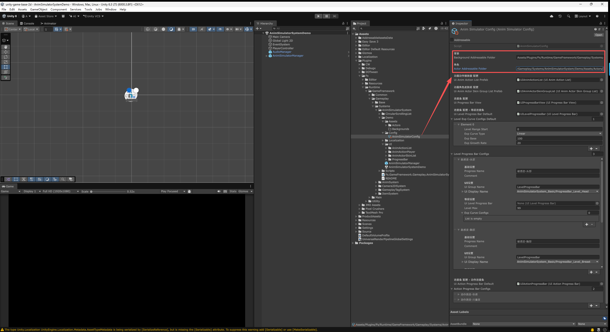

- 背景、角色、可以在AnimSimulatorConfig中，修改文件夹的路径。只有放置到 指定文件夹中的 美术资源，才可以在 动画模拟器系统中 进行配置与使用。
  - BackgroundAddressableFolder：背景，文件夹路径。
  - ActorAddressableFolder：角色，文件夹路径。
- 文件夹路径 的格式为 Assets/ProductAssets/AnimSimulator/Actors/，以Assets开头，文件夹后面使用“/”隔开，所以 最后也需要使用“/”进行结尾。
  - 建议将资源文件夹都放置在 Assets/ProductAssets/文件夹中，根据不同的系统，进行分类整理。
  - 例如，角色的预制体 可以防止在 Assets/ProductAssets/AnimSimulator/Actors/ 文件夹中，背景的预制体 可以放置在 Assets/ProductAssets/AnimSimulator/Backgrounds/ 文件夹中。

## 动画动作播放器 配置

动画动作播放器 相关的配置，在这里可以替换 动作列表的UI样式。
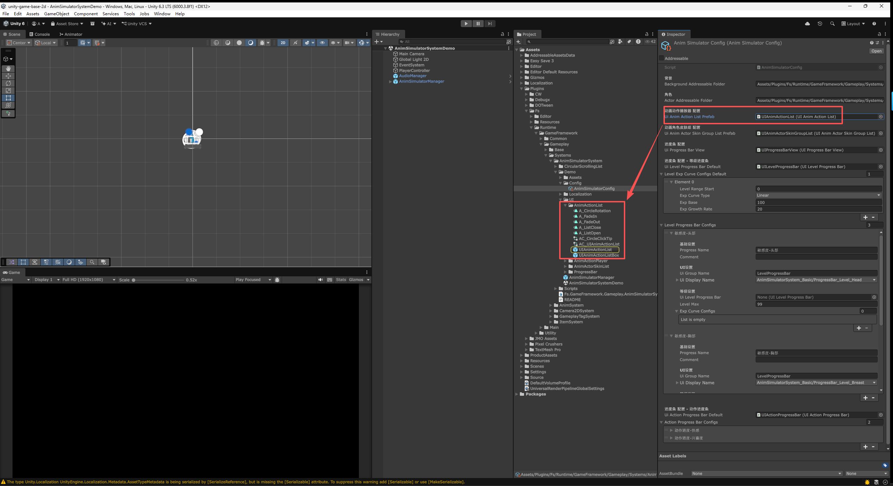

- Ui Anim Action List Prefab：动画动作列表的 UI预制体。可以替换成 自己制作的 UI预制体，来修改动画动作列表的 UI样式。
  - 点击右侧配置的文件，就可以在 Project面板中，快速找到当前的预制体的源文件。
  - 建议将新制作的UI预制体，放置在 Assets/ProductAssets/AnimSimulator/UI/ 文件夹中，进行分类整理。
  - 建议直接复制整个AnimActionList文件夹，因为UI预制体通常还会制作 UI动画、特效等相关的资源文件，这样能够保持UI预制体的 相关资源文件的完整性。


- 在复制出来的新的UI预制体上，进行修改来完成UI样式的替换。例如，替换图片、调整排版、修改动画效果等。
  - 单个 动画动作的条目UI，是制作在 UIAnimActionListBox 预制体中的，需要在这个预制体上进行修改。
  - 之后，将 UIAnimActionListBox预制体，配置在 UIAnimActionList预制体的CircularScrollingList组件上，挂载到 Box Prefab栏中，并点击下方的 [Generate Boxes And Arrange]按钮，应用修改的设置。

## 动画角色皮肤组 配置

动画角色皮肤组 相关的配置，在这里可以替换 皮肤列表的UI样式。


- Ui Anim Actor Skin Group List Prefab：动画角色皮肤组列表的 UI预制体。可以替换这个UI预制体，来修改 UI样式。
  - 点击右侧配置的文件，就可以在 Project面板中，快速找到当前的预制体的源文件。
  - 建议将新制作的UI预制体，放置在 Assets/ProductAssets/AnimSimulator/UI/ 文件夹中，进行分类整理。
  - 建议直接复制整个 AnimActorSkinList文件夹，因为UI预制体通常还会制作 UI动画、特效等相关的资源文件，这样能够保持UI预制体的 相关资源文件的完整性。

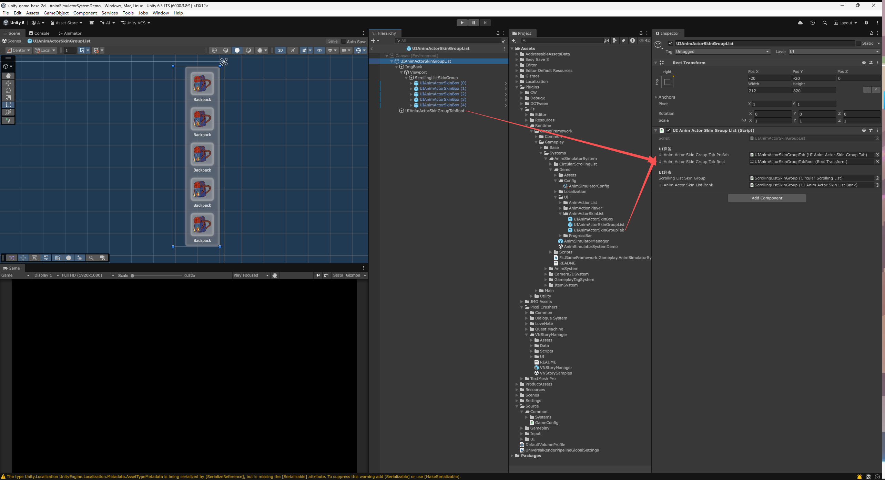

- Ui Anim Actor Skin Group List组件，是动画角色皮肤组列表的 核心组件。
  - UI Anim Actor Skin Group Tab Prefab：动画角色皮肤组标签的 UI预制体。所有的Tab标签 都会根据 [角色的皮肤组配置](#皮肤组) 并使用这个预制体来自动生成。可以替换这个UI预制体，来修改UI样式。
  - UI Anim Actor Skin Group Tab Root：动画角色皮肤组标签的根物体。指定 Ui Anim Actor Skin Group List预制体中的一个子物体，自动生成的 Tab标签 就会放置在这个物体下。可以调整这个物体的位置、排版等，来修改UI样式。
  - Scrolling List Skin Group：动画角色皮肤组的 滚动列表组件。通常不需要修改。
  - Ui Anim Actor Skin List Bank：动画角色皮肤组的 滚动列表数据。通常不需要修改。

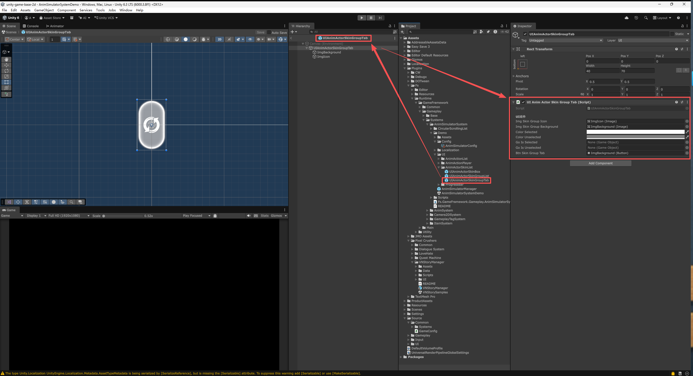

- UI Anim Actor Skin Group Tab组件，是动画角色皮肤组标签的 核心组件。
  - 制作自定义的Tab标签UI预制体时，建议直接从这个预制体进行复制，再修改UI样式。
  - Img Skin Group Icon：皮肤组图标。通常不需要替换，直接点击右侧配置的物体，快速选中 Hierarchy面板中的这个物体，直接修改 大小、位置、排版、图片等。
  - Img Skin Group Background：皮肤组背景。通常不需要替换，直接点击右侧配置的物体，快速选中 Hierarchy面板中的这个物体，直接修改 大小、位置、排版等。使用的 图标，会根据 [角色的皮肤组配置](#皮肤组) 的配置自动替换。
  - Color Selected：选中颜色。当Tab标签被选中时 使用的颜色。会直接着色到 Img Skin Group Background图片上。默认为白色，表示不进行着色，使用图片原本的颜色。
  - Color Unselected：未选中颜色。当Tab标签未被选中时 使用的颜色。会直接着色到 Img Skin Group Background图片上。默认为灰色，表示未选中状态的颜色。
  - Go Is Selected：选中状态的标记物体。当Tab标签被选中时，这个物体会被激活显示。可以制作一些外框、特效、提示图标等，来作为选中状态的标记物体。
  - Go Is Unselected：未选中状态的标记物体。当Tab标签未被选中时，这个物体会被激活显示。
  - Btn Skin Group Tab：皮肤组标签的按钮。通常不需要替换。可以调整这个按钮组件的大小、位置等，来修改按钮的可点击范围。

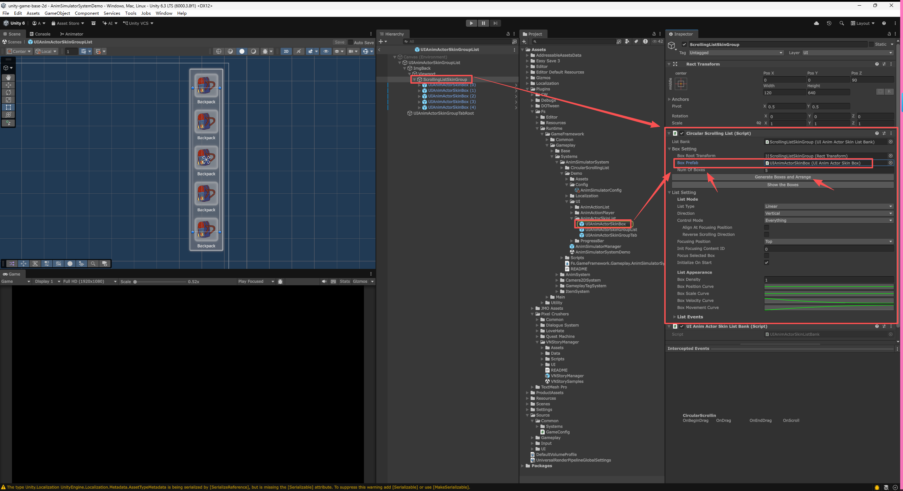

- Circular Scrolling List组件，是动画角色皮肤组的 滚动列表组件。
  - ScrollingListSkinGroup物体上，挂载了 Circular Scrolling List组件。可以在这个组件上，替换 Box Prefab(单个皮肤选项的 UI预制体)，来修改 UI样式。调整 列表的 排版、方向、滚动效果等。
  - Box Prefab：单个 皮肤选项的 UI预制体。可以替换成 自己制作的 UI预制体，来修改单个皮肤选项的 UI样式。
    - 建议直接从 UIAnimActorSkinBox预制体进行复制，再修改UI样式。
  - Num Of Boxes：UI预制体的数量。列表中显示的 皮肤选项UI预制体的数量，根据 UI排版的需要，来调整数量。
  - Generate Boxes And Arrange 按钮：生成并排列UI预制体。修改了 Box Prefab 与 Num Of Boxes参数后，需要点击这个按钮，来生成新的UI预制体，并按照设置进行排列。
  - List Type：列表类型。列表的滚动循环类型。
    - Linear：线性。列表滚动到末尾时，就无法继续滚动了，只能反向滚动回去。
    - Circular：循环。列表滚动到末尾时，会继续滚动回到开头，形成一个循环的滚动列表。
  - Direction：滚动方向。
    - Horizontal：水平。列表在水平方向上 进行滚动。
    - Vertical：垂直。列表在垂直方向上 进行滚动。
  - Control Mode：控制模式。列表的滚动控制方式。
    - Nothing：无。列表不接受任何输入，无法进行滚动。
    - Everything：全部。列表接受所有输入，可以通过鼠标、触摸等方式进行滚动。
    - Pointer：鼠标或指针的操作，可以通过 鼠标拖拽 来进行滚动。
    - Mouse Wheel：鼠标滚轮。鼠标滚轮的操作，可以通过 鼠标滚轮 来进行滚动。
  - Box Density：UI预制体 密度。列表中UI预制体的密度，数值越大，UI预制体之间的间距就越小。
  - Box Position Curve：UI预制体 位置曲线。修改UI预制体的 排列位置，X轴是在 列表滚动方向上的位置，Y轴是 垂直于滚动方向的位置偏移。
    - 例如，将曲线调整成 波浪形，就可以让UI预制体在滚动时，呈现出波浪形的 排列效果。
  - Box Scale Curve：UI预制体 缩放曲线。修改UI预制体的缩放，X轴是在 列表滚动方向上的位置，Y轴是缩放的倍数。
    - 例如，将曲线调整成 拱门形，就可以让UI预制体在滚动时，呈现出中间大，两端小的拱门形的 缩放效果。
  - Box Velocity Curve：UI预制体 释放速度曲线。修改UI预制体的 释放滚动速度，X轴是持续时间(秒)，Y轴是速度的倍数。
    - 例如，将曲线调整成 先快后慢的形状，在鼠标拖拽 并向上甩动列表，在释放鼠标后，列表会先以指定速度(Y轴)滚动一段时间，并在指定持续时间(X轴)内，逐渐减速，直到停止。
  - Box Movement Curve：UI预制体 移动曲线。修改UI预制体的 移动方式，X轴是持续时间(秒)，Y轴是 滚动方向上的位置。
    - 例如，将曲线调整成 先降后升的形状，在鼠标滚轮 向下滚动列表，在持续时间内，列表会先向上(反方向)滚动一小段距离，再向下滚动到目标位置，形成一个先退后进的移动效果。


- UI Anim Actor Skin Box组件，是动画角色皮肤组中，单个皮肤选项的 核心组件。
  - 制作自定义的单个皮肤选项UI预制体时，建议直接从这个预制体进行复制，再修改UI样式。
  - Txt Skin Name：文本组件，皮肤名称（`TMP_Text`）。通常不需要修改。点击已配置的内容，就可以在Hierarchy面板中，快速选中这个物体。直接修改 文本的排版、颜色、大小等，来修改UI样式。显示的文本内容，会根据 [角色的皮肤组配置](#皮肤组) 的 Ui Display Skin Name(显示皮肤名称)进行替换。
  - Img Skin：皮肤图片。通常不需要修改。点击已配置的内容，就可以在Hierarchy面板中，快速选中这个物体。直接修改 图片的大小、位置、排版等，来修改UI样式。显示的图片内容，会根据 [角色的皮肤组配置](#角色预制体) 的 Skin Image(皮肤图标)进行替换。
  - Btn Skin：皮肤的按钮。通常不需要修改。可以调整这个按钮组件的大小、位置等，来修改按钮的可点击范围。
  - Go Selected Tip：选中提示物体。当这个皮肤选项被选中时，这个物体会被激活显示。可以制作一些外框、特效、提示图标等，来作为选中状态的标记物体。
  - Go Unselected Tip：未选中提示物体。当这个皮肤选项未被选中时，这个物体会被激活显示。

## 进度条 配置

进度条相关的 配置，在这里可以替换 进度条的UI样式。


- Ui Progress Bar View Prefab：进度条UI视口的预制体。可以替换成 自己制作的 UI预制体，来修改进度条的 UI样式。
  - 点击右侧配置的文件，就可以在 Project面板中，快速找到当前的预制体的源文件。
  - 建议将新制作的UI预制体，放置在 Assets/ProductAssets/AnimSimulator/UI/ 文件夹中，进行分类整理。
  - 建议直接复制整个UIProgressBarView预制体，因为UI预制体通常还会制作 UI动画、特效等相关的资源文件，这样能够保持UI预制体的 相关资源文件的完整性。
    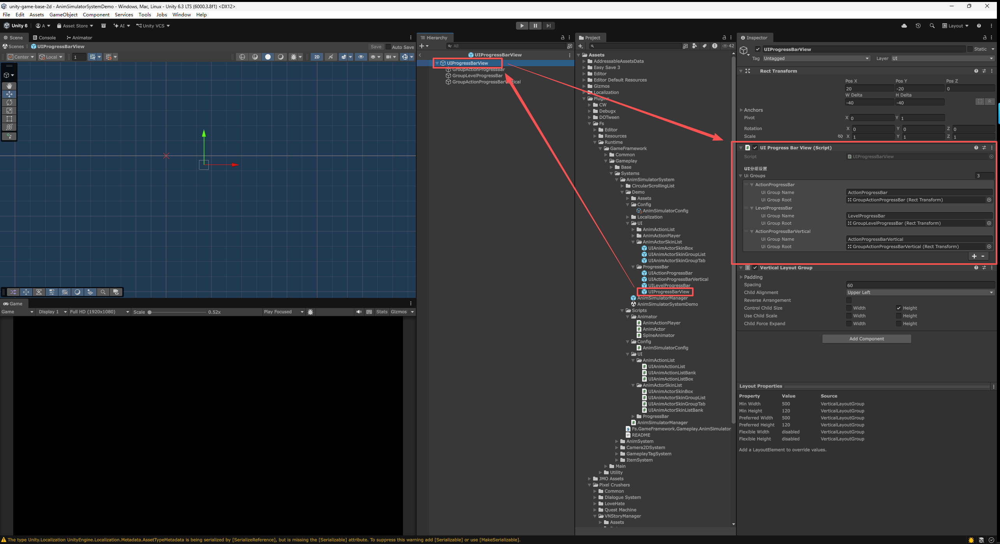
  - Ui Groups：进度条UI的分组。可以根据需求，配置多个不同的 进度条分组，分布在不同的排版位置。
    - Ui Group Name：分组名称。这个名称 仅用于配置文件之间的识别与指定。游戏中不显示。
    - Ui Group Root：分组根物体。自动生成的 进度条UI 会放置在这个物体下。可以调整这个物体的位置、排版等，来修改UI样式。

### 等级进度条 配置

随着玩家的操作 或其他系统的养成，会获得经验值，经验值的积累会提升等级，而等级的提升一般会作为解锁条件，来解锁更多的 动画动作、皮肤等内容。


- Ui Level Progress Bar Default：默认的 等级进度条UI预制体。可以替换成 自己制作的 UI预制体，来修改等级进度条的 UI样式。
  - 每个 等级进度条还可以 单独配置不同的 UI预制体，来修改UI样式。但未单独配置时，会默认使用这里配置的 UI预制体。
- Level Exp Curve Configs Default：等级经验曲线配置，默认。可以替换成 自己制作的 等级经验曲线配置文件，来修改 等级所需经验的 增长曲线。
  - 每个 等级进度条还可以 单独配置不同的 等级经验曲线配置文件，但未单独配置时，会默认使用这里配置的 等级经验曲线配置文件。
  - Level Range Start：起始等级范围。大于等于这个等级时，使用这个 经验增长曲线的配置。可以在不同的等级范围，配置多组不同的 经验增长曲线。
  - Exp Curve Type：等级经验曲线类型。决定每一级所需经验的计算方式。
    - Linear：线性增长，每升一级，所需经验增加一个固定的数值，适合于等级较低，或者想要让玩家快速升级的情况。所需经验 = 经验基础值 + (等级 * 经验增长率)。
    - Exponent：指数增长，每升一级，所需经验增加的数值会越来越大，适合于等级较高，或者想要让玩家升级难度逐渐增加的情况。所需经验 = 经验基础值 * (等级 ^ 经验增长率)。
  - Exp Base：经验基础值。每一级所需经验的基础值。
  - Exp Growth Rate：经验增长率。根据曲线类型 与当前等级，调整每一级 所需经验的增长量。
- Level Progress Bar Configs：等级进度条 配置组。配置了所有 等级进度条。
  - Progress Name：进度条名称。这个名称 仅用于配置文件之间的识别与指定。游戏中不显示。
  - Comment：备注。仅用于配置文件之间的备注说明。游戏中不显示。
  - Ui Group Name：UI分组名称。会将 进度条 添加到指定 分组下。若为空，则不显示UI的进度条，但会保留 进度条功能。在之前提到的 Ui Groups 中的 Ui Group Name，等级进度条的UI物体，会自动生成在指定的 UI分组的 Ui Group Root物体下。
  - Ui Display Name：显示名称。玩家在UI中，看到的这个进度条的名称。自 2.2.0 起是 `TextValue`：上面一行直接填**纯文本**；启用 `ATK_LOCALIZATION` 后，下方还会多出一个「本地化」栏可选多语言条目，取不到时自动回退到纯文本。
  - Ui Level Progress Bar：等级进度条UI预制体。可以单独配置 不同的等级进度条UI预制体，来修改UI样式。未单独配置时，会默认使用 Ui Level Progress Bar Default中配置的 UI预制体。
  - Exp Curve Configs：等级经验曲线配置。可以单独配置 不同的等级经验曲线配置文件，来修改 等级所需经验的 增长曲线。未单独配置时，会默认使用 Level Exp Curve Configs Default中配置的 等级经验曲线配置文件。

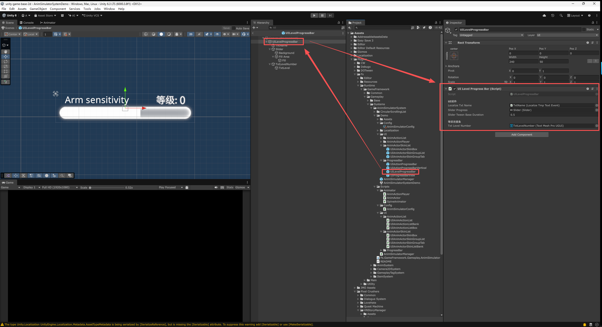

- UI Level Progress Bar组件，是等级进度条UI预制体中的 核心组件。
  - Txt Name：文本组件，名称（`TMP_Text`）。通常不需要修改。点击已配置的内容，就可以在Hierarchy面板中，快速选中这个物体。直接修改 文本的排版、颜色、大小等，来修改UI样式。显示的文本内容，会根据 [等级进度条 配置](#等级进度条-配置) 的 Ui Display Name(显示名称)进行替换。
  - Slider Progress：进度滑条组件。通常不需要修改。直接修改 滑条的大小、位置、排版等，来修改UI样式。滑条的填充量，会根据 当前经验值/升级所需经验值 的比例进行填充。
  - Slider Tween Base Duration：滑条数值平滑变化的 持续时间(秒)。当经验值发生变化时，滑条的填充量 会平滑地变化到 新的数值。数值越大，变化就越慢。
  - Txt Level Number：等级数字文本。通常不需要修改。直接修改 文本的排版、颜色、大小等，来修改UI样式。显示的文本内容，会根据 当前等级数值 来进行替换。

### 动作进度条 配置

随着玩家的操作 或道具的使用，会获得进度值，进度值会逐渐积累。当进度值达到 指定的数值时，就会触发一个动画动作，并消耗 指定的进度值。\
例如，玩家通过持续的操作，可以积累“快乐值”。当“快乐值”达到100时，就会自动触发角色的“跳舞动作”，并消耗掉“快乐值”。
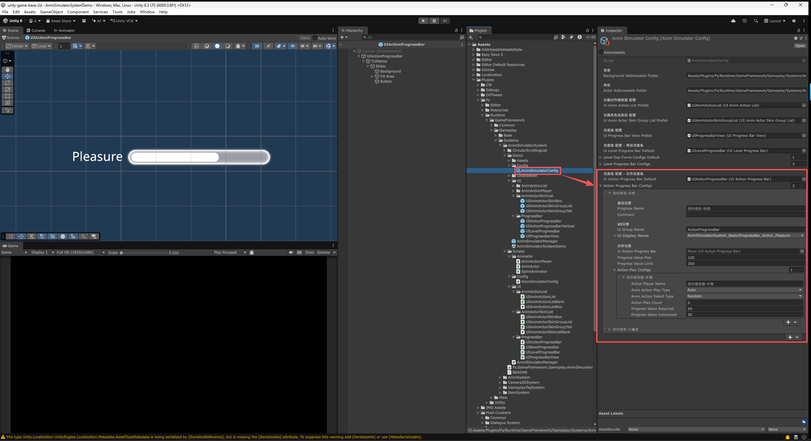

- Ui Action Progress Bar Default：默认的 动作进度条UI预制体。可以替换成 自己制作的 UI预制体，来修改动作进度条的 UI样式。
  - 每个 动作进度条还可以 单独配置不同的 UI预制体，来修改UI样式，但未单独配置时，会默认使用这里配置的 UI预制体。
- Action Progress Bar Configs：动作进度条配置组。配置了所有 动作进度条。
  - Progress Name：进度条名称。这个名称 仅用于配置文件之间的识别与指定。游戏中不显示。
  - Comment：备注。仅用于配置文件之间的备注说明。游戏中不显示。
  - Ui Group Name：UI分组名称。会将 进度条 添加到指定 分组下。若为空，则不显示UI的进度条，但会保留 进度条功能。在之前提到的 Ui Groups 中的 Ui Group Name，动作进度条的UI物体，会自动生成在指定的 UI分组的 Ui Group Root物体下。
  - Ui Display Name：显示名称。玩家在UI中，看到的这个进度条的名称。自 2.2.0 起是 `TextValue`：上面一行直接填**纯文本**；启用 `ATK_LOCALIZATION` 后，下方还会多出一个「本地化」栏可选多语言条目，取不到时自动回退到纯文本。
  - Ui Action Progress Bar：动作进度条UI预制体。可以单独配置 不同的动作进度条UI预制体，来修改UI样式。未单独配置时，会默认使用 Ui Action Progress Bar Default中配置的 UI预制体。
  - Progress Value Max：当前进度值达到该值后，进度条将视为满值，进度达到100%。
  - Progress Value Limit：进度条的限制值。获取的进度值总和达到该值后，进度条将不再增加。以此来限制可以播放的动画动作的 总体上限。
  - Action Play Configs：动画动作 配置组。配置了这个 动作进度条中，所有的动画动作，以及对应的触发条件、消耗进度值等。
    - Action Player Name：动画动作播放器 名称。对指定的 动画动作播放器 进行操作。这个名称 需要配置在 [动画动作播放器](#动画动作播放器) 中的 Action Player Name栏中，来进行指定。
      - 所有 [角色预制体](#角色预制体) 中，配置的 [动画动作播放器](#动画动作播放器)，建议使用 同一套 Action Player Name名称，这样就可以通过相同的一个名称，来同时对 所有角色预制体 中的动画动作播放器 进行操作。
    - Anim Action Play Type：动作的播放方式。
      - Auto：自动。当进度值 达到要求时，自动触发 动画动作的播放。
      - Manual：手动。当进度值 达到要求时，不会自动触发，而是需要玩家 手动点击UI按钮，来触发 动画动作的播放。
    - Anim Action Select Type：动作的播放选择方式。
      - Select：选择。由玩家在 动画动作的列表中，进行选择。
      - Order：顺序。直接按照配置的顺序，一次一个 播放动画动作。
      - Random：随机。在所有的动画动作中，随机 播放动画动作。
    - Action Play Count：动作播放次数。最多可播放的动作次数，0表示不限制次数。达到该次数后，即使进度值满足要求，也无法播放动作。
    - Progress Value Required：进度值 要求。触发这个动画动作的播放，需要达到的进度值。
    - Progress Value Consume：进度值 消耗。触发这个动画动作的播放后，需要消耗的进度值。


- UI Action Progress Bar组件，是动作进度条UI预制体中的 核心组件。
  - Txt Name：文本组件，名称（`TMP_Text`）。通常不需要修改。点击已配置的内容，就可以在Hierarchy面板中，快速选中这个物体。直接修改 文本的排版、颜色、大小等，来修改UI样式。显示的文本内容，会根据 [动作进度条 配置](#动作进度条-配置) 的 Ui Display Name(显示名称)进行替换。
  - Slider Progress：进度滑条组件。通常不需要修改。直接修改 滑条的大小、位置、排版等，来修改UI样式。滑条的填充量，会根据 当前进度值/Progress Value Required(进度值要求) 的比例进行填充。
  - Slider Tween Base Duration：滑条数值平滑变化的 持续时间(秒)。当进度值发生变化时，滑条的填充量 会平滑地变化到 新的数值。数值越大，变化就越慢。
  - Button：播放动作的按钮。当 Anim Action Play Type(动画动作播放方式)设置成 Manual(手动)时，这个按钮会被激活显示，玩家需要点击这个按钮，来触发动画动作的播放。可以调整这个按钮组件的大小、位置等，来修改按钮的可点击范围。

# 动画模拟器 使用

使用 动画模拟器系统，通常需要在 Unity中 进行一些配置，例如，角色预制体的制作、动画动作播放器的摆放与配置、进度条的配置、皮肤列表的配置等。

## 角色预制体

角色预制体 需要放置在 系统配置中 [资源文件路径](#资源文件路径) 中指定的角色文件夹路径下，才可以在动画模拟器系统中进行配置与使用。\


- 角色预制体的根物体，需要挂载 AnimActor组件。
  - AnimActor组件 是角色预制体的核心组件，负责管理角色的动画状态、皮肤等动画相关的功能。
  - Animator：动画控制器。指向角色的 **SpineAnimator** 或 **Live2dAnimator**。AnimActor 只与动画控制器的公共基类打交道，因此**同一份角色配置对两个后端都成立**，换后端只需换这个组件。
  - State Init List：状态初始化列表。状态的切换，通常会伴随 动画的切换。状态列表与对应的动画组，在 Spine Animator 或 Live2D Animator 组件中进行配置。
  - Base Skins：基础皮肤列表。角色的基础皮肤，会始终存在，不会被替换。通常用于角色的基础服装、身体等部位的皮肤配置。填写时会**自动列出该角色可用的皮肤名下拉**（Spine 取骨架里的皮肤，Live2D 取 Live2dAnimator 上配置的皮肤）。

### 皮肤组

- Anim Actor Skin Groups：角色皮肤组列表。配置了角色上所有可切换的皮肤，按照配置 在UI中分组显示，供玩家进行选择切换。通常用于角色的换装系统的配置。
  - Skin Group Name：皮肤组名称。这个名称 仅用于配置文件之间的识别与指定。游戏中仅显示 Skin Group Icon 中配置的图标。
  - Skin Group Icon：皮肤组图标。这个图标 会显示在UI中，作为这个皮肤组的代表图标，玩家通过点击这个图标，来选择切换这个皮肤组。
  - Skin Select Count Max：皮肤选择的最大数量。同时可应用的皮肤 最大数量，0则不限制。例如，饰品的皮肤组，可以同时选择多个饰品皮肤。眼睛的皮肤组，通常只能选择 一个眼睛皮肤。
  - Is Must Select Skin：必须选择皮肤。是否 必须选择 至少一个皮肤。例如，眼睛的皮肤组，必须选择一个眼睛皮肤。饰品的皮肤组，可以不选择任何一个饰品皮肤。
  - Default Skin Number：默认皮肤序号。在必须选择皮肤时，默认选择的皮肤序号。从1开始计数。
  - Anim Actor Skins：角色皮肤列表。配置了这个皮肤组中，所有的皮肤选项。每个皮肤选项，代表一个可切换的皮肤。
    - Skin Name：皮肤名称。Spine或Live2D中制作的皮肤，通过 文本名称 来进行指定，**两个后端使用相同的命名规则**（含文件夹路径时用 '/' 分隔）。这个名称 仅用于配置文件之间的 识别与指定。游戏中显示的名称，需要在 UiDisplaySkinName(显示皮肤名称)中进行设置。
      - 该栏会**自动列出当前角色可用的皮肤名下拉**。取不到候选时（未指定动画控制器、骨架数据缺失、Live2D 尚未配置皮肤）会退化为普通文本框，仍可手工填写；已填但不在候选内的值会被保留并标注「缺失」，不会被下拉洗掉。
    - Ui Display Skin Name：显示皮肤名称。玩家在UI中，看到的这个皮肤的名称。自 2.2.0 起是 `TextValue`：上面一行直接填**纯文本**；启用 `ATK_LOCALIZATION` 后，下方还会多出一个「本地化」栏可选多语言条目，取不到时自动回退到纯文本。
    - Skin Image：皮肤图标。这个图标 会显示在UI中，作为这个皮肤的 预览图标，玩家通过点击这个图标，来选择切换这个皮肤。

## 动画动作播放器

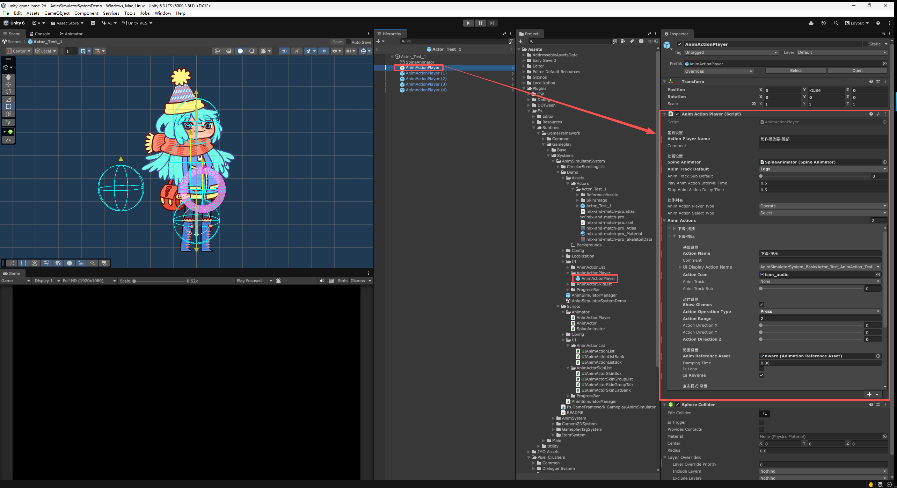

- AnimActionPlayer(动画动作播放器)，用于配置 角色身上可以被 玩家操作的动画动作。
  - 可以将 AnimActionPlayer预制体，直接拖拽放置到 角色预制体中。也可以自己手动创建空物体，并挂载 AnimActionPlayer组件(SphereCollider组件通常会自动添加)来完成。通过预制体的方式，能够直接使用 已经配置好的 组件与参数，节省了配置的时间。
  - Action Player Name：动画动作播放器名称。这个名称 仅用于配置文件之间的识别与指定。
  - Comment：备注。对于这个动画动作播放器的备注说明，便于策划进行识别与区分。
  - Animator：动画控制器。指向角色的 SpineAnimator 或 Live2dAnimator，负责动画的播放与控制。通常会自动寻找并挂载到预制体上，如果没有找到，也可以手动添加并配置。
  - Anim Track Default：动画轨道默认值。当通过这个动画动作播放器，触发播放动画时，如果没有在动画动作的配置中，指定动画轨道，就会使用这个默认的动画轨道。
  - Anim Track Sub Default：动画子轨道默认值。当通过这个动画动作播放器，触发播放动画时，如果没有在动画动作的配置中，指定动画子轨道，就会使用这个默认的动画子轨道。
  - Anim Track Blend Weight：轨道混合权重（0~1，默认 1.0）。这个播放器的动作**压在更低轨道之上的强度**。详见下面的 [轨道与混合权重](#轨道与混合权重)。
  - Play Anim Action Interval Time：最小间隔时间，连续播放 动画动作的 最小间隔时间，单位是秒。避免玩家连续快速地 触发动画动作，导致动画播放过于频繁，影响动画播放效果。一般设置成0.5秒左右。
  - Stop Anim Action Delay Time：停止动画动作 延迟时间。单位是秒。动画动作 播放完成 或 玩家停止操作后，等待指定时间后，才停止动画动作的播放。一般设置成0.5秒左右，能够让动画动作的停止更自然一些。
  - Anim Action Player Type：动画动作播放器 类型。决定这个播放器**接不接受玩家点击**、以及**播哪一条由谁决定**：

    | 类型 | 光标悬停时 | 点击时 | 播哪一条 |
    |---|---|---|---|
    | Operate(玩家操作) | 淡入点击提示 **+ 铺开动作列表** | 播放列表中当前选中的那条 | 玩家滚动列表自己挑 |
    | Random(点击随机) | 点击提示的表现**与 Operate 完全一致**，但**不铺开列表** | 当场随机抽一条播放 | 系统按权重随机 |
    | ProgressBar(进度条控制) | 无反应 | 不接受点击 | 由进度条配置驱动 |

    - **Random(点击随机)** 自 2.3.0 起提供。抽样只在**满足解锁条件**的动作中进行，并遵守下面动画动作上的 `Random Type Weight`（随机权重）与 `Random Type Play Limit`（限制播放次数）——与进度条驱动的随机播放是同一套抽样。适合「这里可以点，但点出什么不由玩家挑」的轻交互。
    - 三种类型都可以随时切换，切换后不需要复位任何东西。

### 轨道与混合权重

多条轨道可以同时播放。当它们**控制到同一根骨骼**时，谁盖谁由**轨道号**决定：

> **`EAnimTrack` 枚举值大的轨道，覆盖枚举值小的轨道。**

所以 `Action`(900) / `Other`(999) 会盖住 `Body`(1) / `Head`(2) 这些基础轨道——玩家操作触发的动作因此总能压过角色的待机、呼吸等循环动画，操作反馈最直观。这条保证在两个后端上都成立（Spine 按轨道号升序应用，Live2D 按层号先后应用；插件内部会把稀疏的轨道号压成保序的紧凑编号交给各自的运行时）。

**Anim Track Blend Weight（轨道混合权重）** 决定「盖得有多实」，配在 `AnimActionPlayer` 上，取值 0~1：

| 值 | 效果 |
|---|---|
| 1.0（默认） | 完全覆盖低轨道。与 2.3.0 之前的行为完全一致 |
| 0.5 | 本动作与低轨道的姿势各占一半，动作幅度看起来减半 |
| 0 | 完全看不出本动作，低轨道原样显示 |

注意权重只影响**强度**，不影响**方向**——低轨道永远盖不过高轨道，改权重也不会反转这个关系。

- **Spine**：落到 `TrackEntry.Alpha`。**权重取 1 时结果完全确定**；取小于 1 时有一处 Spine 的固有语义要知道——「以本条为基准姿势」（`MixBlend.First`）只作用于 Spine 的 **0 号轨道**，而本系统的轨道从 `Body` 起、0 号轨道空着。于是**没有任何轨道打过关键帧的骨骼**会与上一帧的姿势相混而非从初始姿势起混，多帧下呈渐近而非定值。真需要严格的基准姿势，把基础循环动画配到 `EAnimTrack.None`（即 0 号轨道）即可。
- **Live2D**：落到 `CubismMotionController.SetLayerWeight`。Cubism 的 **0 号层是层混合器的基准层、权重恒为 1**，落到那里的权重设置无效（会告警一次）；另外拖拽 / 旋转 / 按压与反向播放走的是逐帧采样通道，不经过层混合器，权重对它们不适用。

### 动画动作列表


- Anim Actions：动画动作列表。配置了这个动画动作播放器中，所有的动画动作选项。每个动画动作选项，代表一个可触发的动画动作。
  - Action Name：动作名称。这个名称 仅用于配置文件之间的识别与指定。UI中显示的名称，需要在 UiDisplayActionName(显示动作名称)中进行设置。
  - Comment：备注。对于这个动画动作的备注说明，便于策划进行识别与区分。
  - Ui Display Action Name：显示动作名称。玩家在UI中，看到的这个动画动作的名称。自 2.2.0 起是 `TextValue`：上面一行直接填**纯文本**；启用 `ATK_LOCALIZATION` 后，下方还会多出一个「本地化」栏可选多语言条目，取不到时自动回退到纯文本。
  - Action Icon：动作图标。这个图标 会显示在UI中，作为这个动画动作的预览图标。
  - Anim Track：动画轨道。用于不同类型的动画的区分，便于分类整理。不同轨道的动画 可以同时播放。在上面的 Anim Track Default(动画轨道默认值)中，配置了默认的动画轨道，如果在这里没有 指定动画轨道(设置为None)，就会使用默认的动画轨道。
  - Anim Track Sub：动画子轨道。用于同一类型动画的区分，便于分类整理。不同子轨道的动画 可以同时播放。在上面的 Anim Track Sub Default(动画子轨道默认值)中，配置了默认的动画子轨道，如果在这里没有 指定动画子轨道(设置为None)，就会使用默认的动画子轨道。
  - Show Gizmos：显示线框。在Scene场景视图中，是否显示这个动画动作的交互范围的线框。便于调整交互范围的位置与大小。
  - Action Operation Type：动作操作类型。这个动画动作 是通过什么方式 来触发的。
    - Click(点击)：点击后，直接播放 动画动作。
    - Drag(拖拽)：沿着指定方向来回拖拽，作为动画播放的进度参数。
    - Rotate(旋转)：绕指定中心拖拽旋转，作为动画播放的进度参数。
    - Press(按压)：长按时，动画进度涨到100%。松开时，动画进度落到0%。
  - Action Range：动作的交互范围。交互范围的大小，影响动画进度的变化程度。例如，拖拽到范围边缘时，动画进度涨到100%，拖拽到范围中心时，动画进度为0%。一般设置成2.0左右。
  - Action Direction X：动作的交互方向 X轴。对交互方向的X轴进行旋转，调整交互的方向。例如，拖拽的交互方向，默认是水平垂直向上的，可以通过这个值进行选择来调整。
  - Action Direction Y：动作的交互方向 Y轴。对交互方向的Y轴进行旋转，调整交互的方向。
  - Action Direction Z：动作的交互方向 Z轴。对交互方向的Z轴进行旋转，调整交互的方向。
  - Anim Name：动画名称。这个动作要播放的动画，用**动画制作时起的名字**来指定，例如“dress-up”。Spine 与 Live2D **使用相同的命名规则**——同一份动作配置对两个后端都成立。
    - Spine 侧按名在骨架数据中查找；Live2D 侧按名在 Live2dAnimator 的「动作查找表」中查找（Cubism 没有按名找动作的 API，需先在那张表里把动画名与动作剪辑对应起来）。
  - Damping Time：阻尼时间。用于平滑过渡动画的进度变化，单位是秒。一般设置成0.05秒左右，能够让动画进度的变化更自然一些。增大这个值，可以让动画的反应更迟钝，更有重量感。
  - Is Loop：是否循环。这个动画动作 是否需要循环播放。例如，从Idle动画切换到Walk动画，两个动画均为循环动画，那么这个动画动作就需要设置成 循环。
  - Is Reverse：是否反向。这个动画动作 是否需要反向播放。
  - Start Delay Time：开始延迟时间，单位是秒。玩家触发这个动画动作后，等待指定时间，才开始播放动画。

    
  - 下面两个参数在**随机抽样**时生效，两处随机都用它们：动画动作播放器的类型设为 Random(点击随机)，以及 [动作进度条配置](#动作进度条-配置) 里 Anim Action Select Type 设为 Random(随机)。
  - Random Type Weight：随机权重。权重值越大，被随机到的概率就越大。随机概率 = 这个动画动作的权重值 / 所有动画动作的权重值总和。例如，两个动画动作，动画动作A的权重值是10，动画动作B的权重值是40，那么动画动作A被随机到的概率就是10/(10+40)=20%，动画动作B被随机到的概率就是40/(10+40)=80%。
  - Random Type Play Limit：限制播放次数。这个动画动作可以被播放的最大次数，达到这个次数后，就不会再被随机到。设置为0则不限制。
  - Click Mode Anim Play Speed：点击模式 动画播放速度。这个动画动作的动画播放速度的倍速，默认为1.0。
    > ⚠️ **不要填 0**。速度 0 在两个后端都表现为「动画定格在起始帧」且**不报错**（Spine 是 `TrackEntry.TimeScale = 0`，Live2D 会因 Cubism 表达不了暂停而切到采样通道停在进度 0），角色一动不动却毫无线索。自 2.3.1 起遇到这种配置会**告警一次**。
    >
    > 拖拽 / 旋转 / 按压这类**由玩家驱动进度**的动作也不需要把它设为 0——它们以正常速度起播，首次写入进度时会自动切到采样通道。
  - Rotate Mode Angle Range Max：旋转模式 角度范围最大值，单位是 度。旋转的角度达到这个最大值时，动画进度涨到100%。设置为360度时，可以进行全方位的旋转交互。设置为180度时，可以进行半周的旋转交互。
  - Is Anti Clockwise：是否逆时针。旋转交互时，是否 逆时针的方向来进行旋转。
  - Press Mode Anim Press Speed：按压模式 动画按压速度。在按压时 动画进度 上涨的速度倍率，默认为1.0。
  - Press Mode Anim Release Speed：按压模式 动画松开速度。在松开时 动画进度 下降的速度倍率，默认为1.0。
  - Press Mode Anim Action Stop Delay：按压模式 动画动作停止延迟时间（秒），按压松开 并不进行操作后，等待一段时间 再停止动作。

    
  - Progress Bar Configs：进度条 配置组。动作关联的 进度条 配置组，对进度条 进行操作。
    - Progress Name：进度条名称。指定关联的 进度条名称。进度条需要在 系统配置的 [进度条配置](#进度条-配置) 中进行配置。
    - Progress Modify Value：进度条 修改值。完成一次动画动作，对进度条 进行增加或减少的值。配置为负数时，就会对进度条进行减少。
  - Conditions：条件。**全部满足时，本动作才会出现在 动画动作列表 中；留空即为无条件。**

    自 2.2.0 起，这里用的是 Ale Toolkit 的**条件系统**（`Ale.Condition`），在 Inspector 上直接内联编辑。结构是固定的两层：

    ```
    条件（表达式）           组之间：AND / OR
    └─ 组                    组可整体取反(NOT)；组内条目之间：AND / OR
       └─ 条目               条目可单独取反(NOT)；选一个「判定器」并填其参数
    ```

    - **组操作符 / 条目操作符**：点那个 `AND` / `OR` 按钮即可切换。
    - **NOT**：勾上即对该组 / 该条目的结果取反。
    - **判定器**：点条目上的下拉，按分类选择。本插件提供两个（分类「动画模拟器」）：

      | 判定器 | 参数 | 说明 |
      |---|---|---|
      | 等级进度条-等级 | 等级进度条名称 / 比较 / 等级 | 与该进度条的**当前等级**比较。进度条需先在 [进度条配置](#进度条-配置) 中配好 |
      | 进度条-进度值 | 进度条名称 / 比较 / 进度值 | 与该进度条的**当前进度值**比较，等级条与动作条都适用 |

      比较符有「大于 / 大于等于 / 等于 / 小于等于 / 小于」五种。

    - 条件系统本身还自带 `总是成立` / `持有标记` / `数值比较` 三个通用判定器，可一并使用。
    - **要接自己的游戏系统**（例如「持有某道具」），写一个带 `[ConditionEvaluator("你的键")]` 的类实现 `IConditionEvaluator` 即可，运行时会自动发现并出现在下拉里，不需要改本插件。

    > **判定一律「失败即关」**：进度条名称查不到、场景中没有 `AnimSimulatorManager`、参数缺失——这些情况都判为**不满足**。2.2.0 之前的实现在这些情况下反而判为满足，配错名字的条件会静默失效、动作凭空解锁。

    > **解锁是实时的**：条件依赖的进度条读数一变，`AnimSimulatorManager` 就广播一次，动作列表随即重新求值，无需重开列表。

### 动画动作列表UI 制作与排错

上面的 [动画动作列表](#动画动作列表) 讲的是**数据**（AnimActionPlayer 上配置了哪些动作）。这一节讲的是**显示这些数据的 UI 预制体**（`UIAnimActionList.prefab`）：玩家把光标移到角色身上时淡入、滚动选择动作的那个列表。

自 2.0.0 起，这个列表由第三方的 CircularScrollingList 改为 Unity 原生 `ScrollRect` + toolkit 的虚拟滚动列表（`UiwFocusOrderList`）。两者的驱动方式完全不同，**下面这些点在原来的实现里都不存在**，是重做后新增的约束——不满足时的表现往往非常具有迷惑性（比如"列表明明显示出来了却一动不动"），故单列一节。

#### 预制体结构

```
UIAnimActionList              ← Animator（淡入淡出 / 开合动画）+ UIAnimActionList 脚本
├─ CircularScrollingList      ← CanvasGroup + ScrollRect + UIAnimActionScrollList
│  └─ Viewport                ← RectMask2D + 透明 Image（必需，见要点 ②）
│     └─ Content              ← 空 RectTransform，格子由脚本实例化到此
└─ CircleClickTip             ← 纯视觉的点击提示，不参与射线
   └─ ImgCircleClickTip
```

- `CircularScrollingList` 这个**节点名是历史遗留**（2.0.0 之前挂的是同名的第三方组件），现在挂的是 Unity 原生 ScrollRect。不要改名——5 个动画剪辑（`A_FadeIn` / `A_FadeOut` / `A_ListOpen` / `A_ListClose` / `A_TipOnly`）的曲线是**按节点路径名绑定**的，改名会让整套开合动画失配。同理，`CircleClickTip` 也不要挪层级。
- 列表的显示 / 隐藏由 Animator 驱动 `CircularScrollingList` 上 CanvasGroup 的 `Alpha` 与 `Blocks Raycasts`：`A_ListOpen` 置 1、`A_ListClose` / `A_FadeOut` / `A_TipOnly` 置 0。**收起状态下列表是收不到任何 UI 射线的**，这是有意为之。
- **`A_TipOnly` 是 Random(点击随机) 类型专用的状态**（2.3.1 起）。它对 `CircleClickTip` 的处理与 `A_ListOpen` **逐条相同**（放大到 1.55 倍 + 持续旋转），只是把列表的两条曲线按住 0——两种同样「能点」的播放器，点击提示的视觉反馈必须一致，差别只在列表铺不铺开。

  状态机因此是五个状态：

  ```
  A_FadeOut ──TriggerFadeIn──▶ A_FadeIn ──(播完自动)──▶ A_ListClose
                                                          │
                                    TriggerListOpen ◀──────┼──────▶ TriggerTipOnly
                                            │                              │
                                            ▼                              ▼
                                       A_ListOpen ◀──────────────────▶ A_TipOnly
                                    （提示圈展开 + 列表铺开）      （只有提示圈展开）
  ```

  `A_ListOpen` 与 `A_TipOnly` 之间互设转换，是为了让光标从一种播放器直接滑到另一种时能就地切换。两者都接受 `TriggerListClose` 收回、`TriggerFadeOut` 直接淡出。

  **`A_ListClose` 是 idle 态，不是隐藏态。** 光标离开后 Operate 与 Random 都回到这里——提示圈缩回 1.0 倍、`ImgCircleClickTip` 上那个独立 Animator 的慢速自转（`A_CircleRotation`）继续跑，「这里能点」的提示仍在。真正让提示圈消失的是 `A_FadeOut`，由**播放器的绑定 / 解绑**触发（见 `SetAnimActionPlayer`），与悬停无关。

  > **自制 UI 预制体要补上这个状态。** 沿用旧预制体（没有 `TriggerTipOnly` 参数）时插件不会报错，Random 类型的提示圈会停在「已淡入但未展开」的形态，并在首次发生时告警一次。
- 格子预制体（`UIAnimActionListBox.prefab`）挂在 `UIAnimActionScrollList` 的 `Cell Prefab` 上，不要作为子物体预先摆进 Content —— 格子由虚拟滚动按需实例化与复用。

#### 配置要点

**① Content 的尺寸由脚本接管，不要手动设置，也不要挂 Layout Group / Content Size Fitter。**

- **格子高度**自动取自 `Cell Prefab` 根 RectTransform 的高度（示例中为 60）。
- **行距** = 格子高度 × `Row Pitch Scale`（行距倍率，在 `UIAnimActionScrollList` 上，默认 `1.0`）。**想调条目的疏密改这个倍率即可，不必再去改格子预制体的高度**——改预制体高度会连带改变格子里所有元素的可用空间。倍率大于 1 拉开间隙，小于 1 让相邻行重叠。
  - 需要 **`com.ale.toolkit` ≥ 1.7.5**。Play 模式下改这个值会立刻生效，方便对着调。
- **Content 高度** = 条目数 × 行距 **+ 首尾留白**。
- **首尾留白**是焦点列表特有的：`Focus Anchor` 设为 `Center` 时，第一条和最后一条也必须能滚到视口正中，所以 Content 头尾各补 `(视口高 − 行距) / 2`。
- ⚠️ 这一项需要 **`com.ale.toolkit` ≥ 1.7.1**。低于该版本时没有留白，动作只有 3 条时 Content 仅 180px、比 400px 的视口还矮，ScrollRect 判定"无内容可滚"——表现为**条目全挤在列表顶部、滚轮完全没反应**；即便动作很多，首尾各半个视口的条目也**永远无法被选中**。
- **焦点条目严格居中**：配了 `Focus Scale Curve`（焦点缩放曲线）时，焦点条目的视觉中心与焦点线重合。这需要 **`com.ale.toolkit` ≥ 1.7.5**——更早的版本把格子轴心设在顶端，放大的格子只向下长开，焦点条目会比焦点线低 `(缩放 − 1) × 行距 / 2`（缩放峰值 1.5、行距 60 时正好偏 15px）。

**② Viewport 上必须有一张"透明但可命中"的 Image。**

原生 ScrollRect 靠 UI 射线收滚轮：光标必须命中某个 Raycast Target，事件才会沿父链冒泡到 ScrollRect。原来的 CircularScrollingList 是自己轮询鼠标滚轮的，不依赖射线，所以旧预制体上没有这张图——重做后必须补。两个设置**缺一不可**：

- `Image`：`Color` 的 **A = 0**、**`Raycast Target` 勾选**
- `CanvasRenderer`：**`Cull Transparent Mesh` 不要勾** ← 最容易漏。勾上后 alpha 为 0 的图形会被剔除，**连带失去射线命中**，等于白加

漏掉时的表现：只有光标恰好压在某个格子的图标或文字上才滚得动，格子之间的空隙一滚就停。

**③ Viewport 宽度必须容得下动作名标签。**

`RectMask2D` 是按 Viewport 矩形裁剪的，而动作名标签是自格子中心**向右伸出**的（示例中 `ImgNameLabel` 伸到 +150px）。Viewport 只有 100px 宽时，动作名会被齐根切掉、只剩中间的图标。示例取 500×400（**关于中心对称**加宽，格子与其子物体的相对位置不受影响）。调整动作名排版时，记得同步复查这个宽度。

**④ 滚轮的步长与平滑位移，分别由两个组件上的两个字段控制。**

| 字段 | 在哪 | 含义 |
|---|---|---|
| `Scroll Sensitivity` | ScrollRect | **一档滚轮走多远**（像素）。设为**行距**（示例 60；改了 `Row Pitch Scale` 就要同步改这里），一档正好一条动作；否则会停在两条之间 |
| `Scroll Tween Duration` | UIAnimActionScrollList | **一档走完用多久**（秒）。默认 0.1；设为 0 则恢复瞬间跳变 |

`Movement Type` 建议 `Clamped`，滚到两端不回弹过冲。

⚠️ **`Scroll Sensitivity` 在运行期会被列表取走并置 0**，这是有意的，不是 bug。原因是 `ScrollRect` 与 `UIAnimActionScrollList` 挂在同一个 GameObject 上，而 `ExecuteEvents` 会把滚轮事件派发给该物体上**全部** `IScrollHandler`——两者都会收到。不把 `ScrollRect` 的灵敏度清零，就会先被它瞬间挪一档、再被补间从头拉回，白抖一帧。清零后位移完全由列表给出，行为唯一。

- 这只改运行期的字段值，**不动预制体**——Inspector 上的 `Scroll Sensitivity` 仍是「一档滚多远」的唯一可调入口，只是改由列表来应用它。
- 所以**运行时读到 `scrollSensitivity` 为 0 属正常**，别照着它去反推「滚轮坏了」。
- 连滚数档时按**目标位置**累加，而非按当前位置——否则每档都从半路重新起算，越滚越短、最后停在两条之间。

> 已知限制：**拖拽滚动松手后不做吸附对齐**。停在两条之间时，焦点缩放曲线会让上下两条都呈半放大态。只用滚轮不受影响（一档整格步进，且拖拽开始时会取消进行中的补间）。

**⑤ 场景 EventSystem 的输入模块必须接线（最隐蔽的一条）。**

本系统有**两条互相独立**的输入通路，务必先分清：

| 通路 | 走什么 | 负责什么 |
|---|---|---|
| 角色交互 | `AnimSimulatorManager` 的 `ToolkitInputBinder` + **物理射线**（`Physics2D.GetRayIntersection`） | 光标移动、列表的悬停淡入 / 展开、点击 / 拖拽 / 旋转 / 按压驱动动画 |
| 列表交互 | **UI EventSystem**（`GraphicRaycaster` + `InputSystemUIInputModule`） | 列表滚轮、格子点击 |

角色交互**完全绕开 EventSystem**。所以 EventSystem 一旦坏掉，**悬停展开一切正常，只有列表滚不动、格子点不动**——极易误判成列表本身的问题。检查项：

- EventSystem 上 `InputSystemUIInputModule` 的 `Actions Asset`，以及 `Point` / `Left Click` / `Scroll Wheel` 等动作引用，必须都指向工程内**确实存在**的 `.inputactions` 资产。引用指向一份已被删除的资产时，Inspector 里**看起来仍有名字**（如 `UI/ScrollWheel`），但实际解析为 null，不会有任何报错。
- 场景里的 `PlayerInput` 若设置了 `UI Input Module`，它会在运行时用**自己的** Actions 覆盖模块的 Actions Asset，并按「动作图名/动作名」重映射引用。**两边应指向同一份资产**，否则重映射可能整体落空、把引用全部洗成 null。
- Demo 场景就踩过这个坑：模块引用的是一份随 Fs 插件一起消失的 `.inputactions`（GUID 在工程中已不存在），十个动作引用全部解析失败，UI 指针事件一个都产不出来。现已改为与 `PlayerInput` 共用 `Assets/InputSystem_Actions.inputactions`。

#### 排错速查

| 症状 | 最可能的原因 | 怎么确认 |
|---|---|---|
| 条目全挤在列表顶部，滚轮完全没反应 | ① 缺首尾留白（toolkit < 1.7.1） | 比一下 Content 高度是否 ≤ Viewport 高度 |
| 首尾几条动作永远选不中，中间的正常 | ① 同上 | 滚到底，看焦点能否落到最后一条 |
| 只有压在格子上才滚得动，空隙处滚不动 | ② Viewport 缺可命中 Image，或勾了 Cull Transparent Mesh | 查 Viewport 的 Image 与 CanvasRenderer |
| 滚轮和格子点击都没反应，但悬停展开正常 | ⑤ EventSystem 输入模块引用失效 | 播放时查模块的 `scrollWheel` / `point` 是否为空 |
| 动作名看不见，只剩中间的图标 | ③ Viewport 太窄，被 RectMask2D 裁掉 | 把 Viewport 加宽，看标签是否回来 |
| 一档滚轮跳过好几条，或总停在两条之间 | ④ Scroll Sensitivity 与行距不一致 | 令其等于 Cell Prefab 高度 × Row Pitch Scale |
| 焦点条目明显偏下，对不准视口中线 | ① toolkit < 1.7.5，格子轴心在顶端、放大只向下长开 | 量一下偏移是否恰为 (缩放 − 1) × 行距 / 2 |
| 想调条目疏密，却只能改格子预制体高度 | ① toolkit < 1.7.5，没有 Row Pitch Scale | 升级 toolkit 后改倍率，不要动预制体高度 |
| 滚轮切换条目是瞬间跳变的 | ④ Scroll Tween Duration 为 0，或 toolkit < 1.7.2 | 把它设为 0.1 左右 |
| 滚轮位移过慢 / 拖沓 | ④ Scroll Tween Duration 过大 | 0.1 秒是较跟手的取值，超过 0.2 会明显发黏 |
| 运行时看到 Scroll Sensitivity 变成 0 | 正常现象，列表按 ④ 接管了滚轮 | 看预制体上的值是否仍是行高 |
| 格子位置错乱 / 相互重叠 | Content 上挂了 Layout Group 或 Content Size Fitter | 移除这些组件，定位交回虚拟滚动 |
| 列表已淡出却仍挡住背后的点击 | 开合动画未把 `Blocks Raycasts` 归 0 | 查 `A_ListClose` / `A_FadeOut` / `A_TipOnly` 的曲线 |
| Random 播放器的点击提示不放大、不旋转，比 Operate 的"小一号" | UI 预制体缺 `A_TipOnly` 状态与 `TriggerTipOnly` 参数 | 看控制台是否有「没有 TriggerTipOnly 参数」的告警 |
| Random 播放器悬停时列表也铺开了 | `A_TipOnly` 里 `CircularScrollingList` 的两条曲线没归 0 | 查该剪辑的 `CanvasGroup.Alpha` / `BlocksRaycasts` 是否恒 0 |
| 光标一离开，某个播放器的提示圈就整个消失（别的还在） | 关闭分支把它判成了「不接受点击」 | 查该播放器的 `Anim Action Player Type` 是不是 ProgressBar |

#### 运行期自检片段

排查"到底是列表的问题还是 EventSystem 的问题"时，进入播放模式后执行下面这段即可分辨。它先看输入模块有没有动作，再直接给列表合成一个滚轮事件——**若合成事件能滚而实际滚轮不能，问题就一定在 EventSystem 一侧**。

```csharp
// 1) 输入模块是否拿得到动作
var uim = UnityEngine.EventSystems.EventSystem.current.currentInputModule
          as UnityEngine.InputSystem.UI.InputSystemUIInputModule;
Debug.Log($"scrollWheel = {(uim.scrollWheel?.action == null ? "未接线!" : uim.scrollWheel.action.name)}");
Debug.Log($"point       = {(uim.point?.action == null ? "未接线!" : uim.point.action.name)}");

// 2) 给列表合成一个滚轮事件，看 Content 会不会动
var scrollRect = /* 列表上的 ScrollRect */;
var ped = new UnityEngine.EventSystems.PointerEventData(UnityEngine.EventSystems.EventSystem.current)
{
    position    = RectTransformUtility.WorldToScreenPoint(null, scrollRect.viewport.position),
    scrollDelta = new Vector2(0f, -1f),   // 向下滚一档
};
var hits = new System.Collections.Generic.List<UnityEngine.EventSystems.RaycastResult>();
UnityEngine.EventSystems.EventSystem.current.RaycastAll(ped, hits);
Debug.Log($"射线命中 {hits.Count} 个，最上层 = {(hits.Count > 0 ? hits[0].gameObject.name : "无")}");
if (hits.Count > 0)
{
    ped.pointerCurrentRaycast = hits[0];
    var handler = UnityEngine.EventSystems.ExecuteEvents.ExecuteHierarchy(
        hits[0].gameObject, ped, UnityEngine.EventSystems.ExecuteEvents.scrollHandler);
    Debug.Log($"滚轮由 {(handler ? handler.name : "无人")} 处理，Content = {scrollRect.content.anchoredPosition}");
}
```

判读方式：

- **射线命中 0 个** → 列表处于收起态（`Blocks Raycasts` 为 0），或要点 ② 没配好。
- **命中了但"无人处理"** → 命中的对象不在 ScrollRect 的子树下（例如被某个兄弟节点的图形挡在了上层）。
- **Content 动了，但实际滚轮不动** → 列表侧没问题，去查要点 ⑤ 的输入模块。

## 背景预制体

背景预制体 需要放置在 系统配置中 [资源文件路径](#资源文件路径) 中指定的背景文件夹路径下，才可以在动画模拟器系统中进行配置与使用。\
背景预制体 与 角色预制体的 配置方式 其实是相同的，都是由 Spine 或 Live2D 动画资源导入到Unity中，制作成预制体，并挂载 AnimActor组件 与对应的动画控制器（SpineAnimator 或 Live2dAnimator）来完成。\
做出区分是为了方便 分类整理，以及在系统配置中，能够区分背景与角色的文件夹路径，来进行不同的资源管理。
