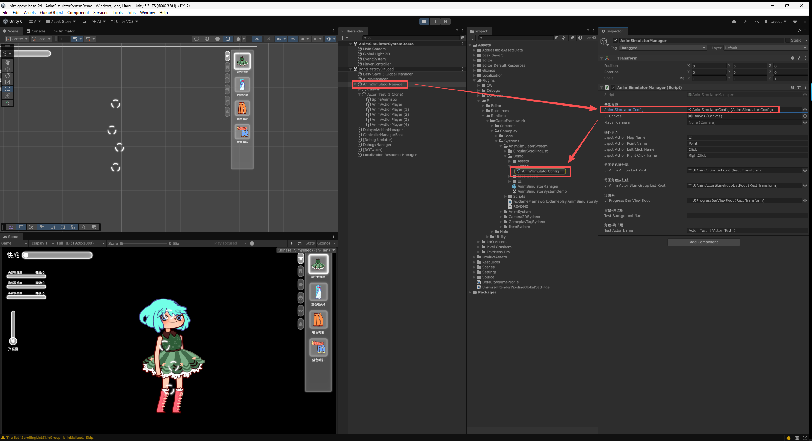

<p align="center">
  
  
  
  
  
  
</p>

<p align="center">
  📥
  <a href="#-安装">安装</a> |
  <a href="#-快速开始">快速开始</a> |
  <a href="Packages/com.ale.animsimulatorsystem/README.md">详细文档</a>
</p>

# Ale Anim Simulator System - 动画模拟器系统
Ale Anim Simulator System 是一款面向 `Unity` 的 **2D 动画模拟器插件**，把美术在 **Spine / Live2D** 中制作好的动画资源，变成可以用光标 **点击 / 拖拽 / 旋转 / 按压** 去玩的互动内容。
它用一个 `AnimSimulatorConfig` 资产集中配置**背景与角色的资源路径、动作列表 / 皮肤列表 / 进度条的 UI 预制体、等级进度条与动作进度条**；角色预制体上则用 `AnimActionPlayer` 在身体的各个位置摆放「可操作点」，每个点挂一组动画动作。等级作为动作与皮肤的**解锁条件**，进度值作为动作的**播放条件**，再配上可分组的自定义换装，构成一套完整的养成 / 互动循环。
面向**策划**：全部配置在 Inspector 与 ScriptableObject 上完成，无需写代码；动画与皮肤一律按**字符串名**指定，**两个后端使用相同的命名规则**，因此同一份动作 / 皮肤组配置对 Spine 与 Live2D 都成立。



## 📜 目录
- [Ale Anim Simulator System - 动画模拟器系统](#ale-anim-simulator-system---动画模拟器系统)
  - [📜 目录](#-目录)
  - [简介](#简介)
    - [项目特性](#项目特性)
    - [两个动画后端](#两个动画后端)
  - [💻 环境要求](#-环境要求)
    - [必需：Ale Toolkit](#必需ale-toolkit)
    - [其他](#其他)
  - [📦 安装](#-安装)
    - [使用 UPM（推荐）](#使用-upm推荐)
    - [安装动画后端运行时](#安装动画后端运行时)
    - [导入演示 Sample（可选）](#导入演示-sample可选)
    - [其他方式](#其他方式)
  - [🚀 快速开始](#-快速开始)
    - [1. 启用动画后端](#1-启用动画后端)
    - [2. 创建配置资产](#2-创建配置资产)
    - [3. 制作角色预制体](#3-制作角色预制体)
    - [4. 摆放动画动作播放器](#4-摆放动画动作播放器)
    - [5. 场景挂载与试玩](#5-场景挂载与试玩)
    - [6. 运行时接口](#6-运行时接口)
  - [🖥️ 欢迎窗口](#️-欢迎窗口)
  - [🧩 编译宏开关](#-编译宏开关)
  - [📖 详细文档](#-详细文档)
  - [📁 目录结构](#-目录结构)
  - [📋 待办事项](#-待办事项)
  - [📄 许可](#-许可)

## 简介
Spine 与 Live2D 只负责把动画**播出来**，而「玩家摸一下角色的头，头部动画就跟着手的位移走」这类互动，要自己从输入、射线、轨道、混合权重一路搭到 UI。本插件把这条链路收拢成一套可配置的东西：

1. **摆点位，不写代码** —— `AnimActionPlayer` 配一个 `SphereCollider` 就是角色身上的一个可操作点。放在头上就是摸头，放在裙摆上就是掀裙摆；一个点挂一组动作，玩家悬停时列表自动铺开。
2. **动画跟着手走** —— 拖拽 / 旋转 / 按压三种操作把光标的位移、角度、按压时长换算成**动画播放进度**，而不是触发后放完一整段。手停动画就停，手回动画就倒着走。
3. **多轨道叠加** —— 呼吸、眨眼、待机循环与玩家正在操作的动作可以同时播。`EAnimTrack` 枚举值大的轨道覆盖小的，因此操作反馈总能压过基础循环动画；盖得有多实由**轨道混合权重**（0~1）控制。
4. **养成循环现成** —— 等级进度条（经验 → 等级 → 解锁）与动作进度条（累积 → 触发 → 消耗）各自带运行时逻辑与 UI，解锁条件用可视化的条件系统配置。
5. **两个后端一份配置** —— 动画名与皮肤名的命名规则相同，换后端只需换角色预制体上的动画控制器组件。

### 项目特性
| 特性 | 描述 |
| --- | --- |
| 双后端并存 | **Spine 与 Live2D 可在同一工程内同时启用**，用哪个由角色预制体上挂 `SpineAnimator` 还是 `Live2dAnimator` 决定。后端无关的机制（状态机、轨道播放栈、计时、皮肤名册、淡入淡出）都在抽象基类 `AnimatorBase` 里，上层的 `AnimActor` / `AnimActionPlayer` 对具体后端无感。 |
| 四种光标操作 | **点击 / 拖拽 / 旋转 / 按压**。后三种把光标的位移、角度、按压时长换算成动画播放进度（可配交互范围、方向、阻尼、旋转角度范围、按压涨落速度）。 |
| 三类动作播放器 | `Operate`（悬停铺开列表，玩家滚动挑一条）/ `Random`（**只淡入点击提示，点击时按权重随机抽一条**）/ `ProgressBar`（不接受点击，由进度条驱动）。 |
| 多轨道与混合权重 | 轨道号 = `主轨道 × 10 + 子轨道`，**`EAnimTrack` 枚举值大的轨道覆盖枚举值小的**；`Anim Track Blend Weight`（0~1，默认 1.0）决定覆盖强度。Spine 落到 `TrackEntry.Alpha`，Live2D 落到 `CubismMotionController.SetLayerWeight`。 |
| 等级进度条 | 经验 → 等级，等级作为动作与皮肤的解锁条件。经验曲线可按**等级区间**分段配置 `Linear`（线性）/ `Exponent`（指数）两种增长。 |
| 动作进度条 | 进度值累积到阈值后**消耗进度并触发动作**。播放方式 `Auto` / `Manual`，选择方式 `Select` / `Order` / `Random`，另有单条动作的播放次数上限与进度条总量上限。 |
| 解锁条件系统 | 基于 toolkit 的 `Ale.Condition`：两级 AND / OR、组与条目各自可取反、Inspector 内联编辑。自带「等级进度条-等级」「进度条-进度值」两个判定器；接自己的游戏系统只需写一个带 `[ConditionEvaluator]` 的类，不必改本插件。**解锁是实时的**，进度条读数一变列表就重新求值。 |
| 可分组换装 | 皮肤按组配置（衣服 / 裤子 / 头发 / 眼睛 / 配饰…），每组可设最大可选数、是否必选、默认项。Spine 用骨架里的 Skin 合并成组合皮肤（**可叠加**），Live2D 用部件 ID 映射，**皮肤名规则相同**；皮肤名字段会自动列出该角色可用的下拉。 |
| 虚拟滚动 UI | 动作列表与皮肤列表基于 toolkit 的虚拟滚动（对象池 + 只渲染可见区）。焦点条目**严格居中**，条目疏密由 `Row Pitch Scale` 行距倍率调整，无需改格子预制体高度。 |
| 展示名可选多语言 | 动作名 / 皮肤名 / 进度条名统一为 `TextValue`：**纯文本那一项始终存在**，Unity Localization 条目是附加的，取不到时自动回退。关掉 `ATK_LOCALIZATION` 不再丢失展示名。 |
| 零第三方运行时依赖 | 2.1.0 起不再依赖 DOTween，淡入淡出 / 起播延时 / 单次播放完成 / 循环随机间隔全部改用 `ToolkitTween`。除 Ale Toolkit 外无其它运行时依赖。 |
| 欢迎窗口向导 | 后端宏一键开关并**实时检测运行时是否安装**，外加创建配置资产、打开文档的快捷入口；界面语言与 `ATK_*` 全局宏跳转到 Ale Toolkit 欢迎窗口统一配置。 |

### 两个动画后端
| 后端 | 组件 | 需要的运行时 | 安装方式 | 该后端的差异点 |
| --- | --- | --- | --- | --- |
| **Spine** | `SpineAnimator` | `com.esotericsoftware.spine.spine-unity`（+ `spine-csharp`） | git URL，经 Package Manager 安装 | 动画**按名直接在骨架数据里查**，无需查找表；轨道数不受限制；皮肤是骨架数据里的一等公民、可下拉选取并叠加；进度控制原生支持（直接读写 `TrackEntry.TrackTime`）。 |
| **Live2D** | `Live2dAnimator` | Cubism SDK for Unity（≥ Cubism 5 SDK R1 beta2） | **不是 UPM 包**，从[官网](https://www.live2d.com/en/sdk/download/unity/)下载 `.unitypackage` 导入到 `Assets/Live2D/Cubism/` | 动作需**登记进查找表**（Cubism 没有按名找动作的 API）；轨道需映射到 Cubism 的**层**；「皮肤」是配置出来的部件 ID 映射；进度控制与反向播放走**逐帧采样通道**。 |

> **Live2D 为什么不能走 UPM**：官方以 `.unitypackage` 分发，其中包含专有的 Cubism Core 原生库；开源的 `Live2D/CubismUnityComponents` 仓库既没有 `package.json`、也不含 Core。因此它无法写进 `package.json` 的 `dependencies`，只能手动导入。好在 Cubism 5 SDK 自带 `Live2D.Cubism` 程序集定义，导入后本插件即可自动引用。

> 两个后端的完整接入步骤（含 URP 下的额外设置）见[详细文档](#-详细文档)的「动画后端」一章。

## 💻 环境要求
- `Unity 2022.3` 或更新版本（`package.json` 声明的最低版本；本仓库基于 `Unity 6000.3` 开发与维护）。
- **至少启用一个动画后端**才能播放动画。两个都不启用时插件仍能编译，只是角色动画无法播放——编辑器加载时会给出提示。
- 光标操作输入（点击 / 拖拽 / 旋转 / 按压）依赖 `com.unity.inputsystem` 与 `ATK_INPUT_SYSTEM` 宏。

### 必需：Ale Toolkit
本插件构建于 **[Ale Toolkit](https://github.com/AleFeng/unity-ale-toolkit)**（`com.ale.toolkit`，**≥ 1.7.7**）之上，用到的底层能力：

| toolkit 能力 | 插件中的用途 |
|---|---|
| `ToolkitMonoSingleton<T>` | `AnimSimulatorManager` 的单例基类 |
| `ToolkitAssets`（按地址加载） | 角色 / 背景资产的加载、实例化与释放 |
| `ToolkitInputBinder` | 光标移动 / 左键 / 右键的输入绑定 |
| `ToolkitTween` | 淡入淡出、起播延时、单次播放完成、循环随机间隔的全部计时 |
| `UIUtility.WorldPosToUILocalPos` | 动作列表跟随角色的世界坐标定位 |
| `UiwFocusOrderList<,>` / `UiwVirtualOrderList<,>` | 动画动作列表与皮肤列表的虚拟滚动、焦点选中与行距倍率 |
| `TextValue` | 动作名 / 皮肤名 / 进度条名的展示文本（纯文本 + 可选的多语言条目） |
| `Ale.Condition`（条件系统） | 动画动作的解锁条件：两级与或非组合、内联编辑界面、可扩展判定器 |
| `LocalizedFontEvent` | Demo 预制体的字体随语言切换 |
| `DefineUtils` / `ToolkitEditorL10n` | 本插件欢迎窗口的宏开关与界面三语 |

toolkit 走 git URL / 本地路径分发（不在 UPM 注册表），故未写进 `package.json` 的 `dependencies`，需自行安装。

> **最低版本是 1.7.7**：
> - **1.7.3** 给 `ToolkitTween` 新增了通用浮点补间 `To()`，本插件用它补间 Spine 的 `Skeleton.A` 与 Live2D 的 `CubismRenderController.Opacity`——这两个目标都不是 `UnityEngine.Object`，落不到 toolkit 原有的任何固定通道上。
> - **1.7.5** 把顺序虚拟列表的**行距与格子高度解耦**（新增 `rowPitchScale` 行距倍率），并把格子轴心由顶端改为正中。后者是动作列表的一处显示修复：焦点缩放曲线放大焦点条目时，顶端轴心会让它只向下长开、视觉中心比焦点线低 `(缩放 − 1) × 行距 / 2`。低于该版本插件仍能编译运行，但动作列表的条目间距不可调、焦点条目对不准中线。
> - **1.7.7** 给顺序虚拟列表加了 `reverseContentOrder`（倒序排布）与 `reverseScrollDirection`（反向滚轮）。动作列表的倒序显示自 2.3.1 起改由前者承担——此前是本插件把数据数组翻过来实现的，导致「第几条」在数据层与配置层含义相反。低于该版本插件仍能编译运行，但动作列表会按配置的正序显示。

> **`ToolkitMonoSingleton` 的行为提示**：它的 `Instance` **不会自动创建实例**。场景中必须先存在 `AnimSimulatorManager` 组件，`AnimActionPlayer` 等才能注册进去；否则会给出明确警告而非静默失效。

### 其他
插件还依赖 **TextMeshPro**（进度条的等级数字与三处展示名文本使用 `TMP_Text`，Unity 6 中内置于 `com.unity.ugui`）。

> **2.1.0 起不再依赖 DOTween**。此前它是硬依赖且缺失时会让淡入淡出、单次播放完成、循环随机间隔、起播延时四项**静默失效**（角色因此永远不显示）；现已全部改用 `ToolkitTween`，插件的第三方运行时依赖归零。

## 📦 安装

> ⚠️ **本插件依赖通用底层包 [`com.ale.toolkit`](https://github.com/AleFeng/unity-ale-toolkit)，必须先装它、再装本插件。** Unity Package Manager 不支持在 `package.json` 的 `dependencies` 里写 git URL，无法自动拉取，故**顺序不能颠倒**。用与下方相同的方式先安装 toolkit：`https://github.com/AleFeng/unity-ale-toolkit.git?path=/Packages/com.ale.toolkit#1.7.7`。漏装或颠倒会报 `找不到 Ale.Toolkit.*` 一类编译错——补装 toolkit 并等重新编译即可，无需重装本插件。

### 使用 UPM（推荐）
`Window > Package Manager` → 左上角 `+` → `Install package from git URL...` → 粘贴：

```
https://github.com/AleFeng/unity-ale-anim-simulator.git?path=/Packages/com.ale.animsimulatorsystem
```

这样装的是 `main` 的最新提交。**要固定版本，把 `#<tag>` 加在整条 URL 的最末尾**（必须在 `?path=` 之后）：

```
https://github.com/AleFeng/unity-ale-anim-simulator.git?path=/Packages/com.ale.animsimulatorsystem#2.3.0
```

可用的 tag 见 [Releases](https://github.com/AleFeng/unity-ale-anim-simulator/releases)。

### 安装动画后端运行时
装完插件本体还要装动画后端的运行时，否则角色动画无法播放。两个后端**可以同时装**，装好后在[欢迎窗口](#️-欢迎窗口)里勾上对应的宏。

**Spine**（三个包都经 `Add package from git URL...` 添加，`#4.2` 为分支，按项目使用的 Spine 版本调整）：

| 包 | git URL |
|---|---|
| `com.esotericsoftware.spine.spine-csharp` | `https://github.com/EsotericSoftware/spine-runtimes.git?path=spine-csharp/src#4.2` |
| `com.esotericsoftware.spine.spine-unity` | `https://github.com/EsotericSoftware/spine-runtimes.git?path=spine-unity/Assets/Spine#4.2` |
| `com.esotericsoftware.spine.urp-shaders` | `https://github.com/EsotericSoftware/spine-runtimes.git?path=spine-unity/Modules/com.esotericsoftware.spine.urp-shaders#4.2` |

`spine-unity` 依赖 `spine-csharp`，两者都要装；**URP 工程还需装 `urp-shaders`**，否则 Spine 材质在 URP 下不显示。

**Live2D**：从[官方下载页](https://www.live2d.com/en/sdk/download/unity/)下载 Cubism SDK for Unity，把 `.unitypackage` 导入到 `Assets/Live2D/Cubism/`，导入完成后**关闭并重新打开工程**（官方要求）。

> ⚠️ **URP 工程还有三项必需设置，缺一不可且都不会报错**：渲染管线资产的 Renderer List 里要有 `CubismURPRenderer.asset` 并**设为 Default**（否则模型完全不显示）；**HDR Precision 要设为 64 Bits**（32 位的颜色格式没有 alpha 通道，会导致除模型外**满屏漆黑**）；需要排在模型**之后**的东西（背景等）必须走**不透明队列**（Cubism 的绘制通道在常规透明队列之前，否则会盖住模型）。三项的成因与排查见[详细文档](#-详细文档)的「URP 工程的三项必需设置」。

### 导入演示 Sample（可选）
装好后在 Package Manager 里选中本包 → `Samples` → 导入 **Anim Simulator System Demo**（配置资产 `AnimSimulatorConfig` + 管理器预制体 + 多语言表 + UI 示例场景），打开其中的 `AnimSimulatorSystemDemo.unity` 可直接进 Play 体验。

导入后的位置：`Assets/Samples/Anim Simulator System/<版本号>/Anim Simulator System Demo/`。

> Sample 是**复制**到 `Assets` 下的，属于你自己的工程资产，可以随意修改，不会被包升级覆盖。反过来，包本体位于 `Packages/com.ale.animsimulatorsystem/`，不要把游戏资产放进去。

### 其他方式
也可以下载仓库，把 `Packages/com.ale.animsimulatorsystem` 整个文件夹拷进你项目的 **`Packages/` 目录**（不是 `Assets/`）—— Unity 会自动把它识别为本地包。

安装成功后，菜单栏会出现 **`Tools → Ale Toolkit → Anim Simulator System`**，Unity 会话首次打开时还会自动弹出**欢迎窗口**。

## 🚀 快速开始
下面是最短路径的使用流程，**完整的配置说明与排错见 [详细文档](#-详细文档)**。想直接看成品，按上面的步骤导入 Demo 打开示例场景即可。

### 1. 启用动画后端
打开欢迎窗口（`Tools > Ale Toolkit > Anim Simulator System > Welcome`），在「动画后端」区勾上 `ASS_SPINE` 或 `ASS_LIVE2D`，等 Unity 重新编译。窗口会显示对应运行时的安装状态，未检测到时勾选会先弹确认。

### 2. 创建配置资产
```
Project 面板右键 > Create > Ale > AnimSimulator System > AnimSimulator Config
```
（或在欢迎窗口点击「创建配置资产」；也可以直接从 Demo 的 `Config/AnimSimulatorConfig` 复制一份来改。）

创建后先把两个资源文件夹路径改成自己工程的路径——**只有放在这两个文件夹里的预制体才能被加载**，路径以 `Assets` 开头、以 `/` 结尾：

- `ActorAddressableFolder`：角色，例如 `Assets/ProductAssets/AnimSimulator/Actors/`
- `BackgroundAddressableFolder`：背景，例如 `Assets/ProductAssets/AnimSimulator/Backgrounds/`

### 3. 制作角色预制体
按 Spine / Live2D 官方流程把动画资源导入 Unity 并做成预制体，然后：

- 在模型物体上挂 **`SpineAnimator`** 或 **`Live2dAnimator`**，配好它的状态数据列表（状态名 → 该状态要播的一组动画）。Live2D 还需额外填「动作查找表」。
- 在预制体的**根物体**上挂 **`AnimActor`**，把上面那个动画控制器拖到它的 `Animator` 栏（一般会自动找到）。
- 把预制体放进第 2 步配置的角色文件夹里。

### 4. 摆放动画动作播放器
把 `AnimActionPlayer` 预制体（Demo 的 `Assets/UI/AnimActionPlayer/`）拖进角色预制体，摆到要交互的位置上，用 `SphereCollider` 的 `Radius` 调交互范围。然后配三件事：

- `Anim Action Player Type` 选 `Operate`（悬停铺开动作列表）或 `Random`（点一下随机播一条）。
- 在 `Anim Actions` 里点 `+` 加一条动作，填 `Action Name`（配置内部用的识别名）与 `Ui Display Action Name`（玩家看到的名字）。
- 选 `Action Operation Type`（`Click` / `Drag` / `Rotate` / `Press`），并在 `Anim Name` 里填**动画制作时起的名字**（例如 `dress-up`）——Spine 与 Live2D 用相同的命名规则。

### 5. 场景挂载与试玩
在场景中新建 GameObject，添加 `AnimSimulatorManager` 组件，把配置资产拖进 `Anim Simulator Config` 栏，再接好三个 UI 根节点（动作列表 / 皮肤组列表 / 进度条视口）。`Player Camera` 留空即取主相机。直接用 Demo 里配好的 `AnimSimulatorManagerBase` 预制体最省事。

想立刻验证配置，在 `Test Actor Name` 里填角色预制体相对角色文件夹的路径（例如 `Actor_Test_1/Actor_Test_1`），直接进 Play——该字段仅在编辑器下生效，会自动启动模拟器并加载这个角色。

### 6. 运行时接口
正式流程由自己的游戏代码驱动。`Instance` **不会自动创建实例**，场景中必须先存在 `AnimSimulatorManager`。

```csharp
using Ale.AnimSimulatorSystem;

// 启动：加载角色（可选带背景，用 | 分隔），并淡入 UI 与角色
// 名称是相对各自资源文件夹的路径，不含 .prefab 后缀
AnimSimulatorManager.Instance.StartAnimSimulatorWithParam(
    "Actor_Test_1/Actor_Test_1|Backgrounds_Forest_1/Backgrounds_Forest_1");

// 改进度：正数增加、负数减少。等级进度条会按经验曲线自动升级并触发解锁
AnimSimulatorManager.Instance.ModifyProgressBars("动作进度-快感", 10f);

// 读进度：等级条取等级，任意进度条取当前进度值
AnimSimulatorManager.Instance.TryGetLevel("敏感度-头部", out int level);
AnimSimulatorManager.Instance.TryGetProgressValue("动作进度-快感", out float value);

// 结束：淡出 UI 与角色，默认卸载已加载的角色与背景（传 false 可保留）
AnimSimulatorManager.Instance.StopAnimSimulator();
```

> 例子里的进度条名取自 Demo 的 `AnimSimulatorConfig`，换成自己配的名字即可。**名称查不到时一律判否**（不会静默当作成功），拼错会有明确告警。

## 🖥️ 欢迎窗口
插件的统一入口面板，集中了动画后端的宏开关与几个快捷操作。每次 Unity 会话首次会自动弹出一次（可在页脚关掉「启动时自动显示」），也可随时手动打开：

```
Tools > Ale Toolkit > Anim Simulator System > Welcome
```

页眉之下自上而下：**「打开 Ale Toolkit 设置」跳转**、**快捷操作**（创建配置资产 / 查看使用文档 / 查看 README）、**动画后端**（`ASS_SPINE` / `ASS_LIVE2D` 一键开关，并实时检测对应运行时是否已安装）、**启动时自动显示**。

> **界面语言与 `ATK_*` 可选依赖宏是项目级全局设定，统一在 Ale Toolkit 欢迎窗口（`Tools > Ale Toolkit > Welcome`）配置。** 本窗口顶部提供跳转按钮。语言切换仅影响编辑器界面文案，与运行时内容本地化无关。

## 🧩 编译宏开关
以下宏均为**项目级手动开关**（写在 `Player Settings > Scripting Define Symbols`，由两个欢迎窗口代为读写）。插件 asmdef 的 `versionDefines` 已清空——自动探测与手动开关并存会导致「装了包就强制置位、开关关不掉」，故统一由手动开关决定。

| 宏 | 由谁管理 | 需要的运行时 | 未启用时的影响 |
|---|---|---|---|
| `ATK_LOCALIZATION` | Ale Toolkit 欢迎窗口<br/>（`Tools > Ale Toolkit > Welcome`） | `com.unity.localization` | `TextValue` 只剩纯文本一项，多语言条目不参与编译 |
| `ATK_TMP` | 同上 | 内置于 `com.unity.ugui` | toolkit 的本地化字体组件不参与编译 |
| `ATK_INPUT_SYSTEM` | 同上 | `com.unity.inputsystem` | 光标操作输入（点击 / 拖拽 / 旋转 / 按压）不可用 |
| `ATK_ADDRESSABLE` | 同上 | `com.unity.addressables` | 角色 / 背景无法按地址异步加载（退化为 `Resources` 兜底并告警） |
| `ASS_SPINE` | 本插件欢迎窗口<br/>（`Tools > Ale Toolkit > Anim Simulator System > Welcome`） | `com.esotericsoftware.spine.spine-unity` | `SpineAnimator` 不参与编译，Spine 动画播放与换装不可用 |
| `ASS_LIVE2D` | 同上 | Cubism SDK for Unity | `Live2dAnimator` 不参与编译，Live2D 动作播放与换装不可用 |

`ASS_` 是本插件自有前缀（= AnimSimulatorSystem）。**两个后端宏可以同时启用**，互不排斥。切换宏后需等待 Unity 重新编译生效。

> **2.2.0 起，关掉 `ATK_LOCALIZATION` 不再丢失展示名。** 此前动作名 / 皮肤名 / 进度条名是「同名字段按宏在 `LocalizedString` 与 `string` 之间换类型」，切宏即丢数据；现在统一为 `TextValue`——纯文本那一项**始终存在**，多语言条目是附加的。关掉宏只是不再走本地化查表，纯文本照常显示。
>
> 但另一个方向仍需注意：**关着宏保存过的资产，其多语言条目会被丢弃**（该字段此时不参与序列化）。这一点对所有按宏门控的字段都成立，两个后端宏（`ASS_SPINE` / `ASS_LIVE2D`）同理——关着宏保存角色预制体会丢掉对应后端的配置。

> 从 2.0.0 升级上来的工程，`ASS_SPINE` 的前身 `HAS_SPINE` 会在编辑器加载时被自动改写（幂等），无需手动处理。

## 📖 详细文档
本 README 面向整体介绍与快速上手。**完整的使用说明**——两个后端的接入步骤、每一项配置字段的含义、UI 预制体的制作与排错、运行期自检片段等——请见插件内文档：

👉 **[Packages/com.ale.animsimulatorsystem/README.md](Packages/com.ale.animsimulatorsystem/README.md)**

主要章节：

- [快速入门](Packages/com.ale.animsimulatorsystem/README.md#快速入门) — 从示例场景到自己的第一个可交互角色
- [动画后端](Packages/com.ale.animsimulatorsystem/README.md#动画后端) — [Spine 接入](Packages/com.ale.animsimulatorsystem/README.md#spine-接入) / [Live2D 接入](Packages/com.ale.animsimulatorsystem/README.md#live2d-接入)：运行时安装、角色预制体、状态与动画、皮肤、各自的使用约束
- [系统配置](Packages/com.ale.animsimulatorsystem/README.md#系统配置) — `AnimSimulatorConfig` 的资源路径、动作列表 / 皮肤列表 / 进度条的 UI 样式替换
- [动画模拟器 使用](Packages/com.ale.animsimulatorsystem/README.md#动画模拟器-使用) — 角色预制体、皮肤组、动画动作播放器、动作字段全表、解锁条件
- [轨道与混合权重](Packages/com.ale.animsimulatorsystem/README.md#轨道与混合权重) — 覆盖优先级的规则，以及两个后端各自的落点与边界
- [动画动作列表UI 制作与排错](Packages/com.ale.animsimulatorsystem/README.md#动画动作列表ui-制作与排错) — 预制体结构、5 条配置要点、排错速查表、运行期自检片段

其他：

- [美术资产规范](Packages/com.ale.animsimulatorsystem/Docs~/ArtAssets/AnimSimulatorSystemArtAssets.md) — 背景 / 头像 / 角色 / 特效 / 音频 / 图标的格式、尺寸与布局要求
- [更新日志](Packages/com.ale.animsimulatorsystem/CHANGELOG.md) — 版本变更、破坏性变更与升级注意事项

## 📁 目录结构
```
Packages/com.ale.animsimulatorsystem/     ← 包根
├── package.json  CHANGELOG.md  README.md   ← 详细使用文档
├── Runtime/
│   ├── AnimSimulatorManager.cs   主流程与子组件管理（单例）、进度条读写、条件广播
│   ├── AnimSimLog.cs             统一日志
│   ├── Animator/                 AnimActor / AnimActionPlayer / AnimatorBase / AnimData
│   │                             + SpineAnimator / Live2dAnimator / AnimTrackOrdinal
│   ├── Attributes/               皮肤名下拉的特性标记
│   ├── Condition/                解锁条件判定器（等级进度条-等级 / 进度条-进度值）
│   ├── Config/                   AnimSimulatorConfig（ScriptableObject）
│   └── UI/                       AnimActionList（动作列表）/ AnimActorSkinList（皮肤列表）
│                                 / ProgressBar（等级条 + 动作条）/ AnimLocale（语言切换广播）
├── Editor/
│   ├── AnimSimulatorWelcomeWindow.cs   欢迎窗口
│   ├── AnimSimulatorDefines*.cs        ASS_ 宏开关与运行时安装探测
│   ├── AnimSkinNameDrawer.cs           皮肤名下拉绘制器
│   └── L10n/                           欢迎窗口界面三语
├── Docs~/              文档配图，及 ArtAssets/ 美术资产规范
└── Samples~/Demo/      演示 Sample（配置资产 + 管理器预制体 + 多语言表 + UI 示例场景）
```

## 📋 待办事项
- 动作列表**拖拽滚动松手后不做吸附对齐**：停在两条之间时，焦点缩放曲线会让上下两条都呈半放大态。滚轮走的是整格步进，不受影响。
- 动作列表的 `focusOffsetCurve` 目前填的是像素估算值，需在编辑器内目视微调。
- Live2D 后端的按序数分层与层权重目前只做过代码与静态验证，尚未在真实 Live2D 角色上实测。
- README 的英文 / 日文版本。

## 📄 许可
本项目基于 [MIT License](LICENSE) 开源，可自由用于商业与非商业项目。
